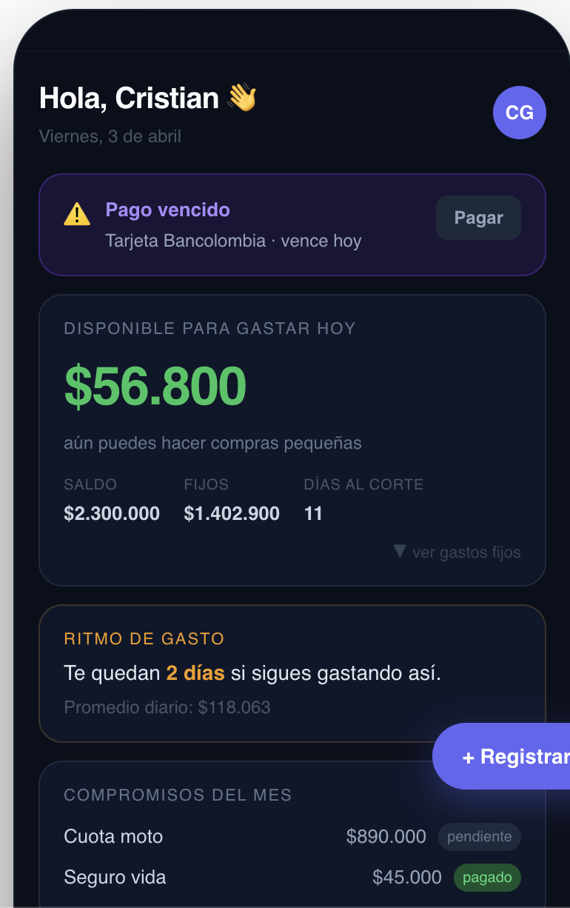

# Resumen de brainstorming — Rediseño de app de finanzas personales

## Contexto

Este documento resume las notas escritas a mano del propietario del producto sobre dos áreas de mejora de su app de finanzas personales: el **dashboard principal** y el módulo de **Plan / Presupuesto**.

---

## 1. Dashboard principal

### Pregunta guía
> ¿Qué quiero ver/saber cuando abro la app?

### Información visible en pantalla

- **Saludo personalizado** con avatar del usuario (ej. "Hola, Cristian")
- **Alerta o item prioritario** al tope (lo más urgente o relevante del momento)
- **Disponible para gastar hoy**: monto prominente, calculado a partir del saldo real menos compromisos ya asignados — *no* el saldo bruto de la cuenta
  - Sub-info: saldo total, gastos fijos, días para el siguiente pago
- **Compromisos** del período (confirmados, visibles)
- **Pendientes y recordatorios**
- **Ritmo de gasto**: insight predictivo, ej. "Te quedan 2 días si sigues gastando así"

### Comportamientos / UX

- Al hacer click en la tarjeta de "disponible para gastar", se expande una **mini-vista con los gastos fijos** del período
- **Acción dinámica contextual** según el estado de la cuenta:
  - Pago vencido → alerta para pagar
  - X días sin actualizar saldo de alguna cuenta o tarjeta → pregunta "¿Está actualizado este saldo?"
- **Speedometer** o métricas de salud financiera (a evaluar)

### Ingreso de transacciones (acceso rápido)

Desde el home se puede registrar una transacción por:
- Texto libre
- Formulario
- Audio
- Importación desde correo (los extractos bancarios también pueden llegar por email)

---

## 2. Plan / Presupuesto

### Objetivo
Permitir al usuario asignar presupuesto a sus categorías de gasto de forma simple o detallada, con un flujo guiado tipo wizard.

### Flujo de configuración (onboarding de presupuesto)

1. **Elige tu estilo**: Por categoría (recomendado) / Base cero / YNAB
2. **Ingresos** (paso 2 de 3): con calculadora integrada → Continuar
3. **Asignación por categoría** (ver abajo)

### Dos modos de asignación

| Modo | Descripción |
|------|-------------|
| **Simple** | Categoría + monto global (ej. Hogar → $200.000) |
| **Completo** | Categoría con subcategorías y lista de ítems detallados |

### Lista de ítems dentro de una categoría (funcionalidad clave)

En el modo **Completo**, el usuario puede crear una **lista de cosas** dentro de una categoría. Esta lista **sirve para calcular el total del presupuesto de esa categoría** sumando sus partes:

Ejemplo:
- Servicios: $200.000
- Comida: $300.000
- → Total Hogar: $500.000

Esta es la funcionalidad más importante del módulo: el presupuesto se construye de abajo hacia arriba a partir de los ítems.

### Comportamientos adicionales

- Al expandir una categoría → muestra subcategorías ordenadas por **mayor gasto primero**
- Al crear una categoría nueva, debe aparecer **inmediatamente disponible** en la lista de asignación (bug actual: no aparece)
- Asignación puede hacerse a nivel global o por subcategoría
- Con "destinatarios" se puede hacer limpieza/reclasificación de transacciones

### Notas de implementación

- La sección de presupuesto ya existe pero está **oculta después del plan** — se quiere evitar scroll excesivo en esa pantalla
- No hay scroll dentro del módulo de presupuesto; la navegación debe ser fluida

---

## Lo que NO va (descartado)

- Módulo de deudas (descartado del home)
- Widget de clima
- Sugerencia de costo al categorizar con ítems similares (carrito)

---

*Documento generado a partir de notas manuscritas del propietario. Usar como referencia para diseño y desarrollo.*

