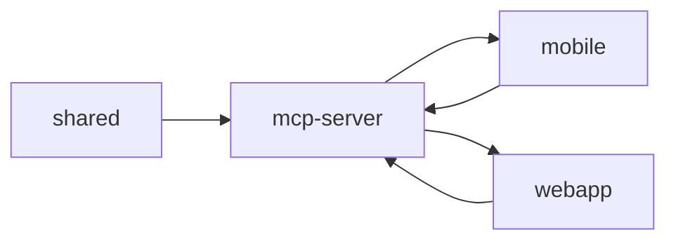

# mcp-server

> `ai_ui_pal/mcp-server` · typescript · 8 public symbols

## Purpose
<!-- service-docs:purpose:start -->
MCP server for the AI UI pal design-review workflow. Exposes handlers over the Model Context Protocol so an AI coding agent can create and sync UI reviews, fetch pending reviews and annotations, and pull design tokens (`createReviewHandler`, `getPendingReviewsHandler`, `getDesignTokensHandler`). Backed by Supabase; part of the design-iteration loop rather than the app's runtime. Distinct from the finance MCP server under `packages/mcp-server`.
<!-- service-docs:purpose:end -->

## Service dependencies

**External packages:**
- @modelcontextprotocol/sdk
- @supabase/supabase-js
- zod

## Public surface

<code>src/lib</code> — 3 symbols

- `syncReviews` _(function)_ — src/lib/sync.ts
- `downloadIfMissing` _(function)_ — src/lib/sync.ts
- `IndexEntry` _(interface)_ — src/lib/sync.ts

<code>src/tools</code> — 5 symbols

- `createReviewHandler` _(function)_ — src/tools/create-review.ts
- `getAnnotationHandler` _(function)_ — src/tools/get-annotation.ts
- `getDesignTokensHandler` _(function)_ — src/tools/get-design-tokens.ts
- `getPendingReviewsHandler` _(function)_ — src/tools/get-pending-reviews.ts
- `resolveReviewHandler` _(function)_ — src/tools/resolve-review.ts

## Known issues
### Tracked (manual — edit in `ai_ui_pal/mcp-server/SERVICE.md`)
_None tracked._
### Auto-detected
- (none found)

**Failing tests:**
- (none)

Generated 2026-07-10 by service-docs.
