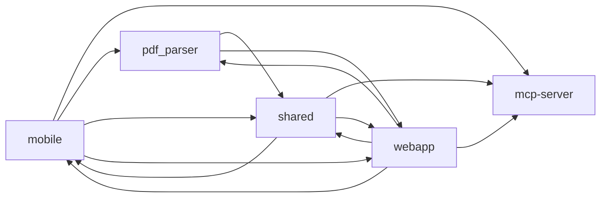

# Services

| Service | Path | Language | Public symbols | Open TODOs |
|---|---|---|---|---|
| [mcp-server](ai_ui_pal-mcp-server.md) | `ai_ui_pal/mcp-server` | typescript | 8 | 0 |
| [mobile](mobile.md) | `mobile` | typescript | 537 | 3 |
| [mcp-server](packages-mcp-server.md) | `packages/mcp-server` | typescript | 6 | 0 |
| [shared](packages-shared.md) | `packages/shared` | typescript | 205 | 2 |
| [pdf_parser](services-pdf_parser.md) | `services/pdf_parser` | python | 65 | 4 |
| [webapp](webapp.md) | `webapp` | typescript | 1620 | 11 |

Generated 2026-07-10 by service-docs. Arrow reads "depends on".
