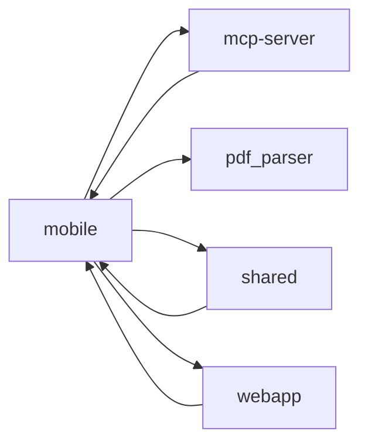

# mobile

> `mobile` · typescript · 537 public symbols

## Purpose
<!-- service-docs:purpose:start -->
Expo / React Native mobile client for Zeta. Offline-first (local SQLite mirrored to Supabase), it renders the finance app on-device — authentication (biometric + Google sign-in via `LoginScreen`/`handleBiometricLogin`), dashboards, and transaction/budget flows drawn with Skia and react-navigation. Mirrors the webapp, which is the design source of truth, and shares all business logic through `@zeta/shared`.
<!-- service-docs:purpose:end -->

## Service dependencies

**External packages:**

50 external packages

- @expo-google-fonts/inter
- @expo-google-fonts/kalam
- @expo/vector-icons
- @react-native-community/datetimepicker
- @react-native-google-signin/google-signin
- @react-navigation/native
- @shopify/react-native-skia
- @supabase/supabase-js
- @zeta/shared
- expo
- expo-apple-authentication
- expo-build-properties
- expo-constants
- expo-crypto
- expo-dev-client
- expo-document-picker
- expo-file-system
- expo-font
- expo-image-picker
- expo-linking
- expo-local-authentication
- expo-location
- expo-notifications
- expo-router
- expo-secure-store
- expo-speech-recognition
- expo-splash-screen
- expo-sqlite
- expo-status-bar
- expo-system-ui
- expo-task-manager
- expo-web-browser
- lucide-react-native
- nativewind
- react
- react-dom
- react-native
- react-native-css-interop
- react-native-edge-to-edge
- react-native-gesture-handler
- react-native-keyboard-controller
- react-native-reanimated
- react-native-safe-area-context
- react-native-screens
- react-native-svg
- react-native-url-polyfill
- react-native-view-shot
- react-native-web
- react-native-worklets
- zustand

## Public surface

<code>(root)</code> — 1 symbol

- `ViewShot` _(class)_ — react-native-view-shot.d.ts

<code>app</code> — 41 symbols

- `Root` _(function)_ — app/+html.tsx
- `NotFoundScreen` _(function)_ — app/+not-found.tsx
- `RootLayout` _(function)_ — app/_layout.tsx
- `AccountsListScreen` _(function)_ — app/accounts-list.tsx
- `AnnotateScreenshotScreen` _(function)_ — app/annotate-screenshot.tsx
- `BugReportScreen` _(function)_ — app/bug-report.tsx
- `handleAnnotated` _(function)_ — app/bug-report.tsx
- `validateAttachment` _(function)_ — app/bug-report.tsx
- `handlePickAttachment` _(function)_ — app/bug-report.tsx
- `handleSubmit` _(function)_ — app/bug-report.tsx
- `CaptureScreenshotScreen` _(function)_ — app/capture-screenshot.tsx
- `pickFromCamera` _(function)_ — app/capture-screenshot.tsx
- `pickFromGallery` _(function)_ — app/capture-screenshot.tsx
- `uploadAndParse` _(function)_ — app/capture-screenshot.tsx
- `importAll` _(function)_ — app/capture-screenshot.tsx
- `CaptureVoiceScreen` _(function)_ — app/capture-voice.tsx
- `CaptureScreen` _(function)_ — app/capture.tsx
- `handleTypeChange` _(function)_ — app/capture.tsx
- `handleDescriptionBlur` _(function)_ — app/capture.tsx
- `handleSave` _(function)_ — app/capture.tsx
- `CategoriesScreen` _(function)_ — app/categories.tsx
- `CategorizarScreen` _(function)_ — app/categorizar.tsx
- `DeseosScreen` _(function)_ — app/deseos.tsx
- `DestinatariosScreen` _(function)_ — app/destinatarios.tsx
- `EtiquetasScreen` _(function)_ — app/etiquetas.tsx
- `ModalScreen` _(function)_ — app/modal.tsx
- `MobileOnboardingScreen` _(function)_ — app/onboarding.tsx
- `persistOnboarding` _(function)_ — app/onboarding.tsx
- `handleNext` _(function)_ — app/onboarding.tsx
- `handleBack` _(function)_ — app/onboarding.tsx
- `handleFinishPrimary` _(function)_ — app/onboarding.tsx
- `handleExplore` _(function)_ — app/onboarding.tsx
- `PeriodoScreen` _(function)_ — app/periodo.tsx
- `PersonasScreen` _(function)_ — app/personas.tsx
- `ArmarPresupuestoScreen` _(function)_ — app/presupuesto-armar.tsx
- `PresupuestoScreen` _(function)_ — app/presupuesto.tsx
- `PurchaseDecisionScreen` _(function)_ — app/purchase-decision.tsx
- `SettingsScreen` _(function)_ — app/settings.tsx
- `loadBiometricState` _(function)_ — app/settings.tsx
- `SubscriptionsScreen` _(function)_ — app/subscriptions.tsx
- `TendenciasScreen` _(function)_ — app/tendencias.tsx

<code>app/(auth)</code> — 11 symbols

- `AuthLayout` _(function)_ — app/(auth)/_layout.tsx
- `ForgotPasswordScreen` _(function)_ — app/(auth)/forgot-password.tsx
- `handleResetRequest` _(function)_ — app/(auth)/forgot-password.tsx
- `LoginScreen` _(function)_ — app/(auth)/login.tsx
- `handleBiometricLogin` _(function)_ — app/(auth)/login.tsx
- `handleLogin` _(function)_ — app/(auth)/login.tsx
- `handleTryDemo` _(function)_ — app/(auth)/login.tsx
- `ResetPasswordScreen` _(function)_ — app/(auth)/reset-password.tsx
- `handleResetPassword` _(function)_ — app/(auth)/reset-password.tsx
- `SignupScreen` _(function)_ — app/(auth)/signup.tsx
- `handleSignup` _(function)_ — app/(auth)/signup.tsx

<code>app/(tabs)</code> — 9 symbols

- `TabLayout` _(function)_ — app/(tabs)/_layout.tsx
- `AccountsScreen` _(function)_ — app/(tabs)/accounts.tsx
- `BudgetsScreen` _(function)_ — app/(tabs)/budgets.tsx
- `DeudasScreen` _(function)_ — app/(tabs)/deudas.tsx
- `ImportScreen` _(function)_ — app/(tabs)/import.tsx
- `DashboardScreen` _(function)_ — app/(tabs)/index.tsx
- `MenuScreen` _(function)_ — app/(tabs)/menu.tsx
- `PlanScreen` _(function)_ — app/(tabs)/plan.tsx
- `TransactionsScreen` _(function)_ — app/(tabs)/transactions.tsx

<code>app/account</code> — 2 symbols

- `AccountDetailScreen` _(function)_ — app/account/[id].tsx
- `CreateAccountScreen` _(function)_ — app/account/create.tsx

<code>app/account/edit</code> — 1 symbol

- `EditAccountScreen` _(function)_ — app/account/edit/[id].tsx

<code>app/destinatarios/[id]</code> — 2 symbols

- `EditDestinatarioScreen` _(function)_ — app/destinatarios/[id]/edit.tsx
- `DestinatarioDetailScreen` _(function)_ — app/destinatarios/[id]/index.tsx

<code>app/deudas</code> — 1 symbol

- `PlanificadorScreen` _(function)_ — app/deudas/planificador.tsx

<code>app/recurrentes</code> — 2 symbols

- `RecurrentesScreen` _(function)_ — app/recurrentes/index.tsx
- `NewRecurrenteScreen` _(function)_ — app/recurrentes/new.tsx

<code>app/recurrentes/[id]</code> — 1 symbol

- `EditRecurrenteScreen` _(function)_ — app/recurrentes/[id]/edit.tsx

<code>app/settings</code> — 1 symbol

- `PerfilScreen` _(function)_ — app/settings/perfil.tsx

<code>app/transaction</code> — 1 symbol

- `TransactionDetailScreen` _(function)_ — app/transaction/[id].tsx

<code>app/transactions</code> — 1 symbol

- `NewTransactionScreen` _(function)_ — app/transactions/new.tsx

<code>components</code> — 7 symbols

- `BugFAB` _(function)_ — components/BugFAB.tsx
- `handleCapture` _(function)_ — components/BugFAB.tsx
- `ExternalLink` _(function)_ — components/ExternalLink.tsx
- `ScreenshotAnnotator` _(function)_ — components/ScreenshotAnnotator.tsx
- `useClientOnlyValue` _(function)_ — components/useClientOnlyValue.ts
- `useClientOnlyValue` _(function)_ — components/useClientOnlyValue.web.ts
- `useColorScheme` _(function)_ — components/useColorScheme.web.ts

<code>components/accounts</code> — 26 symbols

- `AccountBalanceCard` _(function)_ — components/accounts/AccountBalanceCard.tsx
- `AccountCard` _(function)_ — components/accounts/AccountCard.tsx
- `FormField` _(function)_ — components/accounts/AccountFormFields.tsx
- `NumericInput` _(function)_ — components/accounts/AccountFormFields.tsx
- `DayPicker` _(function)_ — components/accounts/AccountFormFields.tsx
- `AccountHero` _(function)_ — components/accounts/AccountHero.tsx
- `AccountTypeGrid` _(function)_ — components/accounts/AccountTypeGrid.tsx
- `BalanceGraphHero` _(function)_ — components/accounts/BalanceGraphHero.tsx
- `CardFace` _(function)_ — components/accounts/CardFace.tsx
- `ColorPicker` _(function)_ — components/accounts/ColorPicker.tsx
- `CurrencyPicker` _(function)_ — components/accounts/CurrencyPicker.tsx
- `FlipZone` _(function)_ — components/accounts/FlipZone.tsx
- `filterByRange` _(function)_ — components/accounts/GraphFace.tsx
- `GraphFace` _(function)_ — components/accounts/GraphFace.tsx
- `PaymentActionSheet` _(function)_ — components/accounts/PaymentActionSheet.tsx
- `QuickActionsBar` _(function)_ — components/accounts/QuickActionsBar.tsx
- `handleMore` _(function)_ — components/accounts/QuickActionsBar.tsx
- `handlePress` _(function)_ — components/accounts/QuickActionsBar.tsx
- `RangePills` _(function)_ — components/accounts/RangePills.tsx
- `ReconcileSheet` _(function)_ — components/accounts/ReconcileSheet.tsx
- `SpendingPulseHero` _(function)_ — components/accounts/SpendingPulseHero.tsx
- `TransferSheet` _(function)_ — components/accounts/TransferSheet.tsx
- `SheetFieldLabel` _(function)_ — components/accounts/account-action-sheet-parts.tsx
- `SheetAmountInput` _(function)_ — components/accounts/account-action-sheet-parts.tsx
- `SheetAccountPicker` _(function)_ — components/accounts/account-action-sheet-parts.tsx
- `SheetError` _(function)_ — components/accounts/account-action-sheet-parts.tsx

<code>components/auth</code> — 2 symbols

- `SocialAuthButtons` _(function)_ — components/auth/SocialAuthButtons.tsx
- `run` _(function)_ — components/auth/SocialAuthButtons.tsx

<code>components/budgets</code> — 1 symbol

- `BudgetsRoot` _(function)_ — components/budgets/BudgetsRoot.tsx

<code>components/categories</code> — 3 symbols

- `CategoriesRoot` _(function)_ — components/categories/CategoriesRoot.tsx
- `CategoryFormSheet` _(function)_ — components/categories/CategoryFormSheet.tsx
- `CategoryRow` _(function)_ — components/categories/CategoryRow.tsx

<code>components/categorizar</code> — 2 symbols

- `CategorizarRoot` _(function)_ — components/categorizar/CategorizarRoot.tsx
- `UncategorizedRow` _(function)_ — components/categorizar/UncategorizedRow.tsx

<code>components/common</code> — 7 symbols

- `AppKeyboardProvider` _(function)_ — components/common/AppKeyboardAwareScrollView.tsx
- `AppKeyboardAwareScrollView` _(function)_ — components/common/AppKeyboardAwareScrollView.tsx
- `BiometricLockScreen` _(function)_ — components/common/BiometricLockScreen.tsx
- `attemptUnlock` _(function)_ — components/common/BiometricLockScreen.tsx
- `KeyboardScreen` _(function)_ — components/common/KeyboardScreen.tsx
- `MonthSelector` _(function)_ — components/common/MonthSelector.tsx
- `Narrator` _(function)_ — components/common/Narrator.tsx

<code>components/dashboard</code> — 4 symbols

- `BalanceCard` _(function)_ — components/dashboard/BalanceCard.tsx
- `CategoryBreakdown` _(function)_ — components/dashboard/CategoryBreakdown.tsx
- `MonthSummary` _(function)_ — components/dashboard/MonthSummary.tsx
- `PurchaseDecisionCard` _(function)_ — components/dashboard/PurchaseDecisionCard.tsx

<code>components/deseos</code> — 3 symbols

- `DeseosEnrichDrawer` _(function)_ — components/deseos/DeseosEnrichDrawer.tsx
- `handleSubmit` _(function)_ — components/deseos/DeseosEnrichDrawer.tsx
- `DeseosRoot` _(function)_ — components/deseos/DeseosRoot.tsx

<code>components/destinatarios</code> — 5 symbols

- `DestinatarioDetail` _(function)_ — components/destinatarios/DestinatarioDetail.tsx
- `DestinatarioMergeSheet` _(function)_ — components/destinatarios/DestinatarioMergeSheet.tsx
- `DestinatarioRow` _(function)_ — components/destinatarios/DestinatarioRow.tsx
- `DestinatarioSuggestions` _(function)_ — components/destinatarios/DestinatarioSuggestions.tsx
- `DestinatariosRoot` _(function)_ — components/destinatarios/DestinatariosRoot.tsx

<code>components/deudas</code> — 7 symbols

- `DeudasAccountsAccordion` _(function)_ — components/deudas/DeudasAccountsAccordion.tsx
- `DeudasGrid` _(function)_ — components/deudas/DeudasGrid.tsx
- `DeudasHero` _(function)_ — components/deudas/DeudasHero.tsx
- `DeudasPlanificadorLink` _(function)_ — components/deudas/DeudasPlanificadorLink.tsx
- `DeudasRoot` _(function)_ — components/deudas/DeudasRoot.tsx
- `DeudasSalaryBar` _(function)_ — components/deudas/DeudasSalaryBar.tsx
- `PlanificadorRoot` _(function)_ — components/deudas/PlanificadorRoot.tsx

<code>components/deudas/planificador</code> — 13 symbols

- `changeStrategy` _(function)_ — components/deudas/planificador/AllocateStep.tsx
- `move` _(function)_ — components/deudas/planificador/AllocateStep.tsx
- `setCascade` _(function)_ — components/deudas/planificador/AllocateStep.tsx
- `getCascade` _(function)_ — components/deudas/planificador/AllocateStep.tsx
- `plannerReducer` _(function)_ — components/deudas/planificador/reducer.ts
- `formatDebtFreeDate` _(function)_ — components/deudas/planificador/utils.ts
- `formatCalendarMonth` _(function)_ — components/deudas/planificador/utils.ts
- `formatMonths` _(function)_ — components/deudas/planificador/utils.ts
- `getCurrentMonth` _(function)_ — components/deudas/planificador/utils.ts
- `getNextMonth` _(function)_ — components/deudas/planificador/utils.ts
- `abbreviateName` _(function)_ — components/deudas/planificador/utils.ts
- `ScenarioState` _(interface)_ — components/deudas/planificador/reducer.ts
- `PlannerState` _(interface)_ — components/deudas/planificador/reducer.ts

<code>components/import</code> — 7 symbols

- `CreditCardStackCard` _(function)_ — components/import/CreditCardStackCard.tsx
- `CreditCardSummary` _(function)_ — components/import/CreditCardSummary.tsx
- `SectionDivider` _(function)_ — components/import/SectionDivider.tsx
- `StatementChip` _(function)_ — components/import/StatementChip.tsx
- `useImportTheme` _(function)_ — components/import/import-theme.tsx
- `ImportThemeProvider` _(function)_ — components/import/import-theme.tsx
- `themeClasses` _(function)_ — components/import/import-theme.tsx

<code>components/inicio</code> — 4 symbols

- `AddWidgetSheet` _(function)_ — components/inicio/AddWidgetSheet.tsx
- `InicioRoot` _(function)_ — components/inicio/InicioRoot.tsx
- `WidgetGrid` _(function)_ — components/inicio/WidgetGrid.tsx
- `PrimaryAccountSummary` _(interface)_ — components/inicio/HybridHero.tsx

<code>components/inicio/_vault</code> — 8 symbols

- `InicioAccountsHub` _(function)_ — components/inicio/_vault/InicioAccountsHub.tsx
- `InicioActivity` _(function)_ — components/inicio/_vault/InicioActivity.tsx
- `InicioAttention` _(function)_ — components/inicio/_vault/InicioAttention.tsx
- `InicioHero` _(function)_ — components/inicio/_vault/InicioHero.tsx
- `InicioMetricsGrid` _(function)_ — components/inicio/_vault/InicioMetricsGrid.tsx
- `RecentTransaction` _(interface)_ — components/inicio/_vault/InicioActivity.tsx
- `AttentionOverdue` _(interface)_ — components/inicio/_vault/InicioAttention.tsx
- `AttentionPayment` _(interface)_ — components/inicio/_vault/InicioAttention.tsx

<code>components/inicio/widgets</code> — 17 symbols

- `renderAccountsWidget` _(function)_ — components/inicio/widgets/AccountsWidget.tsx
- `renderAttentionWidget` _(function)_ — components/inicio/widgets/AttentionWidget.tsx
- `renderNextBillWidget` _(function)_ — components/inicio/widgets/NextBillWidget.tsx
- `renderNextIncomeWidget` _(function)_ — components/inicio/widgets/NextIncomeWidget.tsx
- `renderPuedoComprarloWidget` _(function)_ — components/inicio/widgets/PuedoComprarloWidget.tsx
- `PulseWidget` _(function)_ — components/inicio/widgets/PulseWidget.tsx
- `renderRecentWidget` _(function)_ — components/inicio/widgets/RecentWidget.tsx
- `renderRitmoWidget` _(function)_ — components/inicio/widgets/RitmoWidget.tsx
- `renderWhereTodayWidget` _(function)_ — components/inicio/widgets/WhereTodayWidget.tsx
- `daysUntilLabel` _(function)_ — components/inicio/widgets/_shared.tsx
- `UpcomingList` _(function)_ — components/inicio/widgets/_shared.tsx
- `renderUpcomingRecurringWidget` _(function)_ — components/inicio/widgets/_shared.tsx
- `AccountsWidgetData` _(interface)_ — components/inicio/widgets/AccountsWidget.tsx
- `NextBillWidgetData` _(interface)_ — components/inicio/widgets/NextBillWidget.tsx
- `NextIncomeWidgetData` _(interface)_ — components/inicio/widgets/NextIncomeWidget.tsx
- `RecentWidgetData` _(interface)_ — components/inicio/widgets/RecentWidget.tsx
- `WhereTodayWidgetData` _(interface)_ — components/inicio/widgets/WhereTodayWidget.tsx

<code>components/movimientos</code> — 12 symbols

- `EmailImportPanel` _(function)_ — components/movimientos/EmailImportPanel.tsx
- `resolveAccount` _(function)_ — components/movimientos/EmailImportPanel.tsx
- `clearRow` _(function)_ — components/movimientos/EmailImportPanel.tsx
- `refreshAfterMutation` _(function)_ — components/movimientos/EmailImportPanel.tsx
- `runApprove` _(function)_ — components/movimientos/EmailImportPanel.tsx
- `handleApprove` _(function)_ — components/movimientos/EmailImportPanel.tsx
- `handleReconcileChoice` _(function)_ — components/movimientos/EmailImportPanel.tsx
- `handleDismiss` _(function)_ — components/movimientos/EmailImportPanel.tsx
- `handleImportAll` _(function)_ — components/movimientos/EmailImportPanel.tsx
- `MovimientosRoot` _(function)_ — components/movimientos/MovimientosRoot.tsx
- `MovimientosUtilidades` _(function)_ — components/movimientos/MovimientosUtilidades.tsx
- `MovimientosFilters` _(interface)_ — components/movimientos/MovimientosUtilidades.tsx

<code>components/nav</code> — 4 symbols

- `FocusModeAccent` _(function)_ — components/nav/FocusModeAccent.tsx
- `TabBarVisibilityProvider` _(function)_ — components/nav/TabBarVisibilityProvider.tsx
- `useTabBarVisibility` _(function)_ — components/nav/TabBarVisibilityProvider.tsx
- `useHideTabBar` _(function)_ — components/nav/TabBarVisibilityProvider.tsx

<code>components/onboarding</code> — 6 symbols

- `PurposeOption` _(function)_ — components/onboarding/PurposeOption.tsx
- `StepAccount` _(function)_ — components/onboarding/StepAccount.tsx
- `StepComplete` _(function)_ — components/onboarding/StepComplete.tsx
- `StepProfile` _(function)_ — components/onboarding/StepProfile.tsx
- `StepPulse` _(function)_ — components/onboarding/StepPulse.tsx
- `StepWelcome` _(function)_ — components/onboarding/StepWelcome.tsx

<code>components/personas</code> — 1 symbol

- `PersonasRoot` _(function)_ — components/personas/PersonasRoot.tsx

<code>components/plan</code> — 8 symbols

- `PaymentSheet` _(function)_ — components/plan/PaymentSheet.tsx
- `PlanRoot` _(function)_ — components/plan/PlanRoot.tsx
- `ReassignSheet` _(function)_ — components/plan/ReassignSheet.tsx
- `PaymentEntry` _(interface)_ — components/plan/PaymentSheet.tsx
- `PaymentAccount` _(interface)_ — components/plan/PaymentSheet.tsx
- `PlanExecution` _(interface)_ — components/plan/PlanNetHero.tsx
- `ReassignTarget` _(interface)_ — components/plan/ReassignSheet.tsx
- `IncomeOption` _(interface)_ — components/plan/ReassignSheet.tsx

<code>components/recurrentes</code> — 6 symbols

- `OccurrenceRow` _(function)_ — components/recurrentes/OccurrenceRow.tsx
- `RecurrentesRoot` _(function)_ — components/recurrentes/RecurrentesRoot.tsx
- `RecurringConfirmSheet` _(function)_ — components/recurrentes/RecurringConfirmSheet.tsx
- `RecurringForm` _(function)_ — components/recurrentes/RecurringForm.tsx
- `handleSubmit` _(function)_ — components/recurrentes/RecurringForm.tsx
- `RecurringSummaryCard` _(function)_ — components/recurrentes/RecurringSummaryCard.tsx

<code>components/tendencias</code> — 14 symbols

- `DrilldownTransactions` _(function)_ — components/tendencias/DrilldownTransactions.tsx
- `LensTabs` _(function)_ — components/tendencias/TendenciasLenses.tsx
- `SavingsRateCard` _(function)_ — components/tendencias/TendenciasLenses.tsx
- `IncomeExpenseCard` _(function)_ — components/tendencias/TendenciasLenses.tsx
- `BudgetAdherenceCard` _(function)_ — components/tendencias/TendenciasLenses.tsx
- `MoversCard` _(function)_ — components/tendencias/TendenciasLenses.tsx
- `AnomaliesCard` _(function)_ — components/tendencias/TendenciasLenses.tsx
- `TopRecipientsCard` _(function)_ — components/tendencias/TendenciasLenses.tsx
- `FixedVariableCard` _(function)_ — components/tendencias/TendenciasLenses.tsx
- `ForecastCard` _(function)_ — components/tendencias/TendenciasLenses.tsx
- `foldForSearch` _(function)_ — components/tendencias/TendenciasView.tsx
- `PeriodControl` _(function)_ — components/tendencias/TendenciasView.tsx
- `DeltaChip` _(function)_ — components/tendencias/TendenciasView.tsx
- `CategoryTrendList` _(function)_ — components/tendencias/TendenciasView.tsx

<code>components/transactions</code> — 11 symbols

- `CategoryPicker` _(function)_ — components/transactions/CategoryPicker.tsx
- `CategoryZonePickerSheet` _(function)_ — components/transactions/CategoryZonePickerSheet.tsx
- `reset` _(function)_ — components/transactions/CategoryZonePickerSheet.tsx
- `handleSelect` _(function)_ — components/transactions/CategoryZonePickerSheet.tsx
- `handleClose` _(function)_ — components/transactions/CategoryZonePickerSheet.tsx
- `DestinatarioPicker` _(function)_ — components/transactions/DestinatarioPicker.tsx
- `SearchBar` _(function)_ — components/transactions/SearchBar.tsx
- `TagPickerSheet` _(function)_ — components/transactions/TagPickerSheet.tsx
- `TagSelector` _(function)_ — components/transactions/TagSelector.tsx
- `TransactionRow` _(function)_ — components/transactions/TransactionRow.tsx
- `VincularPicker` _(function)_ — components/transactions/VincularPicker.tsx

<code>components/ui</code> — 31 symbols

- `AnimatedAccordion` _(function)_ — components/ui/AnimatedAccordion.tsx
- `AvatarMenuTrigger` _(function)_ — components/ui/AvatarMenu.tsx
- `CategoryIcon` _(function)_ — components/ui/CategoryIcon.tsx
- `ExpandableChip` _(function)_ — components/ui/ExpandableChip.tsx
- `ChipEyebrow` _(function)_ — components/ui/ExpandableChip.tsx
- `ChipDetailHeading` _(function)_ — components/ui/ExpandableChip.tsx
- `ExpandableStatTile` _(function)_ — components/ui/ExpandableStatTile.tsx
- `FabMenuSheet` _(function)_ — components/ui/FabMenuSheet.tsx
- `handle` _(function)_ — components/ui/FabMenuSheet.tsx
- `FieldGroup` _(function)_ — components/ui/FormField.tsx
- `SegmentedRow` _(function)_ — components/ui/FormField.tsx
- `GradientCard` _(function)_ — components/ui/GradientCard.tsx
- `HubEntry` _(function)_ — components/ui/HubEntry.tsx
- `MCard` _(function)_ — components/ui/MCard.tsx
- `MCardTight` _(function)_ — components/ui/MCard.tsx
- `MCardGrid` _(function)_ — components/ui/MCard.tsx
- `MCardGridCell` _(function)_ — components/ui/MCard.tsx
- `MListRow` _(function)_ — components/ui/MCard.tsx
- `MCardHeader` _(function)_ — components/ui/MCard.tsx
- `MobileHeader` _(function)_ — components/ui/MobileHeader.tsx
- `MobileSheet` _(function)_ — components/ui/MobileSheet.tsx
- `MobileTabBar` _(function)_ — components/ui/MobileTabBar.tsx
- `handleFabAction` _(function)_ — components/ui/MobileTabBar.tsx
- `MobileZone` _(function)_ — components/ui/MobileZone.tsx
- `RingChart` _(function)_ — components/ui/RingChart.tsx
- `SectionDivider` _(function)_ — components/ui/SectionDivider.tsx
- `StateChip` _(function)_ — components/ui/StateChip.tsx
- `ToneActionRow` _(function)_ — components/ui/ToneActionRow.tsx
- `TrendChip` _(function)_ — components/ui/TrendChip.tsx
- `WizardProgress` _(function)_ — components/ui/WizardProgress.tsx
- `useExpandableZone` _(function)_ — components/ui/useExpandableZone.ts

<code>lib</code> — 59 symbols

- `parseLocalizedAmount` _(function)_ — lib/amount.ts
- `formatAmountInput` _(function)_ — lib/amount.ts
- `parseFormattedAmount` _(function)_ — lib/amount.ts
- `signInWithGoogle` _(function)_ — lib/auth-social.ts
- `signInWithApple` _(function)_ — lib/auth-social.ts
- `useAuth` _(function)_ — lib/auth.tsx
- `AuthProvider` _(function)_ — lib/auth.tsx
- `resolveSessionSafely` _(function)_ — lib/auth.tsx
- `handleUserBoundary` _(function)_ — lib/auth.tsx
- `triggerInitialSyncOnce` _(function)_ — lib/auth.tsx
- `maybeResumeLocationTracking` _(function)_ — lib/auth.tsx
- `initializeAuthState` _(function)_ — lib/auth.tsx
- `handleAuthStateChange` _(function)_ — lib/auth.tsx
- `isBiometricsAvailable` _(function)_ — lib/biometrics.ts
- `isBiometricsEnabled` _(function)_ — lib/biometrics.ts
- `enableBiometrics` _(function)_ — lib/biometrics.ts
- `disableBiometrics` _(function)_ — lib/biometrics.ts
- `isBackgroundReauthEnabled` _(function)_ — lib/biometrics.ts
- `setBackgroundReauth` _(function)_ — lib/biometrics.ts
- `hasBeenPromptedForBiometrics` _(function)_ — lib/biometrics.ts
- `markBiometricsPrompted` _(function)_ — lib/biometrics.ts
- `authenticateWithBiometrics` _(function)_ — lib/biometrics.ts
- `authenticateForLogin` _(function)_ — lib/biometrics.ts
- `storeBiometricCredentials` _(function)_ — lib/biometrics.ts
- `getBiometricCredentials` _(function)_ — lib/biometrics.ts
- `hasBiometricCredentials` _(function)_ — lib/biometrics.ts
- `clearBiometricCredentials` _(function)_ — lib/biometrics.ts
- `BugReportProvider` _(function)_ — lib/bugReportMode.tsx
- `setFabEnabled` _(function)_ — lib/bugReportMode.tsx
- `toggleBugMode` _(function)_ — lib/bugReportMode.tsx
- `captureScreen` _(function)_ — lib/bugReportMode.tsx
- `BugReportViewShot` _(function)_ — lib/bugReportMode.tsx
- `useBugReport` _(function)_ — lib/bugReportMode.tsx
- `deleteUserAccount` _(function)_ — lib/delete-account.ts
- `seedDemoData` _(function)_ — lib/demo-data.ts
- `isDemoModeEnabled` _(function)_ — lib/demo-mode.ts
- `enableDemoMode` _(function)_ — lib/demo-mode.ts
- `disableDemoMode` _(function)_ — lib/demo-mode.ts
- `useOnboardingStatus` _(function)_ — lib/onboarding-status.tsx
- `getPdfPasswordForAccount` _(function)_ — lib/pdf-passwords.ts
- `setPdfPasswordForAccount` _(function)_ — lib/pdf-passwords.ts
- `getSavedPdfPasswordsForAccounts` _(function)_ — lib/pdf-passwords.ts
- `getLocalProfile` _(function)_ — lib/profile.ts
- `setLocationTrackingEnabled` _(function)_ — lib/profile.ts
- `updateProfile` _(function)_ — lib/profile.ts
- `invalidatePreferredCurrency` _(function)_ — lib/profile.ts
- `getPreferredCurrency` _(function)_ — lib/profile.ts
- `resetUserData` _(function)_ — lib/reset-data.ts
- `setProfile` _(function)_ — lib/store.ts
- `setAccounts` _(function)_ — lib/store.ts
- `setTransactions` _(function)_ — lib/store.ts
- `setCategories` _(function)_ — lib/store.ts
- `clear` _(function)_ — lib/store.ts
- `ZetaThemeProvider` _(function)_ — lib/theme.tsx
- `useTheme` _(function)_ — lib/theme.tsx
- `themeSurfaceClasses` _(function)_ — lib/theme.tsx
- `isDebtAccountType` _(function)_ — lib/transaction-semantics.ts
- `isDebtInflow` _(function)_ — lib/transaction-semantics.ts
- `getTransactionTypeLabel` _(function)_ — lib/transaction-semantics.ts

<code>lib/analytics</code> — 1 symbol

- `trackProductEvent` _(function)_ — lib/analytics/product-events.ts

<code>lib/constants</code> — 4 symbols

- `isDebtAccountType` _(function)_ — lib/constants/accounts.ts
- `getMobileTabs` _(function)_ — lib/constants/mobile-nav.ts
- `isMobileTabActive` _(function)_ — lib/constants/mobile-nav.ts
- `isFocusModePath` _(function)_ — lib/constants/mobile-nav.ts

<code>lib/dashboard</code> — 4 symbols

- `normalizeLayout` _(function)_ — lib/dashboard/layout-storage.ts
- `loadDashboardLayout` _(function)_ — lib/dashboard/layout-storage.ts
- `saveDashboardLayout` _(function)_ — lib/dashboard/layout-storage.ts
- `useDashboardData` _(function)_ — lib/dashboard/useDashboardData.ts

<code>lib/db</code> — 2 symbols

- `getDatabase` _(function)_ — lib/db/database.ts
- `clearDatabase` _(function)_ — lib/db/database.ts

<code>lib/domain</code> — 1 symbol

- `toDomainAccount` _(function)_ — lib/domain/account.ts

<code>lib/hooks</code> — 1 symbol

- `useTabBarClearance` _(function)_ — lib/hooks/useTabBarClearance.ts

<code>lib/onboarding</code> — 1 symbol

- `bootstrapOnboardingLocally` _(function)_ — lib/onboarding/bootstrap.ts

<code>lib/repositories</code> — 131 symbols

- `toColombiaDateString` _(function)_ — lib/repositories/accounts-detail.ts
- `getBalanceHistory` _(function)_ — lib/repositories/accounts-detail.ts
- `getSpendingPulse` _(function)_ — lib/repositories/accounts-detail.ts
- `getAllAccounts` _(function)_ — lib/repositories/accounts.ts
- `getAccountById` _(function)_ — lib/repositories/accounts.ts
- `createAccount` _(function)_ — lib/repositories/accounts.ts
- `updateAccount` _(function)_ — lib/repositories/accounts.ts
- `deleteAccount` _(function)_ — lib/repositories/accounts.ts
- `registerPayment` _(function)_ — lib/repositories/accounts.ts
- `reconcileBalance` _(function)_ — lib/repositories/accounts.ts
- `getTendenciasDataset` _(function)_ — lib/repositories/analytics.ts
- `getDrilldownTransactions` _(function)_ — lib/repositories/analytics.ts
- `getBudgetProgress` _(function)_ — lib/repositories/budgets.ts
- `getMonthlyIncome` _(function)_ — lib/repositories/budgets.ts
- `compute503020` _(function)_ — lib/repositories/budgets.ts
- `getBudgetBuilderRows` _(function)_ — lib/repositories/budgets.ts
- `saveBudgetDraft` _(function)_ — lib/repositories/budgets.ts
- `upsertBudget` _(function)_ — lib/repositories/budgets.ts
- `deleteBudget` _(function)_ — lib/repositories/budgets.ts
- `getAllCategories` _(function)_ — lib/repositories/categories.ts
- `isIncomeCategory` _(function)_ — lib/repositories/categories.ts
- `filterCategoriesByDirection` _(function)_ — lib/repositories/categories.ts
- `createCategory` _(function)_ — lib/repositories/categories.ts
- `getDebtOverview` _(function)_ — lib/repositories/debt.ts
- `getAllDestinatarios` _(function)_ — lib/repositories/destinatarios.ts
- `getDestinatarioById` _(function)_ — lib/repositories/destinatarios.ts
- `getRulesForDestinatario` _(function)_ — lib/repositories/destinatarios.ts
- `getDestinatarioRulesForMatching` _(function)_ — lib/repositories/destinatarios.ts
- `createDestinatarioWithPattern` _(function)_ — lib/repositories/destinatarios.ts
- `updateDestinatario` _(function)_ — lib/repositories/destinatarios.ts
- `addDestinatarioRule` _(function)_ — lib/repositories/destinatarios.ts
- `deleteDestinatarioRule` _(function)_ — lib/repositories/destinatarios.ts
- `mergeDestinatarios` _(function)_ — lib/repositories/destinatarios.ts
- `getDestinatarioSuggestions` _(function)_ — lib/repositories/destinatarios.ts
- `dismissDestinatarioSuggestion` _(function)_ — lib/repositories/destinatarios.ts
- `createDestinatarioFromSuggestion` _(function)_ — lib/repositories/destinatarios.ts
- `expoHashFn` _(function)_ — lib/repositories/ledger-helpers.ts
- `computeIdempotencyKey` _(function)_ — lib/repositories/ledger-helpers.ts
- `enqueueAccountUpdateCoalesced` _(function)_ — lib/repositories/ledger-helpers.ts
- `buildLedgerTxPayload` _(function)_ — lib/repositories/ledger-helpers.ts
- `insertLedgerTransaction` _(function)_ — lib/repositories/ledger-helpers.ts
- `applyLocalBalanceDelta` _(function)_ — lib/repositories/ledger-helpers.ts
- `setLocalBalanceOverwrite` _(function)_ — lib/repositories/ledger-helpers.ts
- `applyStatementMetaBalance` _(function)_ — lib/repositories/ledger-helpers.ts
- `parseCurrencyBalances` _(function)_ — lib/repositories/ledger-helpers.ts
- `getPendingEmailTransactionsCount` _(function)_ — lib/repositories/pending-email.ts
- `getPendingEmailTransactions` _(function)_ — lib/repositories/pending-email.ts
- `checkEmailReconciliation` _(function)_ — lib/repositories/pending-email.ts
- `approveEmailTransaction` _(function)_ — lib/repositories/pending-email.ts
- `dismissEmailTransaction` _(function)_ — lib/repositories/pending-email.ts
- `getActivePersonalDebts` _(function)_ — lib/repositories/personal-debts.ts
- `getActivePeriod` _(function)_ — lib/repositories/planning.ts
- `getPeriodEntries` _(function)_ — lib/repositories/planning.ts
- `getPeriodAssignments` _(function)_ — lib/repositories/planning.ts
- `getActivePeriodWithEntries` _(function)_ — lib/repositories/planning.ts
- `markEntryCompleted` _(function)_ — lib/repositories/planning.ts
- `updateAssignmentAmount` _(function)_ — lib/repositories/planning.ts
- `deleteAssignment` _(function)_ — lib/repositories/planning.ts
- `createAssignment` _(function)_ — lib/repositories/planning.ts
- `toMonthlyAmount` _(function)_ — lib/repositories/recurring.ts
- `getActiveTemplates` _(function)_ — lib/repositories/recurring.ts
- `getAllTemplates` _(function)_ — lib/repositories/recurring.ts
- `getTemplateById` _(function)_ — lib/repositories/recurring.ts
- `getTemplatesByIds` _(function)_ — lib/repositories/recurring.ts
- `getOccurrencesForMonth` _(function)_ — lib/repositories/recurring.ts
- `getPendingOccurrences` _(function)_ — lib/repositories/recurring.ts
- `getRecurringSummary` _(function)_ — lib/repositories/recurring.ts
- `createRecurringTemplate` _(function)_ — lib/repositories/recurring.ts
- `updateRecurringTemplate` _(function)_ — lib/repositories/recurring.ts
- `isTransactionLinkedToOccurrence` _(function)_ — lib/repositories/recurring.ts
- `getCandidateOccurrencesForTransaction` _(function)_ — lib/repositories/recurring.ts
- `getAccountIdsWithPendingOccurrences` _(function)_ — lib/repositories/recurring.ts
- `linkExistingTransactionToOccurrence` _(function)_ — lib/repositories/recurring.ts
- `findAndLinkLocalOccurrence` _(function)_ — lib/repositories/recurring.ts
- `skipOccurrence` _(function)_ — lib/repositories/recurring.ts
- `recordRecurringOccurrencePayment` _(function)_ — lib/repositories/recurring.ts
- `getScenarios` _(function)_ — lib/repositories/scenarios.ts
- `saveScenario` _(function)_ — lib/repositories/scenarios.ts
- `deleteScenario` _(function)_ — lib/repositories/scenarios.ts
- `upsertLocalStatementSnapshot` _(function)_ — lib/repositories/statement-snapshots.ts
- `getActiveSubscriptions` _(function)_ — lib/repositories/subscriptions.ts
- `getMonthlyOutflowOccurrences` _(function)_ — lib/repositories/subscriptions.ts
- `confirmSubscription` _(function)_ — lib/repositories/subscriptions.ts
- `dismissSubscription` _(function)_ — lib/repositories/subscriptions.ts
- `markForCancellation` _(function)_ — lib/repositories/subscriptions.ts
- `cancelSubscription` _(function)_ — lib/repositories/subscriptions.ts
- `getAllTagGroups` _(function)_ — lib/repositories/tags.ts
- `getAllTags` _(function)_ — lib/repositories/tags.ts
- `getTagsForTransaction` _(function)_ — lib/repositories/tags.ts
- `saveTransactionTags` _(function)_ — lib/repositories/tags.ts
- `createTagGroup` _(function)_ — lib/repositories/tags.ts
- `updateTagGroup` _(function)_ — lib/repositories/tags.ts
- `deleteTagGroup` _(function)_ — lib/repositories/tags.ts
- `createTag` _(function)_ — lib/repositories/tags.ts
- `deleteTag` _(function)_ — lib/repositories/tags.ts
- `createTransaction` _(function)_ — lib/repositories/transactions.ts
- `createTransactionAndApplyBalance` _(function)_ — lib/repositories/transactions.ts
- `getTransactions` _(function)_ — lib/repositories/transactions.ts
- `getMonthlyAggregates` _(function)_ — lib/repositories/transactions.ts
- `getTopUncategorized` _(function)_ — lib/repositories/transactions.ts
- `getTransactionById` _(function)_ — lib/repositories/transactions.ts
- `getReconciliationCandidateById` _(function)_ — lib/repositories/transactions.ts
- `getReconciliationCandidateRowsInRange` _(function)_ — lib/repositories/transactions.ts
- `getReconciliationCandidates` _(function)_ — lib/repositories/transactions.ts
- `applyReconciliationMerge` _(function)_ — lib/repositories/transactions.ts
- `deleteTransaction` _(function)_ — lib/repositories/transactions.ts
- `updateTransaction` _(function)_ — lib/repositories/transactions.ts
- `categorizeAndLearn` _(function)_ — lib/repositories/transactions.ts
- `createTransfer` _(function)_ — lib/repositories/transfers.ts
- `getActiveWishlistItems` _(function)_ — lib/repositories/wishlist.ts
- `getWishlistItemById` _(function)_ — lib/repositories/wishlist.ts
- `getBoughtWishlistItems` _(function)_ — lib/repositories/wishlist.ts
- `getWishlistCount` _(function)_ — lib/repositories/wishlist.ts
- `getWishlistSummary` _(function)_ — lib/repositories/wishlist.ts
- `createWishlistItem` _(function)_ — lib/repositories/wishlist.ts
- `enrichWishlistItem` _(function)_ — lib/repositories/wishlist.ts
- `persistWishlistScore` _(function)_ — lib/repositories/wishlist.ts
- `markWishlistItemBought` _(function)_ — lib/repositories/wishlist.ts
- `dismissWishlistNudge` _(function)_ — lib/repositories/wishlist.ts
- `deleteWishlistItem` _(function)_ — lib/repositories/wishlist.ts
- `SnapshotPoint` _(interface)_ — lib/repositories/accounts-detail.ts
- `DailyPoint` _(interface)_ — lib/repositories/accounts-detail.ts
- `TendenciasDataset` _(interface)_ — lib/repositories/analytics.ts
- `DrilldownTransaction` _(interface)_ — lib/repositories/analytics.ts
- `DebtAccountInfo` _(interface)_ — lib/repositories/debt.ts
- `DebtOverviewData` _(interface)_ — lib/repositories/debt.ts
- `ParsedEmailTransaction` _(interface)_ — lib/repositories/pending-email.ts
- `SavedScenario` _(interface)_ — lib/repositories/scenarios.ts
- `SnapshotAccount` _(interface)_ — lib/repositories/scenarios.ts
- `SavedScenarioResults` _(interface)_ — lib/repositories/scenarios.ts
- `SaveScenarioPayload` _(interface)_ — lib/repositories/scenarios.ts

<code>lib/services</code> — 7 symbols

- `getFinancialSnapshot` _(function)_ — lib/services/purchase-decision.ts
- `getSelectedAccountAvailable` _(function)_ — lib/services/purchase-decision.ts
- `analyzeLocally` _(function)_ — lib/services/purchase-decision.ts
- `scoreWishlistItemWithSnapshot` _(function)_ — lib/services/purchase-decision.ts
- `computeActiveNudges` _(function)_ — lib/services/wishlist-nudges.ts
- `getWishlistItemsWithFreshScores` _(function)_ — lib/services/wishlist-scoring.ts
- `rescoreWishlistItem` _(function)_ — lib/services/wishlist-scoring.ts

<code>lib/services/location</code> — 11 symbols

- `reverseGeocode` _(function)_ — lib/services/location/geocode.ts
- `findNearestPing` _(function)_ — lib/services/location/linker.ts
- `linkPingToTransaction` _(function)_ — lib/services/location/linker.ts
- `linkNearestPingToTransaction` _(function)_ — lib/services/location/linker.ts
- `requestLocationPermissions` _(function)_ — lib/services/location/permissions.ts
- `getCurrentPermissionLevel` _(function)_ — lib/services/location/permissions.ts
- `persistLocationPings` _(function)_ — lib/services/location/task.ts
- `startBackgroundLocationTracking` _(function)_ — lib/services/location/tracker.ts
- `stopBackgroundLocationTracking` _(function)_ — lib/services/location/tracker.ts
- `isTracking` _(function)_ — lib/services/location/tracker.ts
- `captureCurrentLocation` _(function)_ — lib/services/location/tracker.ts

<code>lib/services/notifications</code> — 6 symbols

- `getNotificationPermission` _(function)_ — lib/services/notifications/permissions.ts
- `requestNotificationPermission` _(function)_ — lib/services/notifications/permissions.ts
- `isPaymentRemindersEnabled` _(function)_ — lib/services/notifications/preferences.ts
- `setPaymentRemindersEnabled` _(function)_ — lib/services/notifications/preferences.ts
- `configureNotificationHandler` _(function)_ — lib/services/notifications/scheduler.ts
- `reschedulePaymentReminders` _(function)_ — lib/services/notifications/scheduler.ts

<code>lib/sync</code> — 10 symbols

- `beginReset` _(function)_ — lib/sync/engine.ts
- `endReset` _(function)_ — lib/sync/engine.ts
- `isResetInProgress` _(function)_ — lib/sync/engine.ts
- `syncAll` _(function)_ — lib/sync/engine.ts
- `useSync` _(function)_ — lib/sync/hooks.ts
- `pullAll` _(function)_ — lib/sync/pull.ts
- `pushPendingChanges` _(function)_ — lib/sync/push.ts
- `enqueueInsert` _(function)_ — lib/sync/queue.ts
- `enqueueUpdate` _(function)_ — lib/sync/queue.ts
- `enqueueDelete` _(function)_ — lib/sync/queue.ts

<code>lib/utils</code> — 16 symbols

- `computeCashflow` _(function)_ — lib/utils/cashflow.ts
- `toLocalDateString` _(function)_ — lib/utils/date.ts
- `toLocalMonthString` _(function)_ — lib/utils/date.ts
- `parseMoney` _(function)_ — lib/utils/money.ts
- `computeNetWorth` _(function)_ — lib/utils/net-worth.ts
- `computeSecondaryNetWorth` _(function)_ — lib/utils/net-worth.ts
- `computeRecurringGroupUuid` _(function)_ — lib/utils/recurring-group.ts
- `computeTimeline` _(function)_ — lib/utils/timeline.ts
- `zoneBackground` _(function)_ — lib/utils/zone-colors.ts
- `zoneBorder` _(function)_ — lib/utils/zone-colors.ts
- `chipBackground` _(function)_ — lib/utils/zone-colors.ts
- `zoneTextColor` _(function)_ — lib/utils/zone-colors.ts
- `CashflowResult` _(interface)_ — lib/utils/cashflow.ts
- `TimelineDay` _(interface)_ — lib/utils/timeline.ts
- `BalancePoint` _(interface)_ — lib/utils/timeline.ts
- `TimelineData` _(interface)_ — lib/utils/timeline.ts

## Known issues
### Tracked (manual — edit in `mobile/SERVICE.md`)
_None tracked._
### Auto-detected
- **TODO** app/transactions/new.tsx:11 — (parity): build the full MobileTransactionForm here and make `/capture`
- **TODO** components/ui/GradientCard.tsx:10 — Replace with expo-linear-gradient once the dep is added.
- **TODO** components/ui/MobileTabBar.tsx:100 — mobile quick-capture (NL text parse) screen — reuse parseQuickCaptureText.

**Failing tests:**
- (none)

Generated 2026-07-10 by service-docs.
