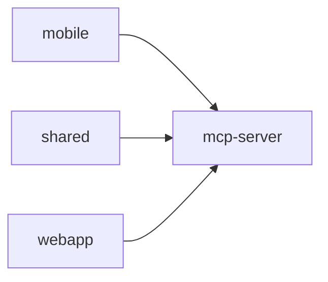

# mcp-server

> `packages/mcp-server` · typescript · 6 public symbols

## Purpose
<!-- service-docs:purpose:start -->
MCP server exposing Zeta's core finance data to AI agents over the Model Context Protocol: `getSummary`, `getAccounts`, `getTransactions`, `getBudgets`, `getDebts`, and `createTransaction`. It is the read/write bridge that lets an assistant query and add to a user's finances. Distinct from the design-review MCP server under `ai_ui_pal/mcp-server`.
<!-- service-docs:purpose:end -->

## Service dependencies

**External packages:**
- @modelcontextprotocol/sdk
- zod

## Public surface

<code>src</code> — 6 symbols

- `getSummary` _(function)_ — src/api-client.ts
- `getAccounts` _(function)_ — src/api-client.ts
- `getTransactions` _(function)_ — src/api-client.ts
- `getBudgets` _(function)_ — src/api-client.ts
- `getDebts` _(function)_ — src/api-client.ts
- `createTransaction` _(function)_ — src/api-client.ts

## Known issues
### Tracked (manual — edit in `packages/mcp-server/SERVICE.md`)
_None tracked._
### Auto-detected
- (none found)

**Failing tests:**
- (none)

Generated 2026-07-10 by service-docs.
