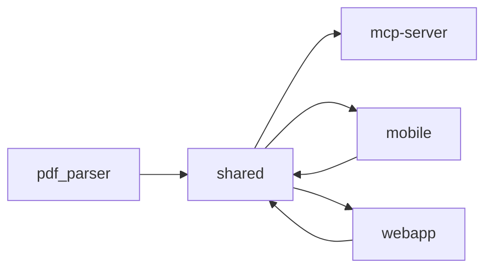

# shared

> `packages/shared` · typescript · 205 public symbols

## Purpose
<!-- service-docs:purpose:start -->
`@zeta/shared` — the framework-free TypeScript library of business logic shared by the web and mobile clients. Computes the derived financial series the UIs render (`incomeVsExpenseSeries`, `savingsRateSeries`, `budgetAdherenceSeries`, `categorySeries`, `anomalies`, `movers`) and owns the cross-cutting rules: auto-categorization, reconciliation, idempotency keys, debt simulation, and the capture-method hierarchy. Pure computation, no I/O — it never imports from the apps that consume it.
<!-- service-docs:purpose:end -->

## Service dependencies

**External packages:**
- date-fns

## Public surface

<code>src/analytics</code> — 30 symbols

- `anomalies` _(function)_ — src/analytics/anomalies.ts
- `budgetAdherenceSeries` _(function)_ — src/analytics/budget-adherence.ts
- `incomeVsExpenseSeries` _(function)_ — src/analytics/cashflow.ts
- `savingsRateSeries` _(function)_ — src/analytics/cashflow.ts
- `categorySeries` _(function)_ — src/analytics/category-series.ts
- `movers` _(function)_ — src/analytics/category-series.ts
- `fixedVsVariable` _(function)_ — src/analytics/fixed-variable.ts
- `forecast` _(function)_ — src/analytics/forecast.ts
- `rangeToWindow` _(function)_ — src/analytics/range.ts
- `nextMonths` _(function)_ — src/analytics/range.ts
- `topRecipients` _(function)_ — src/analytics/recipients.ts
- `allRecipients` _(function)_ — src/analytics/recipients.ts
- `buildVerdict` _(function)_ — src/analytics/verdict.ts
- `AnalyticsTx` _(interface)_ — src/analytics/types.ts
- `CategoryMeta` _(interface)_ — src/analytics/types.ts
- `DestinatarioMeta` _(interface)_ — src/analytics/types.ts
- `AnalyticsConfig` _(interface)_ — src/analytics/types.ts
- `CategoryTrend` _(interface)_ — src/analytics/types.ts
- `RecipientRank` _(interface)_ — src/analytics/types.ts
- `CategoryHierarchyNode` _(interface)_ — src/analytics/types.ts
- `FixedVariable` _(interface)_ — src/analytics/types.ts
- `CashflowPoint` _(interface)_ — src/analytics/types.ts
- `SavingsPoint` _(interface)_ — src/analytics/types.ts
- `AdherencePoint` _(interface)_ — src/analytics/types.ts
- `Mover` _(interface)_ — src/analytics/types.ts
- `Anomaly` _(interface)_ — src/analytics/types.ts
- `RecurringObligation` _(interface)_ — src/analytics/types.ts
- `ForecastPoint` _(interface)_ — src/analytics/types.ts
- `VerdictTile` _(interface)_ — src/analytics/types.ts
- `Verdict` _(interface)_ — src/analytics/types.ts

<code>src/constants</code> — 1 symbol

- `getDebtPaymentCategoryId` _(function)_ — src/constants/categories.ts

<code>src/utils</code> — 173 symbols

- `isDebtAccountType` _(function)_ — src/utils/account-balance.ts
- `applyAccountBalanceDelta` _(function)_ — src/utils/account-balance.ts
- `reverseAccountBalanceDelta` _(function)_ — src/utils/account-balance.ts
- `getDirectionForBalanceDelta` _(function)_ — src/utils/account-balance.ts
- `normalizeForMatching` _(function)_ — src/utils/auto-categorize.ts
- `matchesWordBoundary` _(function)_ — src/utils/auto-categorize.ts
- `autoCategorize` _(function)_ — src/utils/auto-categorize.ts
- `getCategoryName` _(function)_ — src/utils/auto-categorize.ts
- `isLineTouched` _(function)_ — src/utils/budget-scenario.ts
- `lineOverspend` _(function)_ — src/utils/budget-scenario.ts
- `computeStartupPlan` _(function)_ — src/utils/budget-scenario.ts
- `computeScenarioSummary` _(function)_ — src/utils/budget-scenario.ts
- `computeCutCandidates` _(function)_ — src/utils/budget-scenario.ts
- `computeDeferCandidates` _(function)_ — src/utils/budget-scenario.ts
- `computeFundingTimeline` _(function)_ — src/utils/budget-scenario.ts
- `applyCutToDraft` _(function)_ — src/utils/budget-scenario.ts
- `startupRateOptions` _(function)_ — src/utils/budget-scenario.ts
- `cutStep` _(function)_ — src/utils/budget-scenario.ts
- `categoryBudgetGroup` _(function)_ — src/utils/budget-scenario.ts
- `isFixedBudgetCategory` _(function)_ — src/utils/budget-scenario.ts
- `getCaptureTier` _(function)_ — src/utils/capture-hierarchy.ts
- `isBankVerifiedCapture` _(function)_ — src/utils/capture-hierarchy.ts
- `resolveAuthorityWinner` _(function)_ — src/utils/capture-hierarchy.ts
- `projectMinimumPayoff12mo` _(function)_ — src/utils/cc-projection.ts
- `formatCurrency` _(function)_ — src/utils/currency.ts
- `getCurrencySymbol` _(function)_ — src/utils/currency.ts
- `getCurrencyDecimals` _(function)_ — src/utils/currency.ts
- `rowKindFor` _(function)_ — src/utils/dashboard-layout.ts
- `packRows` _(function)_ — src/utils/dashboard-layout.ts
- `formatDate` _(function)_ — src/utils/date.ts
- `formatRelativeDate` _(function)_ — src/utils/date.ts
- `toISODateString` _(function)_ — src/utils/date.ts
- `parseMonth` _(function)_ — src/utils/date.ts
- `formatMonthParam` _(function)_ — src/utils/date.ts
- `monthStartStr` _(function)_ — src/utils/date.ts
- `monthEndStr` _(function)_ — src/utils/date.ts
- `monthsBeforeStart` _(function)_ — src/utils/date.ts
- `formatMonthLabel` _(function)_ — src/utils/date.ts
- `isCurrentMonth` _(function)_ — src/utils/date.ts
- `buildDebtBalanceUpdatePayload` _(function)_ — src/utils/debt-balance.ts
- `runSimulation` _(function)_ — src/utils/debt-simulator.ts
- `allocateLumpSum` _(function)_ — src/utils/debt-simulator.ts
- `simulateSingleAccount` _(function)_ — src/utils/debt-simulator.ts
- `simulate` _(function)_ — src/utils/debt-simulator.ts
- `compareStrategies` _(function)_ — src/utils/debt-simulator.ts
- `computeDebtStats` _(function)_ — src/utils/debt-stats.ts
- `computeDebtTrend` _(function)_ — src/utils/debt-trend.ts
- `detectExtraPayments` _(function)_ — src/utils/debt-trend.ts
- `computeDebtBalance` _(function)_ — src/utils/debt.ts
- `mvToEaPercent` _(function)_ — src/utils/debt.ts
- `sanitizeInterestRate` _(function)_ — src/utils/debt.ts
- `extractDebtAccounts` _(function)_ — src/utils/debt.ts
- `calcUtilization` _(function)_ — src/utils/debt.ts
- `monthlyRateFromEA` _(function)_ — src/utils/debt.ts
- `estimateMonthlyInterest` _(function)_ — src/utils/debt.ts
- `toAlmuerzos` _(function)_ — src/utils/debt.ts
- `toHorasMinimo` _(function)_ — src/utils/debt.ts
- `daysUntilPayment` _(function)_ — src/utils/debt.ts
- `generateInsights` _(function)_ — src/utils/debt.ts
- `cleanDescription` _(function)_ — src/utils/destinatario-matcher.ts
- `prepareDestinatarioRules` _(function)_ — src/utils/destinatario-matcher.ts
- `matchDestinatario` _(function)_ — src/utils/destinatario-matcher.ts
- `detectDestinatarioSuggestions` _(function)_ — src/utils/destinatario-matcher.ts
- `groupByCommonPrefix` _(function)_ — src/utils/destinatario-matcher.ts
- `allocateExtraPayment` _(function)_ — src/utils/extra-payment.ts
- `computeExtraPaymentImpact` _(function)_ — src/utils/extra-payment.ts
- `computeIdempotencyKey` _(function)_ — src/utils/idempotency.ts
- `computeInstallmentGroupId` _(function)_ — src/utils/idempotency.ts
- `computeMonthlyAggregates` _(function)_ — src/utils/monthly-aggregates.ts
- `occurrenceAmountMatches` _(function)_ — src/utils/occurrence-matching.ts
- `extractPattern` _(function)_ — src/utils/pattern-extract.ts
- `inferPersonalDebtRole` _(function)_ — src/utils/personal-debt.ts
- `computeOutstanding` _(function)_ — src/utils/personal-debt.ts
- `isPersonalDebtOverdue` _(function)_ — src/utils/personal-debt.ts
- `isPersonalDebtOrigin` _(function)_ — src/utils/personal-debt.ts
- `analyzePurchaseDecision` _(function)_ — src/utils/purchase-decision.ts
- `parseQuickCaptureText` _(function)_ — src/utils/quick-capture.ts
- `normalizeTransactionDescription` _(function)_ — src/utils/reconciliation.ts
- `scoreReconciliationCandidate` _(function)_ — src/utils/reconciliation.ts
- `findReconciliationCandidates` _(function)_ — src/utils/reconciliation.ts
- `mergeTransactionMetadata` _(function)_ — src/utils/reconciliation.ts
- `getNextOccurrence` _(function)_ — src/utils/recurrence.ts
- `getOccurrencesBetween` _(function)_ — src/utils/recurrence.ts
- `frequencyLabel` _(function)_ — src/utils/recurrence.ts
- `weekdayMondayStart` _(function)_ — src/utils/ritmo.ts
- `deriveRitmoStatus` _(function)_ — src/utils/ritmo.ts
- `computeRitmo` _(function)_ — src/utils/ritmo.ts
- `getDebtColor` _(function)_ — src/utils/salary-breakdown.ts
- `getCurrentSalaryBreakdown` _(function)_ — src/utils/salary-breakdown.ts
- `getTimelineSalaryBreakdown` _(function)_ — src/utils/salary-breakdown.ts
- `expandCashEntries` _(function)_ — src/utils/scenario-engine.ts
- `getMinPayment` _(function)_ — src/utils/scenario-engine.ts
- `runScenario` _(function)_ — src/utils/scenario-engine.ts
- `markPaidOff` _(function)_ — src/utils/scenario-engine.ts
- `computeSnapshotDiffs` _(function)_ — src/utils/snapshot-diff.ts
- `splitEqual` _(function)_ — src/utils/split.ts
- `validateAmountSplit` _(function)_ — src/utils/split.ts
- `percentToAmounts` _(function)_ — src/utils/split.ts
- `computeSplit` _(function)_ — src/utils/split.ts
- `isManualBalanceAdjustment` _(function)_ — src/utils/statement-import.ts
- `assignStatementOccurrenceIndexes` _(function)_ — src/utils/statement-import.ts
- `anchorStatementBalance` _(function)_ — src/utils/statement-import.ts
- `validateStatementPeriodBalance` _(function)_ — src/utils/statement-import.ts
- `detectSubscriptions` _(function)_ — src/utils/subscription-detector.ts
- `buildWeeklyDigest` _(function)_ — src/utils/weekly-digest.ts
- `CategorizationResult` _(interface)_ — src/utils/auto-categorize.ts
- `UserRule` _(interface)_ — src/utils/auto-categorize.ts
- `BudgetScenarioLine` _(interface)_ — src/utils/budget-scenario.ts
- `BudgetScenarioStartupItem` _(interface)_ — src/utils/budget-scenario.ts
- `BudgetScenarioDraft` _(interface)_ — src/utils/budget-scenario.ts
- `ScenarioAllocation` _(interface)_ — src/utils/budget-scenario.ts
- `BudgetScenarioSummary` _(interface)_ — src/utils/budget-scenario.ts
- `ScenarioCutCandidate` _(interface)_ — src/utils/budget-scenario.ts
- `ScenarioDeferCandidate` _(interface)_ — src/utils/budget-scenario.ts
- `ScenarioFundingEntry` _(interface)_ — src/utils/budget-scenario.ts
- `SimulationInput` _(interface)_ — src/utils/debt-simulator.ts
- `MonthSnapshot` _(interface)_ — src/utils/debt-simulator.ts
- `SimulationResult` _(interface)_ — src/utils/debt-simulator.ts
- `SimulationComparison` _(interface)_ — src/utils/debt-simulator.ts
- `LumpSumAllocation` _(interface)_ — src/utils/debt-simulator.ts
- `LumpSumResult` _(interface)_ — src/utils/debt-simulator.ts
- `SingleAccountResult` _(interface)_ — src/utils/debt-simulator.ts
- `AccountPaymentEntry` _(interface)_ — src/utils/debt-stats.ts
- `AccountRateEntry` _(interface)_ — src/utils/debt-stats.ts
- `AccountInterestEntry` _(interface)_ — src/utils/debt-stats.ts
- `AccountUtilizationEntry` _(interface)_ — src/utils/debt-stats.ts
- `AccountProgressEntry` _(interface)_ — src/utils/debt-stats.ts
- `AccountRemainingEntry` _(interface)_ — src/utils/debt-stats.ts
- `UpcomingPaymentEntry` _(interface)_ — src/utils/debt-stats.ts
- `DebtStats` _(interface)_ — src/utils/debt-stats.ts
- `DebtTrendResult` _(interface)_ — src/utils/debt-trend.ts
- `DebtPaymentTx` _(interface)_ — src/utils/debt-trend.ts
- `ExpectedCuota` _(interface)_ — src/utils/debt-trend.ts
- `ExtraPaymentsResult` _(interface)_ — src/utils/debt-trend.ts
- `CurrencyBalance` _(interface)_ — src/utils/debt.ts
- `CurrencyDebt` _(interface)_ — src/utils/debt.ts
- `DebtAccount` _(interface)_ — src/utils/debt.ts
- `DebtByCurrency` _(interface)_ — src/utils/debt.ts
- `DebtOverview` _(interface)_ — src/utils/debt.ts
- `DebtInsight` _(interface)_ — src/utils/debt.ts
- `DestinatarioRule` _(interface)_ — src/utils/destinatario-matcher.ts
- `DestinatarioMatch` _(interface)_ — src/utils/destinatario-matcher.ts
- `DestinatarioSuggestion` _(interface)_ — src/utils/destinatario-matcher.ts
- `ExtraPaymentAllocation` _(interface)_ — src/utils/extra-payment.ts
- `ExtraPaymentImpact` _(interface)_ — src/utils/extra-payment.ts
- `AggregatableTransaction` _(interface)_ — src/utils/monthly-aggregates.ts
- `MonthlyAggregatesResult` _(interface)_ — src/utils/monthly-aggregates.ts
- `AggregateOptions` _(interface)_ — src/utils/monthly-aggregates.ts
- `OutstandingResult` _(interface)_ — src/utils/personal-debt.ts
- `RitmoDailyOutflow` _(interface)_ — src/utils/ritmo.ts
- `RitmoInput` _(interface)_ — src/utils/ritmo.ts
- `RitmoResult` _(interface)_ — src/utils/ritmo.ts
- `SalaryBreakdownInput` _(interface)_ — src/utils/salary-breakdown.ts
- `SalarySegment` _(interface)_ — src/utils/salary-breakdown.ts
- `MonthlyBreakdown` _(interface)_ — src/utils/salary-breakdown.ts
- `CashEntry` _(interface)_ — src/utils/scenario-types.ts
- `ManualOverride` _(interface)_ — src/utils/scenario-types.ts
- `CascadeRedirect` _(interface)_ — src/utils/scenario-types.ts
- `ScenarioAllocations` _(interface)_ — src/utils/scenario-types.ts
- `ScenarioEvent` _(interface)_ — src/utils/scenario-types.ts
- `ScenarioMonthAccount` _(interface)_ — src/utils/scenario-types.ts
- `ScenarioMonth` _(interface)_ — src/utils/scenario-types.ts
- `ScenarioPayoffEntry` _(interface)_ — src/utils/scenario-types.ts
- `ScenarioResult` _(interface)_ — src/utils/scenario-types.ts
- `ScenarioInput` _(interface)_ — src/utils/scenario-types.ts
- `SplitParticipantInput` _(interface)_ — src/utils/split.ts
- `SplitShare` _(interface)_ — src/utils/split.ts
- `DetectorTransaction` _(interface)_ — src/utils/subscription-detector.ts
- `SubscriptionCandidate` _(interface)_ — src/utils/subscription-detector.ts
- `DetectOptions` _(interface)_ — src/utils/subscription-detector.ts
- `WeeklyDigestUpcomingPayment` _(interface)_ — src/utils/weekly-digest.ts
- `WeeklyDigestInput` _(interface)_ — src/utils/weekly-digest.ts
- `WeeklyDigest` _(interface)_ — src/utils/weekly-digest.ts

<code>src/utils/__tests__</code> — 1 symbol

- `makeAccount` _(function)_ — src/utils/__tests__/helpers.ts

## Known issues
### Tracked (manual — edit in `packages/shared/SERVICE.md`)
_None tracked._
### Auto-detected
- **TODO** src/utils/__tests__/auto-categorize.test.ts:8 — there). The suites below
- **TODO** src/utils/auto-categorize.ts:321 — remap SEED_CATEGORY_IDS to subcategory UUIDs, then remove this early return

**Failing tests:**
- (none)

Generated 2026-07-10 by service-docs.
