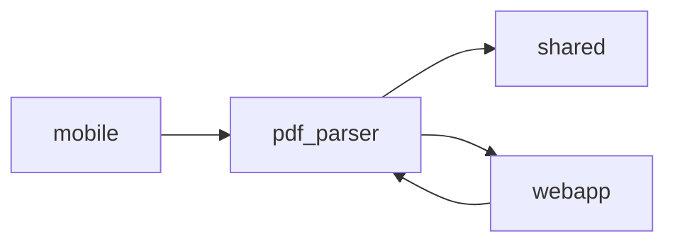

# pdf_parser

> `services/pdf_parser` · python · 65 public symbols

## Purpose
<!-- service-docs:purpose:start -->
Python / FastAPI microservice that parses uploaded bank and credit-card statement PDFs — and scanned images via OCR — into structured transactions (`parse_pdf`, `parse_image`). Routes each file to a bank-specific parser (Bancolombia, Banco de Bogotá, Davivienda, Nu, Falabella, and others) behind `POST /parse`, guarded by a shared `X-Parser-Key` secret, with `health`/`startup_diagnostics` for readiness. Consumed only through the webapp's `/api/parse-statement` proxy during the import wizard; extracts the per-installment cuota per the parser rules.
<!-- service-docs:purpose:end -->

## Service dependencies

**External packages:**
- fastapi
- pdf2image
- pdfplumber
- pytesseract
- python-multipart
- supabase
- uvicorn

## Public surface

<code>(root)</code> — 25 symbols

- `startup_diagnostics` _(function)_ — main.py
- `health` _(function)_ — main.py
- `parse_pdf` _(function)_ — main.py
- `parse_image` _(function)_ — main.py
- `save_for_support` _(function)_ — main.py
- `run` _(function)_ — main.py
- `save_unrecognized` _(function)_ — storage.py
- `print_header` _(function)_ — test_parser.py
- `print_section` _(function)_ — test_parser.py
- `print_debug` _(function)_ — test_parser.py
- `show_raw_text` _(function)_ — test_parser.py
- `show_detection_info` _(function)_ — test_parser.py
- `show_transaction_debug` _(function)_ — test_parser.py
- `show_statement_debug` _(function)_ — test_parser.py
- `export_to_json` _(function)_ — test_parser.py
- `interactive_transaction_editor` _(function)_ — test_parser.py
- `main` _(function)_ — test_parser.py
- `ParseResponse` _(class)_ — main.py
- `StatementType` _(class)_ — models.py
- `TransactionDirection` _(class)_ — models.py
- `ParsedTransaction` _(class)_ — models.py
- `StatementSummary` _(class)_ — models.py
- `CreditCardMetadata` _(class)_ — models.py
- `LoanMetadata` _(class)_ — models.py
- `ParsedStatement` _(class)_ — models.py

<code>parsers</code> — 36 symbols

- `detect_and_parse` _(function)_ — parsers/__init__.py
- `parse_bancolombia_app` _(function)_ — parsers/bancolombia_app_screenshot.py
- `parse_credit_card` _(function)_ — parsers/bancolombia_credit_card.py
- `parse_loan` _(function)_ — parsers/bancolombia_loan.py
- `parse_savings` _(function)_ — parsers/bancolombia_savings.py
- `parse_bancolombia_web` _(function)_ — parsers/bancolombia_web_screenshot.py
- `parse_bogota_credit_card` _(function)_ — parsers/bogota_credit_card.py
- `parse_bogota_loan` _(function)_ — parsers/bogota_loan.py
- `parse_bogota_savings` _(function)_ — parsers/bogota_savings.py
- `n` _(function)_ — parsers/confiar_credit_card.py
- `parse_confiar_credit_card` _(function)_ — parsers/confiar_credit_card.py
- `parse_davivienda_loan` _(function)_ — parsers/davivienda_loan.py
- `parse_davivienda_savings` _(function)_ — parsers/davivienda_savings.py
- `parse_falabella_credit_card` _(function)_ — parsers/falabella_credit_card.py
- `detect_and_parse_image` _(function)_ — parsers/image_detection.py
- `parse_colombian_number` _(function)_ — parsers/image_utils.py
- `strip_icon_artifacts` _(function)_ — parsers/image_utils.py
- `ocr_image` _(function)_ — parsers/image_utils.py
- `ocr_image_with_boxes` _(function)_ — parsers/image_utils.py
- `group_words_into_rows` _(function)_ — parsers/image_utils.py
- `resolve_relative_date` _(function)_ — parsers/image_utils.py
- `parse_lulo_loan` _(function)_ — parsers/lulo_loan.py
- `parse_nequi_app` _(function)_ — parsers/nequi_app_screenshot.py
- `parse_nequi_savings` _(function)_ — parsers/nequi_savings.py
- `parse_nu_credit_card` _(function)_ — parsers/nu_credit_card.py
- `parse_nu_credit_card_app` _(function)_ — parsers/nu_credit_card_app_screenshot.py
- `parse_nu_savings` _(function)_ — parsers/nu_savings.py
- `parse_nu_savings_app` _(function)_ — parsers/nu_savings_app_screenshot.py
- `is_opendataloader_fallback_enabled` _(function)_ — parsers/opendataloader_fallback.py
- `get_opendataloaders_binary` _(function)_ — parsers/opendataloader_fallback.py
- `try_parse_with_opendataloader` _(function)_ — parsers/opendataloader_fallback.py
- `visit` _(function)_ — parsers/opendataloader_fallback.py
- `parse_popular_credit_card` _(function)_ — parsers/popular_credit_card.py
- `parse_us_number` _(function)_ — parsers/utils.py
- `parse_co_number` _(function)_ — parsers/utils.py
- `resolve_year` _(function)_ — parsers/utils.py

<code>tests</code> — 4 symbols

- `test_bancolombia_web_with_bounding_boxes` _(function)_ — tests/test_bancolombia_web_screenshot.py
- `test_parse_colombian_number` _(function)_ — tests/test_nu_savings.py
- `test_nu_savings_no_transactions` _(function)_ — tests/test_nu_savings.py
- `test_nu_savings_parser_via_pdf` _(function)_ — tests/test_nu_savings.py

## Known issues
### Tracked (manual — edit in `services/pdf_parser/SERVICE.md`)
_None tracked._
### Auto-detected
- **TODO** parsers/bogota_savings.py:45 — Extract period dates
- **TODO** parsers/bogota_savings.py:46 — Extract account number
- **TODO** parsers/bogota_savings.py:47 — Extract summary fields
- **TODO** parsers/bogota_savings.py:48 — Parse transaction lines

**Failing tests:**
- (none)

Generated 2026-07-10 by service-docs.
