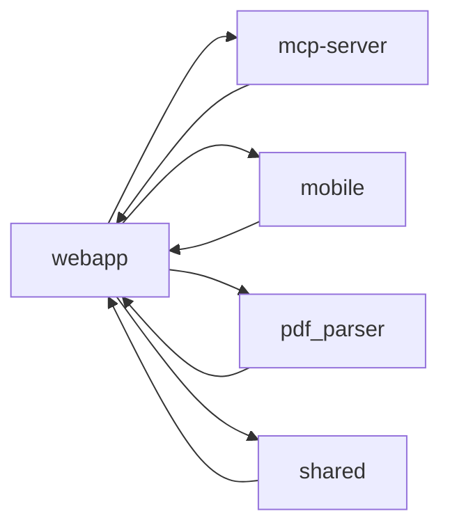

# webapp

> `webapp` · typescript · 1620 public symbols

## Purpose
<!-- service-docs:purpose:start -->
Next.js 15 (App Router) web application — the primary Zeta finance dashboard and the design source of truth for the whole product. Implements the server actions behind accounts, transactions, budgets, budget scenarios, analytics, and Supabase-SSR auth (`getAccounts`, `signIn`, `registerPayment`, `getTendenciasDataset`, …), plus the multi-step statement-import wizard that proxies to the `pdf_parser` service. By far the largest surface in the monorepo; builds its metrics on `@zeta/shared`.
<!-- service-docs:purpose:end -->

## Service dependencies

**External packages:**

22 external packages

- @hookform/resolvers
- @supabase/ssr
- @supabase/supabase-js
- @zeta/shared
- class-variance-authority
- clsx
- cmdk
- date-fns
- lucide-react
- nanoid
- next
- next-themes
- radix-ui
- react
- react-day-picker
- react-dom
- react-hook-form
- recharts
- sonner
- tailwind-merge
- vaul
- zod

## Public surface

<code>.storybook/mocks</code> — 6 symbols

- `Image` _(function)_ — .storybook/mocks/next-image.tsx
- `Link` _(function)_ — .storybook/mocks/next-link.tsx
- `useRouter` _(function)_ — .storybook/mocks/next-navigation.ts
- `usePathname` _(function)_ — .storybook/mocks/next-navigation.ts
- `useSearchParams` _(function)_ — .storybook/mocks/next-navigation.ts
- `useParams` _(function)_ — .storybook/mocks/next-navigation.ts

<code>(root)</code> — 1 symbol

- `middleware` _(function)_ — middleware.ts

<code>src/actions</code> — 379 symbols

- `getAccounts` _(function)_ — src/actions/accounts.ts
- `getAccount` _(function)_ — src/actions/accounts.ts
- `createAccount` _(function)_ — src/actions/accounts.ts
- `updateAccount` _(function)_ — src/actions/accounts.ts
- `setPrimaryAccount` _(function)_ — src/actions/accounts.ts
- `deleteAccount` _(function)_ — src/actions/accounts.ts
- `archiveDebtObligation` _(function)_ — src/actions/accounts.ts
- `toggleDashboardVisibility` _(function)_ — src/actions/accounts.ts
- `reconcileBalance` _(function)_ — src/actions/accounts.ts
- `registerPayment` _(function)_ — src/actions/accounts.ts
- `getAccountSpendingPulse` _(function)_ — src/actions/accounts.ts
- `getAccountTransactions` _(function)_ — src/actions/accounts.ts
- `getAccountBalanceHistory` _(function)_ — src/actions/accounts.ts
- `getTendenciasDataset` _(function)_ — src/actions/analytics.ts
- `getDrilldownTransactions` _(function)_ — src/actions/analytics.ts
- `getAttentionItems` _(function)_ — src/actions/attention-items.ts
- `getAttentionSnapshot` _(function)_ — src/actions/attention.ts
- `signIn` _(function)_ — src/actions/auth.ts
- `signUp` _(function)_ — src/actions/auth.ts
- `signOut` _(function)_ — src/actions/auth.ts
- `resetUserData` _(function)_ — src/actions/auth.ts
- `deleteAccount` _(function)_ — src/actions/auth.ts
- `resetPasswordRequest` _(function)_ — src/actions/auth.ts
- `updatePassword` _(function)_ — src/actions/auth.ts
- `getBudgetScenarios` _(function)_ — src/actions/budget-scenarios.ts
- `saveBudgetScenario` _(function)_ — src/actions/budget-scenarios.ts
- `deleteBudgetScenario` _(function)_ — src/actions/budget-scenarios.ts
- `applyBudgetScenario` _(function)_ — src/actions/budget-scenarios.ts
- `getBudgetMode` _(function)_ — src/actions/budget.ts
- `getHasSavedBudget` _(function)_ — src/actions/budget.ts
- `setBudgetMode` _(function)_ — src/actions/budget.ts
- `bulkUpsertBudgets` _(function)_ — src/actions/budget.ts
- `updateEstimatedIncome` _(function)_ — src/actions/budget.ts
- `getBudgetSummary` _(function)_ — src/actions/budgets.ts
- `upsertBudget` _(function)_ — src/actions/budgets.ts
- `deleteBudget` _(function)_ — src/actions/budgets.ts
- `applyBudgetComposition` _(function)_ — src/actions/budgets.ts
- `deleteBudgetForCategory` _(function)_ — src/actions/budgets.ts
- `getBurnRate` _(function)_ — src/actions/burn-rate.ts
- `getCaptureTokens` _(function)_ — src/actions/capture-tokens.ts
- `createCaptureToken` _(function)_ — src/actions/capture-tokens.ts
- `createTelegramLink` _(function)_ — src/actions/capture-tokens.ts
- `revokeCaptureToken` _(function)_ — src/actions/capture-tokens.ts
- `getPlanningPeriods` _(function)_ — src/actions/cashflow-planner.ts
- `getActivePeriod` _(function)_ — src/actions/cashflow-planner.ts
- `getPeriodPlanData` _(function)_ — src/actions/cashflow-planner.ts
- `createPlanningPeriod` _(function)_ — src/actions/cashflow-planner.ts
- `deletePlanningPeriod` _(function)_ — src/actions/cashflow-planner.ts
- `seedPeriodFromRecurring` _(function)_ — src/actions/cashflow-planner.ts
- `upsertBalanceEnvelopes` _(function)_ — src/actions/cashflow-planner.ts
- `createPlanningEntry` _(function)_ — src/actions/cashflow-planner.ts
- `updatePlanningEntry` _(function)_ — src/actions/cashflow-planner.ts
- `deletePlanningEntry` _(function)_ — src/actions/cashflow-planner.ts
- `toggleEntryStatus` _(function)_ — src/actions/cashflow-planner.ts
- `createAssignment` _(function)_ — src/actions/cashflow-planner.ts
- `toConverted` _(function)_ — src/actions/cashflow-planner.ts
- `updateAssignment` _(function)_ — src/actions/cashflow-planner.ts
- `toConv` _(function)_ — src/actions/cashflow-planner.ts
- `deleteAssignment` _(function)_ — src/actions/cashflow-planner.ts
- `autoAssignExpenses` _(function)_ — src/actions/cashflow-planner.ts
- `findCandidateTransactions` _(function)_ — src/actions/cashflow-planner.ts
- `payPlanningEntry` _(function)_ — src/actions/cashflow-planner.ts
- `confirmIncomeReceived` _(function)_ — src/actions/cashflow-planner.ts
- `getCategories` _(function)_ — src/actions/categories.ts
- `getCategoriesWithBudgets` _(function)_ — src/actions/categories.ts
- `getAllCategoriesForManagement` _(function)_ — src/actions/categories.ts
- `getCategoryTransactionCount` _(function)_ — src/actions/categories.ts
- `getCategoriesWithBudgetData` _(function)_ — src/actions/categories.ts
- `createCategory` _(function)_ — src/actions/categories.ts
- `updateCategory` _(function)_ — src/actions/categories.ts
- `deleteCategory` _(function)_ — src/actions/categories.ts
- `updateCategoryOrder` _(function)_ — src/actions/categories.ts
- `updateCategoryExpenseType` _(function)_ — src/actions/categories.ts
- `reassignAndDeleteCategory` _(function)_ — src/actions/categories.ts
- `toggleCategoryActive` _(function)_ — src/actions/categories.ts
- `getCategoriesByRhythm` _(function)_ — src/actions/categories.ts
- `getUncategorizedTransactions` _(function)_ — src/actions/categorize.ts
- `getUncategorizedCount` _(function)_ — src/actions/categorize.ts
- `getUserCategoryRules` _(function)_ — src/actions/categorize.ts
- `getUnreviewedAutoTransactions` _(function)_ — src/actions/categorize.ts
- `getUnreviewedAutoCount` _(function)_ — src/actions/categorize.ts
- `categorizeTransaction` _(function)_ — src/actions/categorize.ts
- `uncategorizeTransaction` _(function)_ — src/actions/categorize.ts
- `confirmAutoCategory` _(function)_ — src/actions/categorize.ts
- `bulkConfirmAutoCategory` _(function)_ — src/actions/categorize.ts
- `bulkCategorize` _(function)_ — src/actions/categorize.ts
- `assignDestinatario` _(function)_ — src/actions/categorize.ts
- `getDestinatarioSuggestionsForInbox` _(function)_ — src/actions/categorize.ts
- `bulkApplyDestinatarioMatches` _(function)_ — src/actions/categorize.ts
- `removeDestinatarioFromTransaction` _(function)_ — src/actions/categorize.ts
- `getCategorySpending` _(function)_ — src/actions/charts.ts
- `getMonthlyCashflow` _(function)_ — src/actions/charts.ts
- `getDailySpending` _(function)_ — src/actions/charts.ts
- `getMonthMetrics` _(function)_ — src/actions/charts.ts
- `getDailyCashflow` _(function)_ — src/actions/charts.ts
- `getAccountsWithSparklineData` _(function)_ — src/actions/charts.ts
- `getNetWorthHistory` _(function)_ — src/actions/charts.ts
- `getDashboardHeroData` _(function)_ — src/actions/charts.ts
- `getDailyBudgetPace` _(function)_ — src/actions/charts.ts
- `updateDashboardConfig` _(function)_ — src/actions/dashboard-config.ts
- `getDashboardConfig` _(function)_ — src/actions/dashboard-config.ts
- `updateMobileLayout` _(function)_ — src/actions/dashboard-config.ts
- `getMobileLayout` _(function)_ — src/actions/dashboard-config.ts
- `getDashboardConfigWithPurpose` _(function)_ — src/actions/dashboard-config.ts
- `getDebtFreeCountdown` _(function)_ — src/actions/debt-countdown.ts
- `getDebtOverview` _(function)_ — src/actions/debt.ts
- `getDebtTrend` _(function)_ — src/actions/debt.ts
- `getArchivedDebtObligations` _(function)_ — src/actions/debt.ts
- `startDemoSession` _(function)_ — src/actions/demo.ts
- `startGuestSession` _(function)_ — src/actions/demo.ts
- `toggleDemoMode` _(function)_ — src/actions/demo.ts
- `clearDemoData` _(function)_ — src/actions/demo.ts
- `testDestinatarioPattern` _(function)_ — src/actions/destinatarios.ts
- `fetchDestinatarioRules` _(function)_ — src/actions/destinatarios.ts
- `getRecentDestinatarios` _(function)_ — src/actions/destinatarios.ts
- `matchTransactionToDestinatario` _(function)_ — src/actions/destinatarios.ts
- `getDestinatarios` _(function)_ — src/actions/destinatarios.ts
- `getDestinatariosWithSpend` _(function)_ — src/actions/destinatarios.ts
- `getDestinatario` _(function)_ — src/actions/destinatarios.ts
- `getDestinatarioRules` _(function)_ — src/actions/destinatarios.ts
- `createDestinatario` _(function)_ — src/actions/destinatarios.ts
- `updateDestinatario` _(function)_ — src/actions/destinatarios.ts
- `patchDestinatario` _(function)_ — src/actions/destinatarios.ts
- `deleteDestinatario` _(function)_ — src/actions/destinatarios.ts
- `mergeDestinatarios` _(function)_ — src/actions/destinatarios.ts
- `addDestinatarioRule` _(function)_ — src/actions/destinatarios.ts
- `attachPatternToDestinatario` _(function)_ — src/actions/destinatarios.ts
- `removeDestinatarioRule` _(function)_ — src/actions/destinatarios.ts
- `getUnmatchedDescriptions` _(function)_ — src/actions/destinatarios.ts
- `getDestinatarioSuggestions` _(function)_ — src/actions/destinatarios.ts
- `getDestinatarioTransactions` _(function)_ — src/actions/destinatarios.ts
- `getRulesForDestinatario` _(function)_ — src/actions/destinatarios.ts
- `findUnlinkedMatches` _(function)_ — src/actions/destinatarios.ts
- `bulkLinkToDestinatario` _(function)_ — src/actions/destinatarios.ts
- `previewDestinatarioRuleImpact` _(function)_ — src/actions/destinatarios.ts
- `applyDestinatarioRules` _(function)_ — src/actions/destinatarios.ts
- `getEmailIngestAddress` _(function)_ — src/actions/email-ingest.ts
- `getPendingEmailTransactions` _(function)_ — src/actions/email-ingest.ts
- `getPendingEmailCount` _(function)_ — src/actions/email-ingest.ts
- `getEmailIngestLogs` _(function)_ — src/actions/email-ingest.ts
- `getUnrecognizedEmails` _(function)_ — src/actions/email-ingest.ts
- `dismissUnrecognizedEmail` _(function)_ — src/actions/email-ingest.ts
- `retryUnrecognizedEmail` _(function)_ — src/actions/email-ingest.ts
- `retryEmailIngestLog` _(function)_ — src/actions/email-ingest.ts
- `dismissEmailIngestLog` _(function)_ — src/actions/email-ingest.ts
- `generateIngestAddress` _(function)_ — src/actions/email-ingest.ts
- `updateIngestSettings` _(function)_ — src/actions/email-ingest.ts
- `deactivateIngestAddress` _(function)_ — src/actions/email-ingest.ts
- `clearGmailVerification` _(function)_ — src/actions/email-ingest.ts
- `approveEmailTransaction` _(function)_ — src/actions/email-ingest.ts
- `checkEmailReconciliation` _(function)_ — src/actions/email-ingest.ts
- `dismissEmailTransaction` _(function)_ — src/actions/email-ingest.ts
- `bulkApproveEmailTransactions` _(function)_ — src/actions/email-ingest.ts
- `getAllowedSenders` _(function)_ — src/actions/email-ingest.ts
- `addAllowedSender` _(function)_ — src/actions/email-ingest.ts
- `removeAllowedSender` _(function)_ — src/actions/email-ingest.ts
- `getPendingEmailStatements` _(function)_ — src/actions/email-pdf-ingest.ts
- `getPendingEmailStatementCount` _(function)_ — src/actions/email-pdf-ingest.ts
- `dismissEmailPdfStatement` _(function)_ — src/actions/email-pdf-ingest.ts
- `retryPdfParsing` _(function)_ — src/actions/email-pdf-ingest.ts
- `markEmailPdfStatementImported` _(function)_ — src/actions/email-pdf-ingest.ts
- `getExchangeRate` _(function)_ — src/actions/exchange-rate.ts
- `getRatesForCurrencies` _(function)_ — src/actions/exchange-rate.ts
- `getNonDebtAccounts` _(function)_ — src/actions/extra-payment.ts
- `applyExtraDebtPayment` _(function)_ — src/actions/extra-payment.ts
- `getFirstStepsData` _(function)_ — src/actions/guided-experience.ts
- `dismissFirstSteps` _(function)_ — src/actions/guided-experience.ts
- `snoozeFirstSteps` _(function)_ — src/actions/guided-experience.ts
- `setFirstStepsCollapsed` _(function)_ — src/actions/guided-experience.ts
- `getSeenCoachMarks` _(function)_ — src/actions/guided-experience.ts
- `markCoachMarkSeen` _(function)_ — src/actions/guided-experience.ts
- `previewImportReconciliation` _(function)_ — src/actions/import-transactions.ts
- `importTransactions` _(function)_ — src/actions/import-transactions.ts
- `buildInsertRow` _(function)_ — src/actions/import-transactions.ts
- `getEstimatedIncome` _(function)_ — src/actions/income.ts
- `getLiveDashboardData` _(function)_ — src/actions/live-dashboard.ts
- `getModoTransactionIds` _(function)_ — src/actions/modos.ts
- `listModos` _(function)_ — src/actions/modos.ts
- `getModo` _(function)_ — src/actions/modos.ts
- `getModoSummary` _(function)_ — src/actions/modos.ts
- `createModo` _(function)_ — src/actions/modos.ts
- `updateModo` _(function)_ — src/actions/modos.ts
- `deleteModo` _(function)_ — src/actions/modos.ts
- `shareModoTransactions` _(function)_ — src/actions/modos.ts
- `unshareModoTransactions` _(function)_ — src/actions/modos.ts
- `getPendingOccurrencesCached` _(function)_ — src/actions/occurrences.ts
- `getNextIncomeOccurrenceCached` _(function)_ — src/actions/occurrences.ts
- `getNextIncomeOccurrence` _(function)_ — src/actions/occurrences.ts
- `isTransactionLinkedToOccurrence` _(function)_ — src/actions/occurrences.ts
- `getLinkedRecurringForTransaction` _(function)_ — src/actions/occurrences.ts
- `ensureOccurrencesForRange` _(function)_ — src/actions/occurrences.ts
- `ensureCurrentOccurrences` _(function)_ — src/actions/occurrences.ts
- `getOccurrencesForMonth` _(function)_ — src/actions/occurrences.ts
- `getPendingOccurrences` _(function)_ — src/actions/occurrences.ts
- `markOccurrencePaid` _(function)_ — src/actions/occurrences.ts
- `skipOccurrence` _(function)_ — src/actions/occurrences.ts
- `revertOccurrence` _(function)_ — src/actions/occurrences.ts
- `findMatchingOccurrence` _(function)_ — src/actions/occurrences.ts
- `linkTransactionToOccurrence` _(function)_ — src/actions/occurrences.ts
- `linkExistingTransactionToOccurrence` _(function)_ — src/actions/occurrences.ts
- `getCandidateTransactionsForOccurrence` _(function)_ — src/actions/occurrences.ts
- `getCandidateOccurrencesForTransaction` _(function)_ — src/actions/occurrences.ts
- `getAccountIdsWithPendingOccurrences` _(function)_ — src/actions/occurrences.ts
- `finishOnboarding` _(function)_ — src/actions/onboarding.ts
- `skipOnboardingWithDefaults` _(function)_ — src/actions/onboarding.ts
- `getUpcomingPayments` _(function)_ — src/actions/payment-reminders.ts
- `listPdfPasswordsCached` _(function)_ — src/actions/pdf-passwords.ts
- `listPdfPasswords` _(function)_ — src/actions/pdf-passwords.ts
- `suggestPdfPasswordsForAccount` _(function)_ — src/actions/pdf-passwords.ts
- `createPdfPassword` _(function)_ — src/actions/pdf-passwords.ts
- `updatePdfPassword` _(function)_ — src/actions/pdf-passwords.ts
- `deletePdfPassword` _(function)_ — src/actions/pdf-passwords.ts
- `getPersonalDebts` _(function)_ — src/actions/personal-debts.ts
- `getPersonalDebtsOverview` _(function)_ — src/actions/personal-debts.ts
- `createPersonalDebt` _(function)_ — src/actions/personal-debts.ts
- `updatePersonalDebt` _(function)_ — src/actions/personal-debts.ts
- `cancelPersonalDebt` _(function)_ — src/actions/personal-debts.ts
- `deletePersonalDebt` _(function)_ — src/actions/personal-debts.ts
- `settlePersonalDebt` _(function)_ — src/actions/personal-debts.ts
- `reopenPersonalDebt` _(function)_ — src/actions/personal-debts.ts
- `linkTransactionToPersonalDebt` _(function)_ — src/actions/personal-debts.ts
- `getLinkableRepaymentTransactions` _(function)_ — src/actions/personal-debts.ts
- `unlinkTransactionFromPersonalDebt` _(function)_ — src/actions/personal-debts.ts
- `recordRepayment` _(function)_ — src/actions/personal-debts.ts
- `trackProductEvent` _(function)_ — src/actions/product-events.ts
- `trackProductEventForUser` _(function)_ — src/actions/product-events.ts
- `getPreferredCurrency` _(function)_ — src/actions/profile.ts
- `getProfile` _(function)_ — src/actions/profile.ts
- `updateProfile` _(function)_ — src/actions/profile.ts
- `analyzePurchaseDecisionAction` _(function)_ — src/actions/purchase-decision.ts
- `getQuickViewData` _(function)_ — src/actions/quick-view.ts
- `computeRecurringGroupUuid` _(function)_ — src/actions/recurring-templates.ts
- `getRecurringTemplates` _(function)_ — src/actions/recurring-templates.ts
- `getRecurringTemplate` _(function)_ — src/actions/recurring-templates.ts
- `createRecurringTemplate` _(function)_ — src/actions/recurring-templates.ts
- `createRecurringTemplateFromTransaction` _(function)_ — src/actions/recurring-templates.ts
- `updateRecurringTemplate` _(function)_ — src/actions/recurring-templates.ts
- `deleteRecurringTemplate` _(function)_ — src/actions/recurring-templates.ts
- `toggleRecurringTemplate` _(function)_ — src/actions/recurring-templates.ts
- `recordRecurringOccurrencePayment` _(function)_ — src/actions/recurring-templates.ts
- `getUpcomingRecurrences` _(function)_ — src/actions/recurring-templates.ts
- `getRecurringSummary` _(function)_ — src/actions/recurring-templates.ts
- `getRecurringTemplateImpact` _(function)_ — src/actions/recurring-templates.ts
- `mergeRecurringTemplates` _(function)_ — src/actions/recurring-templates.ts
- `splitSubPayment` _(function)_ — src/actions/recurring-templates.ts
- `getMergeableTemplates` _(function)_ — src/actions/recurring-templates.ts
- `createReminder` _(function)_ — src/actions/reminders.ts
- `toggleReminder` _(function)_ — src/actions/reminders.ts
- `updateReminder` _(function)_ — src/actions/reminders.ts
- `postponeReminder` _(function)_ — src/actions/reminders.ts
- `deleteReminder` _(function)_ — src/actions/reminders.ts
- `getRitmo` _(function)_ — src/actions/ritmo.ts
- `getScenarios` _(function)_ — src/actions/scenarios.ts
- `getScenario` _(function)_ — src/actions/scenarios.ts
- `saveScenario` _(function)_ — src/actions/scenarios.ts
- `deleteScenario` _(function)_ — src/actions/scenarios.ts
- `splitExistingTransaction` _(function)_ — src/actions/shared-payments.ts
- `createSharedPayment` _(function)_ — src/actions/shared-payments.ts
- `deleteSharedPayment` _(function)_ — src/actions/shared-payments.ts
- `getSharedPaymentGroups` _(function)_ — src/actions/shared-payments.ts
- `getLatestSnapshotDates` _(function)_ — src/actions/statement-snapshots.ts
- `getStatementSnapshots` _(function)_ — src/actions/statement-snapshots.ts
- `getSubscriptions` _(function)_ — src/actions/subscriptions.ts
- `dismissSubscription` _(function)_ — src/actions/subscriptions.ts
- `markForCancellation` _(function)_ — src/actions/subscriptions.ts
- `cancelSubscription` _(function)_ — src/actions/subscriptions.ts
- `updateSubscription` _(function)_ — src/actions/subscriptions.ts
- `getSubscriptionForTemplate` _(function)_ — src/actions/subscriptions.ts
- `runSubscriptionDetection` _(function)_ — src/actions/subscriptions.ts
- `confirmSubscription` _(function)_ — src/actions/subscriptions.ts
- `formalizeSubscription` _(function)_ — src/actions/subscriptions.ts
- `upsertSubscriptionFromTemplate` _(function)_ — src/actions/subscriptions.ts
- `getTagsForEntity` _(function)_ — src/actions/tags.ts
- `getRecentTags` _(function)_ — src/actions/tags.ts
- `createTagGroup` _(function)_ — src/actions/tags.ts
- `updateTagGroup` _(function)_ — src/actions/tags.ts
- `deleteTagGroup` _(function)_ — src/actions/tags.ts
- `createTag` _(function)_ — src/actions/tags.ts
- `updateTag` _(function)_ — src/actions/tags.ts
- `deleteTag` _(function)_ — src/actions/tags.ts
- `addTagToEntity` _(function)_ — src/actions/tags.ts
- `removeTagFromEntity` _(function)_ — src/actions/tags.ts
- `bulkTagTransactions` _(function)_ — src/actions/tags.ts
- `getTemplateStats` _(function)_ — src/actions/template-stats.ts
- `getTransactions` _(function)_ — src/actions/transactions.ts
- `getMonthlyAggregates` _(function)_ — src/actions/transactions.ts
- `getTransaction` _(function)_ — src/actions/transactions.ts
- `getTransactionLocation` _(function)_ — src/actions/transactions.ts
- `getRecentTransactions` _(function)_ — src/actions/transactions.ts
- `createTransaction` _(function)_ — src/actions/transactions.ts
- `createQuickCaptureTransaction` _(function)_ — src/actions/transactions.ts
- `updateTransaction` _(function)_ — src/actions/transactions.ts
- `updateTransactionAccount` _(function)_ — src/actions/transactions.ts
- `updateTransactionAmountAndDate` _(function)_ — src/actions/transactions.ts
- `updateTransactionNotes` _(function)_ — src/actions/transactions.ts
- `updateTransactionTitle` _(function)_ — src/actions/transactions.ts
- `deleteTransaction` _(function)_ — src/actions/transactions.ts
- `toggleExcludeTransaction` _(function)_ — src/actions/transactions.ts
- `bulkExcludeTransactions` _(function)_ — src/actions/transactions.ts
- `createTransfer` _(function)_ — src/actions/transfers.ts
- `parseVoiceCapture` _(function)_ — src/actions/voice-capture.ts
- `getWeeklyDigest` _(function)_ — src/actions/weekly-digest.ts
- `getWishlistItems` _(function)_ — src/actions/wishlist.ts
- `getWishlistItemsForDashboard` _(function)_ — src/actions/wishlist.ts
- `createWishlistItem` _(function)_ — src/actions/wishlist.ts
- `saveAffordToWishlist` _(function)_ — src/actions/wishlist.ts
- `enrichWishlistItem` _(function)_ — src/actions/wishlist.ts
- `deleteWishlistItem` _(function)_ — src/actions/wishlist.ts
- `markWishlistItemBought` _(function)_ — src/actions/wishlist.ts
- `getFinancialSnapshot` _(function)_ — src/actions/wishlist.ts
- `getWishlistItemsWithFreshScores` _(function)_ — src/actions/wishlist.ts
- `scoreWishlistItem` _(function)_ — src/actions/wishlist.ts
- `submitReflection` _(function)_ — src/actions/wishlist.ts
- `getReflectionsForItem` _(function)_ — src/actions/wishlist.ts
- `getWishlistInsights` _(function)_ — src/actions/wishlist.ts
- `getActiveNudges` _(function)_ — src/actions/wishlist.ts
- `dismissNudge` _(function)_ — src/actions/wishlist.ts
- `getPendingReflections` _(function)_ — src/actions/wishlist.ts
- `AllocationData` _(interface)_ — src/actions/allocation.ts
- `TendenciasDataset` _(interface)_ — src/actions/analytics.ts
- `DrilldownTransaction` _(interface)_ — src/actions/analytics.ts
- `DrilldownParams` _(interface)_ — src/actions/analytics.ts
- `AttentionOverdueReminder` _(interface)_ — src/actions/attention-items.ts
- `AttentionUpcomingPayment` _(interface)_ — src/actions/attention-items.ts
- `AttentionPendingEmail` _(interface)_ — src/actions/attention-items.ts
- `AttentionItems` _(interface)_ — src/actions/attention-items.ts
- `BudgetScenarioRecord` _(interface)_ — src/actions/budget-scenarios.ts
- `BudgetSummary` _(interface)_ — src/actions/budgets.ts
- `BudgetCompositionInput` _(interface)_ — src/actions/budgets.ts
- `BurnRateDataPoint` _(interface)_ — src/actions/burn-rate.ts
- `BurnRateResult` _(interface)_ — src/actions/burn-rate.ts
- `ObligationMarker` _(interface)_ — src/actions/burn-rate.ts
- `BurnRateResponse` _(interface)_ — src/actions/burn-rate.ts
- `PlanCandidateTransaction` _(interface)_ — src/actions/cashflow-planner.ts
- `CategorySpending` _(interface)_ — src/actions/charts.ts
- `MonthlyCashflow` _(interface)_ — src/actions/charts.ts
- `DailySpending` _(interface)_ — src/actions/charts.ts
- `MonthMetrics` _(interface)_ — src/actions/charts.ts
- `DailyCashflow` _(interface)_ — src/actions/charts.ts
- `SparklinePoint` _(interface)_ — src/actions/charts.ts
- `AccountWithSparkline` _(interface)_ — src/actions/charts.ts
- `GroupedAccounts` _(interface)_ — src/actions/charts.ts
- `NetWorthHistory` _(interface)_ — src/actions/charts.ts
- `PendingObligation` _(interface)_ — src/actions/charts.ts
- `DashboardHeroData` _(interface)_ — src/actions/charts.ts
- `DailyBudgetPace` _(interface)_ — src/actions/charts.ts
- `DebtCountdownData` _(interface)_ — src/actions/debt-countdown.ts
- `DebtProgressAccount` _(interface)_ — src/actions/debt-progress.ts
- `LatestDebtSnapshot` _(interface)_ — src/actions/debt-snapshots.ts
- `DebtTrendData` _(interface)_ — src/actions/debt.ts
- `ArchivedObligation` _(interface)_ — src/actions/debt.ts
- `PatternTestResult` _(interface)_ — src/actions/destinatarios.ts
- `ExchangeRateResult` _(interface)_ — src/actions/exchange-rate.ts
- `NonDebtAccount` _(interface)_ — src/actions/extra-payment.ts
- `ExtraPaymentInput` _(interface)_ — src/actions/extra-payment.ts
- `FirstStep` _(interface)_ — src/actions/guided-experience.ts
- `FirstStepsData` _(interface)_ — src/actions/guided-experience.ts
- `HealthMeter` _(interface)_ — src/actions/health-meters.ts
- `HealthMetersData` _(interface)_ — src/actions/health-meters.ts
- `IncomeEstimate` _(interface)_ — src/actions/income.ts
- `InterestPaidData` _(interface)_ — src/actions/interest-paid.ts
- `LiveDashboardData` _(interface)_ — src/actions/live-dashboard.ts
- `NextIncomeInfo` _(interface)_ — src/actions/occurrences.ts
- `RecurringOccurrence` _(interface)_ — src/actions/occurrences.ts
- `LinkedRecurringInfo` _(interface)_ — src/actions/occurrences.ts
- `CandidateTransaction` _(interface)_ — src/actions/occurrences.ts
- `CandidateOccurrence` _(interface)_ — src/actions/occurrences.ts
- `UpcomingPayment` _(interface)_ — src/actions/payment-reminders.ts
- `PersonalDebtsOverview` _(interface)_ — src/actions/personal-debts.ts
- `LinkableTransaction` _(interface)_ — src/actions/personal-debts.ts
- `TimelineDay` _(interface)_ — src/actions/plan-timeline.ts
- `PlanTimelineData` _(interface)_ — src/actions/plan-timeline.ts
- `QuickViewData` _(interface)_ — src/actions/quick-view.ts
- `TemplateImpact` _(interface)_ — src/actions/recurring-templates.ts
- `RitmoData` _(interface)_ — src/actions/ritmo.ts
- `HeatmapDay` _(interface)_ — src/actions/spending-heatmap.ts
- `HeatmapPatterns` _(interface)_ — src/actions/spending-heatmap.ts
- `HeatmapData` _(interface)_ — src/actions/spending-heatmap.ts
- `TemplateStats` _(interface)_ — src/actions/template-stats.ts

<code>src/app</code> — 4 symbols

- `GlobalError` _(function)_ — src/app/global-error.tsx
- `RootLayout` _(function)_ — src/app/layout.tsx
- `NotFound` _(function)_ — src/app/not-found.tsx
- `HomePage` _(function)_ — src/app/page.tsx

<code>src/app/(auth)</code> — 1 symbol

- `AuthLayout` _(function)_ — src/app/(auth)/layout.tsx

<code>src/app/(auth)/forgot-password</code> — 1 symbol

- `ForgotPasswordPage` _(function)_ — src/app/(auth)/forgot-password/page.tsx

<code>src/app/(auth)/login</code> — 1 symbol

- `LoginPage` _(function)_ — src/app/(auth)/login/page.tsx

<code>src/app/(auth)/reset-password</code> — 1 symbol

- `ResetPasswordPage` _(function)_ — src/app/(auth)/reset-password/page.tsx

<code>src/app/(auth)/signup</code> — 1 symbol

- `SignupPage` _(function)_ — src/app/(auth)/signup/page.tsx

<code>src/app/(dashboard)</code> — 3 symbols

- `DashboardError` _(function)_ — src/app/(dashboard)/error.tsx
- `DashboardLayout` _(function)_ — src/app/(dashboard)/layout.tsx
- `Loading` _(function)_ — src/app/(dashboard)/loading.tsx

<code>src/app/(dashboard)/accounts</code> — 1 symbol

- `AccountsPage` _(function)_ — src/app/(dashboard)/accounts/page.tsx

<code>src/app/(dashboard)/accounts/[id]</code> — 1 symbol

- `AccountDetailPage` _(function)_ — src/app/(dashboard)/accounts/[id]/page.tsx

<code>src/app/(dashboard)/categories</code> — 1 symbol

- `CategoriesPage` _(function)_ — src/app/(dashboard)/categories/page.tsx

<code>src/app/(dashboard)/categorizar</code> — 1 symbol

- `CategorizarPage` _(function)_ — src/app/(dashboard)/categorizar/page.tsx

<code>src/app/(dashboard)/dashboard</code> — 2 symbols

- `DashboardLoading` _(function)_ — src/app/(dashboard)/dashboard/loading.tsx
- `DashboardPage` _(function)_ — src/app/(dashboard)/dashboard/page.tsx

<code>src/app/(dashboard)/deseos</code> — 1 symbol

- `DeseosPage` _(function)_ — src/app/(dashboard)/deseos/page.tsx

<code>src/app/(dashboard)/destinatarios</code> — 1 symbol

- `DestinatariosPage` _(function)_ — src/app/(dashboard)/destinatarios/page.tsx

<code>src/app/(dashboard)/destinatarios/[id]</code> — 1 symbol

- `DestinatarioDetailPage` _(function)_ — src/app/(dashboard)/destinatarios/[id]/page.tsx

<code>src/app/(dashboard)/deudas</code> — 1 symbol

- `DeudasPage` _(function)_ — src/app/(dashboard)/deudas/page.tsx

<code>src/app/(dashboard)/deudas-personales</code> — 1 symbol

- `PersonasPage` _(function)_ — src/app/(dashboard)/deudas-personales/page.tsx

<code>src/app/(dashboard)/deudas-personales/pago-compartido/nuevo</code> — 1 symbol

- `NuevoPagoCompartidoPage` _(function)_ — src/app/(dashboard)/deudas-personales/pago-compartido/nuevo/page.tsx

<code>src/app/(dashboard)/deudas/planificador</code> — 1 symbol

- `PlanificadorPage` _(function)_ — src/app/(dashboard)/deudas/planificador/page.tsx

<code>src/app/(dashboard)/etiquetas</code> — 1 symbol

- `EtiquetasPage` _(function)_ — src/app/(dashboard)/etiquetas/page.tsx

<code>src/app/(dashboard)/gestionar</code> — 1 symbol

- `MasPage` _(function)_ — src/app/(dashboard)/gestionar/page.tsx

<code>src/app/(dashboard)/import</code> — 1 symbol

- `ImportPage` _(function)_ — src/app/(dashboard)/import/page.tsx

<code>src/app/(dashboard)/modos</code> — 1 symbol

- `ModosPage` _(function)_ — src/app/(dashboard)/modos/page.tsx

<code>src/app/(dashboard)/modos/[id]</code> — 1 symbol

- `ModoDetailPage` _(function)_ — src/app/(dashboard)/modos/[id]/page.tsx

<code>src/app/(dashboard)/pendientes</code> — 1 symbol

- `PendientesPage` _(function)_ — src/app/(dashboard)/pendientes/page.tsx

<code>src/app/(dashboard)/plan</code> — 1 symbol

- `PlanPage` _(function)_ — src/app/(dashboard)/plan/page.tsx

<code>src/app/(dashboard)/plan/periodo</code> — 1 symbol

- `PeriodoPage` _(function)_ — src/app/(dashboard)/plan/periodo/page.tsx

<code>src/app/(dashboard)/presupuesto</code> — 1 symbol

- `PresupuestoPage` _(function)_ — src/app/(dashboard)/presupuesto/page.tsx

<code>src/app/(dashboard)/presupuesto/armar</code> — 1 symbol

- `ArmarPresupuestoPage` _(function)_ — src/app/(dashboard)/presupuesto/armar/page.tsx

<code>src/app/(dashboard)/puedo-pagar</code> — 1 symbol

- `PuedoPagarPage` _(function)_ — src/app/(dashboard)/puedo-pagar/page.tsx

<code>src/app/(dashboard)/recurrentes</code> — 1 symbol

- `RecurrentesPage` _(function)_ — src/app/(dashboard)/recurrentes/page.tsx

<code>src/app/(dashboard)/recurrentes/[id]/edit</code> — 1 symbol

- `EditRecurrentePage` _(function)_ — src/app/(dashboard)/recurrentes/[id]/edit/page.tsx

<code>src/app/(dashboard)/recurrentes/new</code> — 1 symbol

- `NewRecurrentePage` _(function)_ — src/app/(dashboard)/recurrentes/new/page.tsx

<code>src/app/(dashboard)/settings</code> — 1 symbol

- `SettingsPage` _(function)_ — src/app/(dashboard)/settings/page.tsx

<code>src/app/(dashboard)/settings/analytics</code> — 1 symbol

- `AnalyticsPage` _(function)_ — src/app/(dashboard)/settings/analytics/page.tsx

<code>src/app/(dashboard)/settings/email</code> — 1 symbol

- `EmailSettingsPage` _(function)_ — src/app/(dashboard)/settings/email/page.tsx

<code>src/app/(dashboard)/settings/etiquetas</code> — 1 symbol

- `EtiquetasSettingsPage` _(function)_ — src/app/(dashboard)/settings/etiquetas/page.tsx

<code>src/app/(dashboard)/settings/integraciones</code> — 1 symbol

- `IntegracionesSettingsPage` _(function)_ — src/app/(dashboard)/settings/integraciones/page.tsx

<code>src/app/(dashboard)/settings/pdf-passwords</code> — 1 symbol

- `PdfPasswordsSettingsPage` _(function)_ — src/app/(dashboard)/settings/pdf-passwords/page.tsx

<code>src/app/(dashboard)/settings/perfil</code> — 1 symbol

- `PerfilSettingsPage` _(function)_ — src/app/(dashboard)/settings/perfil/page.tsx

<code>src/app/(dashboard)/settings/reportar-bug</code> — 1 symbol

- `ReportarBugSettingsPage` _(function)_ — src/app/(dashboard)/settings/reportar-bug/page.tsx

<code>src/app/(dashboard)/suscripciones</code> — 1 symbol

- `SuscripcionesPage` _(function)_ — src/app/(dashboard)/suscripciones/page.tsx

<code>src/app/(dashboard)/tendencias</code> — 2 symbols

- `Loading` _(function)_ — src/app/(dashboard)/tendencias/loading.tsx
- `TendenciasPage` _(function)_ — src/app/(dashboard)/tendencias/page.tsx

<code>src/app/(dashboard)/transactions</code> — 1 symbol

- `TransactionsPage` _(function)_ — src/app/(dashboard)/transactions/page.tsx

<code>src/app/(dashboard)/transactions/[id]</code> — 20 symbols

- `TransactionDetailLoading` _(function)_ — src/app/(dashboard)/transactions/[id]/loading.tsx
- `TransactionDetailPage` _(function)_ — src/app/(dashboard)/transactions/[id]/page.tsx
- `TransactionDetailClient` _(function)_ — src/app/(dashboard)/transactions/[id]/transaction-detail-client.tsx
- `handleAccountSelect` _(function)_ — src/app/(dashboard)/transactions/[id]/transaction-detail-client.tsx
- `openEditData` _(function)_ — src/app/(dashboard)/transactions/[id]/transaction-detail-client.tsx
- `handleSaveData` _(function)_ — src/app/(dashboard)/transactions/[id]/transaction-detail-client.tsx
- `handleCategorySelect` _(function)_ — src/app/(dashboard)/transactions/[id]/transaction-detail-client.tsx
- `handleTitleOpen` _(function)_ — src/app/(dashboard)/transactions/[id]/transaction-detail-client.tsx
- `handleTitleBlur` _(function)_ — src/app/(dashboard)/transactions/[id]/transaction-detail-client.tsx
- `runAssign` _(function)_ — src/app/(dashboard)/transactions/[id]/transaction-detail-client.tsx
- `runRemoveDestinatario` _(function)_ — src/app/(dashboard)/transactions/[id]/transaction-detail-client.tsx
- `handleUseDestAsTitle` _(function)_ — src/app/(dashboard)/transactions/[id]/transaction-detail-client.tsx
- `handleDestSelect` _(function)_ — src/app/(dashboard)/transactions/[id]/transaction-detail-client.tsx
- `handleRemoveTag` _(function)_ — src/app/(dashboard)/transactions/[id]/transaction-detail-client.tsx
- `handleNotesBlur` _(function)_ — src/app/(dashboard)/transactions/[id]/transaction-detail-client.tsx
- `handleNotesOpen` _(function)_ — src/app/(dashboard)/transactions/[id]/transaction-detail-client.tsx
- `handleOpenLinkPicker` _(function)_ — src/app/(dashboard)/transactions/[id]/transaction-detail-client.tsx
- `handleConfirmLink` _(function)_ — src/app/(dashboard)/transactions/[id]/transaction-detail-client.tsx
- `handleToggleExclude` _(function)_ — src/app/(dashboard)/transactions/[id]/transaction-detail-client.tsx
- `handleDelete` _(function)_ — src/app/(dashboard)/transactions/[id]/transaction-detail-client.tsx

<code>src/app/(dashboard)/transactions/new</code> — 1 symbol

- `NewTransactionPage` _(function)_ — src/app/(dashboard)/transactions/new/page.tsx

<code>src/app/api/_shared</code> — 2 symbols

- `getRequestUser` _(function)_ — src/app/api/_shared/auth.ts
- `authenticateCaptureToken` _(function)_ — src/app/api/_shared/capture-auth.ts

<code>src/app/api/bug-reports</code> — 1 symbol

- `POST` _(function)_ — src/app/api/bug-reports/route.ts

<code>src/app/api/cache/onboarding-complete</code> — 1 symbol

- `POST` _(function)_ — src/app/api/cache/onboarding-complete/route.ts

<code>src/app/api/capture</code> — 1 symbol

- `POST` _(function)_ — src/app/api/capture/route.ts

<code>src/app/api/mcp/accounts</code> — 1 symbol

- `GET` _(function)_ — src/app/api/mcp/accounts/route.ts

<code>src/app/api/mcp/budgets</code> — 1 symbol

- `GET` _(function)_ — src/app/api/mcp/budgets/route.ts

<code>src/app/api/mcp/debts</code> — 1 symbol

- `GET` _(function)_ — src/app/api/mcp/debts/route.ts

<code>src/app/api/mcp/summary</code> — 1 symbol

- `GET` _(function)_ — src/app/api/mcp/summary/route.ts

<code>src/app/api/mcp/transactions</code> — 1 symbol

- `GET` _(function)_ — src/app/api/mcp/transactions/route.ts

<code>src/app/api/parse-image</code> — 1 symbol

- `POST` _(function)_ — src/app/api/parse-image/route.ts

<code>src/app/api/parse-statement</code> — 1 symbol

- `POST` _(function)_ — src/app/api/parse-statement/route.ts

<code>src/app/api/save-unrecognized</code> — 1 symbol

- `POST` _(function)_ — src/app/api/save-unrecognized/route.ts

<code>src/app/api/webhooks/email-ingest</code> — 1 symbol

- `POST` _(function)_ — src/app/api/webhooks/email-ingest/route.ts

<code>src/app/api/webhooks/telegram</code> — 1 symbol

- `POST` _(function)_ — src/app/api/webhooks/telegram/route.ts

<code>src/app/api/webhooks/telegram/setup</code> — 1 symbol

- `GET` _(function)_ — src/app/api/webhooks/telegram/setup/route.ts

<code>src/app/auth/callback</code> — 1 symbol

- `GET` _(function)_ — src/app/auth/callback/route.ts

<code>src/app/eliminar-cuenta</code> — 1 symbol

- `EliminarCuentaPage` _(function)_ — src/app/eliminar-cuenta/page.tsx

<code>src/app/onboarding</code> — 2 symbols

- `OnboardingLayout` _(function)_ — src/app/onboarding/layout.tsx
- `OnboardingPage` _(function)_ — src/app/onboarding/page.tsx

<code>src/app/privacy</code> — 1 symbol

- `PrivacyPage` _(function)_ — src/app/privacy/page.tsx

<code>src/app/privacy/en</code> — 1 symbol

- `PrivacyEnPage` _(function)_ — src/app/privacy/en/page.tsx

<code>src/app/terms</code> — 1 symbol

- `TermsPage` _(function)_ — src/app/terms/page.tsx

<code>src/app/terms/en</code> — 1 symbol

- `TermsEnPage` _(function)_ — src/app/terms/en/page.tsx

<code>src/components</code> — 2 symbols

- `MonthSelector` _(function)_ — src/components/month-selector.tsx
- `navigateToMonth` _(function)_ — src/components/month-selector.tsx

<code>src/components/accounts</code> — 40 symbols

- `AccountCard` _(function)_ — src/components/accounts/account-card.tsx
- `AccountFormDialog` _(function)_ — src/components/accounts/account-form-dialog.tsx
- `AccountHero` _(function)_ — src/components/accounts/account-hero.tsx
- `AccountIcon` _(function)_ — src/components/accounts/account-icon.tsx
- `AccountRowIdentity` _(function)_ — src/components/accounts/account-row-identity.tsx
- `AccountsSection` _(function)_ — src/components/accounts/accounts-section.tsx
- `BalanceGraphHero` _(function)_ — src/components/accounts/balance-graph-hero.tsx
- `CardFace` _(function)_ — src/components/accounts/card-face.tsx
- `filterByRange` _(function)_ — src/components/accounts/chart-utils.tsx
- `formatAxisDate` _(function)_ — src/components/accounts/chart-utils.tsx
- `formatAxisAmount` _(function)_ — src/components/accounts/chart-utils.tsx
- `ChartTooltip` _(function)_ — src/components/accounts/chart-utils.tsx
- `CompactTransactionRow` _(function)_ — src/components/accounts/compact-transaction-row.tsx
- `DeleteAccountButton` _(function)_ — src/components/accounts/delete-account-button.tsx
- `handleDelete` _(function)_ — src/components/accounts/delete-account-button.tsx
- `FlipZone` _(function)_ — src/components/accounts/flip-zone.tsx
- `GraphFace` _(function)_ — src/components/accounts/graph-face.tsx
- `QuickActionsBar` _(function)_ — src/components/accounts/quick-actions-bar.tsx
- `handleDelete` _(function)_ — src/components/accounts/quick-actions-bar.tsx
- `handleMakePrimary` _(function)_ — src/components/accounts/quick-actions-bar.tsx
- `handleArchive` _(function)_ — src/components/accounts/quick-actions-bar.tsx
- `renderAction` _(function)_ — src/components/accounts/quick-actions-bar.tsx
- `QuickPaymentDialog` _(function)_ — src/components/accounts/quick-payment-dialog.tsx
- `handleOpenChange` _(function)_ — src/components/accounts/quick-payment-dialog.tsx
- `handleSubmit` _(function)_ — src/components/accounts/quick-payment-dialog.tsx
- `RangePills` _(function)_ — src/components/accounts/range-pills.tsx
- `scrollBy` _(function)_ — src/components/accounts/range-pills.tsx
- `RecentTransactions` _(function)_ — src/components/accounts/recent-transactions.tsx
- `loadMore` _(function)_ — src/components/accounts/recent-transactions.tsx
- `ReconcileBalanceDialog` _(function)_ — src/components/accounts/reconcile-balance-dialog.tsx
- `handleOpenChange` _(function)_ — src/components/accounts/reconcile-balance-dialog.tsx
- `handleSubmit` _(function)_ — src/components/accounts/reconcile-balance-dialog.tsx
- `SpecializedAccountForm` _(function)_ — src/components/accounts/specialized-account-form.tsx
- `SpendingPulseHero` _(function)_ — src/components/accounts/spending-pulse-hero.tsx
- `StatementHistoryTimeline` _(function)_ — src/components/accounts/statement-history-timeline.tsx
- `StatementSnapshotsCard` _(function)_ — src/components/accounts/statement-snapshots-card.tsx
- `TransferDialog` _(function)_ — src/components/accounts/transfer-dialog.tsx
- `SnapshotPoint` _(interface)_ — src/components/accounts/account-detail-types.ts
- `DailyPoint` _(interface)_ — src/components/accounts/account-detail-types.ts
- `AccountIdentity` _(interface)_ — src/components/accounts/account-row-identity.tsx

<code>src/components/afford</code> — 4 symbols

- `AffordPageClient` _(function)_ — src/components/afford/afford-page-client.tsx
- `handleAnalyze` _(function)_ — src/components/afford/afford-page-client.tsx
- `handleSaveToWishlist` _(function)_ — src/components/afford/afford-page-client.tsx
- `handleReset` _(function)_ — src/components/afford/afford-page-client.tsx

<code>src/components/app</code> — 2 symbols

- `BrandIcon` _(function)_ — src/components/app/brand-icon.tsx
- `ServerActionRecovery` _(function)_ — src/components/app/server-action-recovery.tsx

<code>src/components/auth</code> — 8 symbols

- `AuthSessionShortcuts` _(function)_ — src/components/auth/auth-session-shortcuts.tsx
- `ForgotPasswordForm` _(function)_ — src/components/auth/forgot-password-form.tsx
- `LoginForm` _(function)_ — src/components/auth/login-form.tsx
- `OAuthButtons` _(function)_ — src/components/auth/oauth-buttons.tsx
- `signIn` _(function)_ — src/components/auth/oauth-buttons.tsx
- `PasswordInput` _(function)_ — src/components/auth/password-input.tsx
- `ResetPasswordForm` _(function)_ — src/components/auth/reset-password-form.tsx
- `SignupForm` _(function)_ — src/components/auth/signup-form.tsx

<code>src/components/budget</code> — 54 symbols

- `AllocationBars5030` _(function)_ — src/components/budget/allocation-bars-5030.tsx
- `BudgetAjustesSheet` _(function)_ — src/components/budget/budget-ajustes-sheet.tsx
- `handleModeChange` _(function)_ — src/components/budget/budget-ajustes-sheet.tsx
- `handleIncomeSave` _(function)_ — src/components/budget/budget-ajustes-sheet.tsx
- `BudgetBuilder` _(function)_ — src/components/budget/budget-builder.tsx
- `groupWithCreated` _(function)_ — src/components/budget/budget-builder.tsx
- `groupTotal` _(function)_ — src/components/budget/budget-builder.tsx
- `setLine` _(function)_ — src/components/budget/budget-builder.tsx
- `removeLine` _(function)_ — src/components/budget/budget-builder.tsx
- `handleCreateSub` _(function)_ — src/components/budget/budget-builder.tsx
- `handleSave` _(function)_ — src/components/budget/budget-builder.tsx
- `handleExit` _(function)_ — src/components/budget/budget-builder.tsx
- `renderGroup` _(function)_ — src/components/budget/budget-builder.tsx
- `addCategory` _(function)_ — src/components/budget/budget-builder.tsx
- `removeCategory` _(function)_ — src/components/budget/budget-builder.tsx
- `renderAddRow` _(function)_ — src/components/budget/budget-builder.tsx
- `BudgetCategoryAddSheet` _(function)_ — src/components/budget/budget-category-add-sheet.tsx
- `BudgetCategoryCard` _(function)_ — src/components/budget/budget-category-card.tsx
- `BudgetCategoryGrid` _(function)_ — src/components/budget/budget-category-grid.tsx
- `handleSetBudget` _(function)_ — src/components/budget/budget-category-grid.tsx
- `handleSave` _(function)_ — src/components/budget/budget-category-grid.tsx
- `handleCancel` _(function)_ — src/components/budget/budget-category-grid.tsx
- `handleDelete` _(function)_ — src/components/budget/budget-category-grid.tsx
- `BudgetComposerSheet` _(function)_ — src/components/budget/budget-composer-sheet.tsx
- `handleSave` _(function)_ — src/components/budget/budget-composer-sheet.tsx
- `BudgetEditorSheet` _(function)_ — src/components/budget/budget-editor-sheet.tsx
- `handleSave` _(function)_ — src/components/budget/budget-editor-sheet.tsx
- `handleDelete` _(function)_ — src/components/budget/budget-editor-sheet.tsx
- `BudgetGroupLines` _(function)_ — src/components/budget/budget-group-lines.tsx
- `suggestionAmount` _(function)_ — src/components/budget/budget-group-lines.tsx
- `handleCreate` _(function)_ — src/components/budget/budget-group-lines.tsx
- `BudgetSummaryBar` _(function)_ — src/components/budget/budget-summary-bar.tsx
- `sumSelectedTx` _(function)_ — src/components/budget/budget-tx-picker-sheet.tsx
- `BudgetTxPickerSheet` _(function)_ — src/components/budget/budget-tx-picker-sheet.tsx
- `handleConfirm` _(function)_ — src/components/budget/budget-tx-picker-sheet.tsx
- `BudgetWizard` _(function)_ — src/components/budget/budget-wizard.tsx
- `handleStartBuilding` _(function)_ — src/components/budget/budget-wizard.tsx
- `CategoryManageList` _(function)_ — src/components/budget/category-manage-list.tsx
- `handleAddSubcategory` _(function)_ — src/components/budget/category-manage-list.tsx
- `handleDeleteSubcategory` _(function)_ — src/components/budget/category-manage-list.tsx
- `handleToggleActive` _(function)_ — src/components/budget/category-manage-list.tsx
- `DashboardBudgetBar` _(function)_ — src/components/budget/dashboard-budget-bar.tsx
- `MobileBudgetList` _(function)_ — src/components/budget/mobile-budget-list.tsx
- `openEditor` _(function)_ — src/components/budget/mobile-budget-list.tsx
- `handleSaved` _(function)_ — src/components/budget/mobile-budget-list.tsx
- `handleDeleted` _(function)_ — src/components/budget/mobile-budget-list.tsx
- `MonthPlanner` _(function)_ — src/components/budget/month-planner.tsx
- `handleOpen` _(function)_ — src/components/budget/month-planner.tsx
- `useAverage` _(function)_ — src/components/budget/month-planner.tsx
- `handleSaveAll` _(function)_ — src/components/budget/month-planner.tsx
- `RhythmView` _(function)_ — src/components/budget/rhythm-view.tsx
- `TrendComparison` _(function)_ — src/components/budget/trend-comparison.tsx
- `BudgetCategoryAddSheetProps` _(interface)_ — src/components/budget/budget-category-add-sheet.tsx
- `BudgetTxPickerSheetProps` _(interface)_ — src/components/budget/budget-tx-picker-sheet.tsx

<code>src/components/budget/scenario</code> — 25 symbols

- `ScenarioSaveSheet` _(function)_ — src/components/budget/scenario/scenario-commit.tsx
- `ScenarioApplySheet` _(function)_ — src/components/budget/scenario/scenario-commit.tsx
- `ScenarioEditorFooter` _(function)_ — src/components/budget/scenario/scenario-editor.tsx
- `ScenarioEditor` _(function)_ — src/components/budget/scenario/scenario-editor.tsx
- `ScenarioEntryButton` _(function)_ — src/components/budget/scenario/scenario-entry.tsx
- `ScenarioEntrySheet` _(function)_ — src/components/budget/scenario/scenario-entry.tsx
- `SavedScenarios` _(function)_ — src/components/budget/scenario/scenario-entry.tsx
- `ScenarioHero` _(function)_ — src/components/budget/scenario/scenario-hero.tsx
- `lineFromCategory` _(function)_ — src/components/budget/scenario/scenario-model.ts
- `createDraft` _(function)_ — src/components/budget/scenario/scenario-model.ts
- `normalizeVerdict` _(function)_ — src/components/budget/scenario/scenario-model.ts
- `ScenarioSandbox` _(function)_ — src/components/budget/scenario/scenario-sandbox.tsx
- `ScenarioEntryPoint` _(function)_ — src/components/budget/scenario/scenario-section.tsx
- `ScenarioSection` _(function)_ — src/components/budget/scenario/scenario-section.tsx
- `ScenTag` _(function)_ — src/components/budget/scenario/scenario-shared.tsx
- `NuevoBadge` _(function)_ — src/components/budget/scenario/scenario-shared.tsx
- `FijoBadge` _(function)_ — src/components/budget/scenario/scenario-shared.tsx
- `DeltaChip` _(function)_ — src/components/budget/scenario/scenario-shared.tsx
- `AffordChip` _(function)_ — src/components/budget/scenario/scenario-shared.tsx
- `PromAnchor` _(function)_ — src/components/budget/scenario/scenario-shared.tsx
- `ScenarioStartup` _(function)_ — src/components/budget/scenario/scenario-startup.tsx
- `ScenarioVerdict` _(function)_ — src/components/budget/scenario/scenario-verdict.tsx
- `ScenarioCategoryOption` _(interface)_ — src/components/budget/scenario/scenario-model.ts
- `ScenarioDeseoOption` _(interface)_ — src/components/budget/scenario/scenario-model.ts
- `ScenarioSandboxProps` _(interface)_ — src/components/budget/scenario/scenario-sandbox.tsx

<code>src/components/cashflow-planner</code> — 38 symbols

- `AssignmentDialog` _(function)_ — src/components/cashflow-planner/assignment-dialog.tsx
- `handleSelectIncome` _(function)_ — src/components/cashflow-planner/assignment-dialog.tsx
- `handleAssign` _(function)_ — src/components/cashflow-planner/assignment-dialog.tsx
- `AutoAssignButton` _(function)_ — src/components/cashflow-planner/auto-assign-button.tsx
- `handleAutoAssign` _(function)_ — src/components/cashflow-planner/auto-assign-button.tsx
- `BalanceSeedButton` _(function)_ — src/components/cashflow-planner/balance-seed-button.tsx
- `handleClick` _(function)_ — src/components/cashflow-planner/balance-seed-button.tsx
- `ConfirmIncomeDialog` _(function)_ — src/components/cashflow-planner/confirm-income-dialog.tsx
- `handleConfirm` _(function)_ — src/components/cashflow-planner/confirm-income-dialog.tsx
- `handleLink` _(function)_ — src/components/cashflow-planner/confirm-income-dialog.tsx
- `handleMarkOnly` _(function)_ — src/components/cashflow-planner/confirm-income-dialog.tsx
- `EditEntryDialog` _(function)_ — src/components/cashflow-planner/edit-entry-dialog.tsx
- `handleSubmit` _(function)_ — src/components/cashflow-planner/edit-entry-dialog.tsx
- `EntryFormDialog` _(function)_ — src/components/cashflow-planner/entry-form-dialog.tsx
- `handleSubmit` _(function)_ — src/components/cashflow-planner/entry-form-dialog.tsx
- `EnvelopeBoard` _(function)_ — src/components/cashflow-planner/envelope-board.tsx
- `openAssignDialog` _(function)_ — src/components/cashflow-planner/envelope-board.tsx
- `openEditDialog` _(function)_ — src/components/cashflow-planner/envelope-board.tsx
- `openConfirmDialog` _(function)_ — src/components/cashflow-planner/envelope-board.tsx
- `openPayDialog` _(function)_ — src/components/cashflow-planner/envelope-board.tsx
- `ExpenseEntryRow` _(function)_ — src/components/cashflow-planner/expense-entry-row.tsx
- `setStatus` _(function)_ — src/components/cashflow-planner/expense-entry-row.tsx
- `handleDelete` _(function)_ — src/components/cashflow-planner/expense-entry-row.tsx
- `IncomeEnvelopeCard` _(function)_ — src/components/cashflow-planner/income-envelope-card.tsx
- `handleRemoveAssignment` _(function)_ — src/components/cashflow-planner/income-envelope-card.tsx
- `handleToggleStatus` _(function)_ — src/components/cashflow-planner/income-envelope-card.tsx
- `handleDelete` _(function)_ — src/components/cashflow-planner/income-envelope-card.tsx
- `PayExpenseDialog` _(function)_ — src/components/cashflow-planner/pay-expense-dialog.tsx
- `getEffectiveAmount` _(function)_ — src/components/cashflow-planner/pay-expense-dialog.tsx
- `handleLinkTransaction` _(function)_ — src/components/cashflow-planner/pay-expense-dialog.tsx
- `handleCreatePayment` _(function)_ — src/components/cashflow-planner/pay-expense-dialog.tsx
- `PeriodHeader` _(function)_ — src/components/cashflow-planner/period-header.tsx
- `PeriodHero` _(function)_ — src/components/cashflow-planner/period-hero.tsx
- `PeriodSetupDialog` _(function)_ — src/components/cashflow-planner/period-setup-dialog.tsx
- `handlePresetChange` _(function)_ — src/components/cashflow-planner/period-setup-dialog.tsx
- `handleSubmit` _(function)_ — src/components/cashflow-planner/period-setup-dialog.tsx
- `SyncRecurringButton` _(function)_ — src/components/cashflow-planner/sync-recurring-button.tsx
- `handleClick` _(function)_ — src/components/cashflow-planner/sync-recurring-button.tsx

<code>src/components/categories</code> — 20 symbols

- `CategoryFormModal` _(function)_ — src/components/categories/category-form-modal.tsx
- `handleSubmit` _(function)_ — src/components/categories/category-form-modal.tsx
- `CategoryIcon` _(function)_ — src/components/categories/category-icon.tsx
- `getLucideIcon` _(function)_ — src/components/categories/category-icon.tsx
- `CategoryZoneManager` _(function)_ — src/components/categories/category-zone-manager.tsx
- `CategoryZonePicker` _(function)_ — src/components/categories/category-zone-picker.tsx
- `handleOpen` _(function)_ — src/components/categories/category-zone-picker.tsx
- `handleSelect` _(function)_ — src/components/categories/category-zone-picker.tsx
- `CategoryPickerBody` _(function)_ — src/components/categories/category-zone-picker.tsx
- `ColorPicker` _(function)_ — src/components/categories/color-picker.tsx
- `DeleteCategoryModal` _(function)_ — src/components/categories/delete-category-modal.tsx
- `handleNext` _(function)_ — src/components/categories/delete-category-modal.tsx
- `handleConfirm` _(function)_ — src/components/categories/delete-category-modal.tsx
- `IconPicker` _(function)_ — src/components/categories/icon-picker.tsx
- `InlineCategoryForm` _(function)_ — src/components/categories/inline-category-form.tsx
- `handleSubmit` _(function)_ — src/components/categories/inline-category-form.tsx
- `SubcategoryChip` _(function)_ — src/components/categories/subcategory-chip.tsx
- `ZoneTile` _(function)_ — src/components/categories/zone-tile.tsx
- `CategoryPickerBodyProps` _(interface)_ — src/components/categories/category-zone-picker.tsx
- `CreatedCategoryInfo` _(interface)_ — src/components/categories/inline-category-form.tsx

<code>src/components/categorize</code> — 13 symbols

- `AutoReviewRow` _(function)_ — src/components/categorize/auto-review-row.tsx
- `BulkActionBar` _(function)_ — src/components/categorize/bulk-action-bar.tsx
- `CategoryInbox` _(function)_ — src/components/categorize/category-inbox.tsx
- `InboxTransactionRow` _(function)_ — src/components/categorize/inbox-transaction-row.tsx
- `handleSelectCategory` _(function)_ — src/components/categorize/inbox-transaction-row.tsx
- `handleConfirm` _(function)_ — src/components/categorize/inbox-transaction-row.tsx
- `handleConfirmAll` _(function)_ — src/components/categorize/inbox-transaction-row.tsx
- `handleCancelConfirm` _(function)_ — src/components/categorize/inbox-transaction-row.tsx
- `MobileCategoryInbox` _(function)_ — src/components/categorize/mobile-category-inbox.tsx
- `handleCategorized` _(function)_ — src/components/categorize/mobile-category-inbox.tsx
- `handleBulkApplySimilar` _(function)_ — src/components/categorize/mobile-category-inbox.tsx
- `handleAutoReviewConfirmed` _(function)_ — src/components/categorize/mobile-category-inbox.tsx
- `handleBulkConfirmAll` _(function)_ — src/components/categorize/mobile-category-inbox.tsx

<code>src/components/charts</code> — 12 symbols

- `BalanceHistoryChart` _(function)_ — src/components/charts/balance-history-chart.tsx
- `BudgetPaceChart` _(function)_ — src/components/charts/budget-pace-chart.tsx
- `CashFlowViewToggle` _(function)_ — src/components/charts/cash-flow-view-toggle.tsx
- `CategoryDonut` _(function)_ — src/components/charts/category-donut.tsx
- `DailySpendingChart` _(function)_ — src/components/charts/daily-spending-chart.tsx
- `EnhancedCashflowChart` _(function)_ — src/components/charts/enhanced-cashflow-chart.tsx
- `IncomeVsExpensesChart` _(function)_ — src/components/charts/income-vs-expenses-chart.tsx
- `MonthlyCashflowChart` _(function)_ — src/components/charts/monthly-cashflow-chart.tsx
- `NetWorthHistoryChart` _(function)_ — src/components/charts/net-worth-history-chart.tsx
- `Sparkline` _(function)_ — src/components/charts/sparkline.tsx
- `SpendingHeatmap` _(function)_ — src/components/charts/spending-heatmap.tsx
- `WaterfallChart` _(function)_ — src/components/charts/waterfall-chart.tsx

<code>src/components/dashboard</code> — 68 symbols

- `QuickValueUpdates` _(function)_ — src/components/dashboard/accounts-overview.tsx
- `AccountsOverview` _(function)_ — src/components/dashboard/accounts-overview.tsx
- `ActividadHeatmap` _(function)_ — src/components/dashboard/actividad-heatmap.tsx
- `BurnRateCard` _(function)_ — src/components/dashboard/burn-rate-card.tsx
- `BurnRateCardEmpty` _(function)_ — src/components/dashboard/burn-rate-card.tsx
- `BurndownExpandable` _(function)_ — src/components/dashboard/burndown-expandable.tsx
- `CashFlowHeroStrip` _(function)_ — src/components/dashboard/cash-flow-hero-strip.tsx
- `DashboardAccountPicker` _(function)_ — src/components/dashboard/dashboard-account-picker.tsx
- `handleToggle` _(function)_ — src/components/dashboard/dashboard-account-picker.tsx
- `DashboardAlerts` _(function)_ — src/components/dashboard/dashboard-alerts.tsx
- `DashboardConfigProvider` _(function)_ — src/components/dashboard/dashboard-config-provider.tsx
- `useDashboardConfigContext` _(function)_ — src/components/dashboard/dashboard-config-provider.tsx
- `useDashboardConfigContextSafe` _(function)_ — src/components/dashboard/dashboard-config-provider.tsx
- `DashboardSection` _(function)_ — src/components/dashboard/dashboard-section.tsx
- `HealthScoreSkeleton` _(function)_ — src/components/dashboard/dashboard-skeletons.tsx
- `BurnRateSkeleton` _(function)_ — src/components/dashboard/dashboard-skeletons.tsx
- `AccountsSkeleton` _(function)_ — src/components/dashboard/dashboard-skeletons.tsx
- `FlujoWaterfallSkeleton` _(function)_ — src/components/dashboard/dashboard-skeletons.tsx
- `FlujoChartsSkeleton` _(function)_ — src/components/dashboard/dashboard-skeletons.tsx
- `PresupuestoSkeleton` _(function)_ — src/components/dashboard/dashboard-skeletons.tsx
- `PatrimonioSkeleton` _(function)_ — src/components/dashboard/dashboard-skeletons.tsx
- `HeatmapSkeleton` _(function)_ — src/components/dashboard/dashboard-skeletons.tsx
- `UpcomingPaymentsSkeleton` _(function)_ — src/components/dashboard/dashboard-skeletons.tsx
- `CashFlowHeroStripSkeleton` _(function)_ — src/components/dashboard/dashboard-skeletons.tsx
- `MobileBurnRateSkeleton` _(function)_ — src/components/dashboard/dashboard-skeletons.tsx
- `MobileAllocationSkeleton` _(function)_ — src/components/dashboard/dashboard-skeletons.tsx
- `MobileDebtSkeleton` _(function)_ — src/components/dashboard/dashboard-skeletons.tsx
- `HeroZoneSkeleton` _(function)_ — src/components/dashboard/dashboard-skeletons.tsx
- `WidgetsZoneSkeleton` _(function)_ — src/components/dashboard/dashboard-skeletons.tsx
- `MobileZoneSkeleton` _(function)_ — src/components/dashboard/dashboard-skeletons.tsx
- `DebtFreeBanner` _(function)_ — src/components/dashboard/debt-free-banner.tsx
- `DebtFreeBannerSkeleton` _(function)_ — src/components/dashboard/debt-free-banner.tsx
- `DebtProgressWidget` _(function)_ — src/components/dashboard/debt-progress-widget.tsx
- `DemoBanner` _(function)_ — src/components/dashboard/demo-banner.tsx
- `handleExit` _(function)_ — src/components/dashboard/demo-banner.tsx
- `DeseosWidget` _(function)_ — src/components/dashboard/deseos-widget.tsx
- `EmergencyFundWidget` _(function)_ — src/components/dashboard/emergency-fund-widget.tsx
- `FlujoCharts` _(function)_ — src/components/dashboard/flujo-charts.tsx
- `FlujoSection` _(function)_ — src/components/dashboard/flujo-section.tsx
- `FlujoWaterfall` _(function)_ — src/components/dashboard/flujo-waterfall.tsx
- `GuestBanner` _(function)_ — src/components/dashboard/guest-banner.tsx
- `HealthMeterExpanded` _(function)_ — src/components/dashboard/health-meter-expanded.tsx
- `HealthMetersCard` _(function)_ — src/components/dashboard/health-meters-card.tsx
- `HealthScoreSection` _(function)_ — src/components/dashboard/health-score-section.tsx
- `HybridHero` _(function)_ — src/components/dashboard/hybrid-hero.tsx
- `InicioDiscoveryRail` _(function)_ — src/components/dashboard/inicio-discovery-rail.tsx
- `InteractiveMetricCard` _(function)_ — src/components/dashboard/interactive-metric-card.tsx
- `QuickStat` _(function)_ — src/components/dashboard/interactive-metric-card.tsx
- `InterestPaidWidget` _(function)_ — src/components/dashboard/interest-paid-widget.tsx
- `PatrimonioSection` _(function)_ — src/components/dashboard/patrimonio-section.tsx
- `PaymentRemindersCard` _(function)_ — src/components/dashboard/payment-reminders-card.tsx
- `PlanTeaserCard` _(function)_ — src/components/dashboard/plan-teaser-card.tsx
- `PresupuestoSection` _(function)_ — src/components/dashboard/presupuesto-section.tsx
- `PrimerosPasosCard` _(function)_ — src/components/dashboard/primeros-pasos-card.tsx
- `toggleCollapsed` _(function)_ — src/components/dashboard/primeros-pasos-card.tsx
- `handleDismiss` _(function)_ — src/components/dashboard/primeros-pasos-card.tsx
- `handleSnooze` _(function)_ — src/components/dashboard/primeros-pasos-card.tsx
- `PrimerosPasos` _(function)_ — src/components/dashboard/primeros-pasos.tsx
- `QuickValueUpdates` _(function)_ — src/components/dashboard/quick-value-updates.tsx
- `RunwayMiniChart` _(function)_ — src/components/dashboard/runway-mini-chart.tsx
- `handlePointer` _(function)_ — src/components/dashboard/runway-mini-chart.tsx
- `SavingsRateWidget` _(function)_ — src/components/dashboard/savings-rate-widget.tsx
- `SpeedometerGauge` _(function)_ — src/components/dashboard/speedometer-gauge.tsx
- `UpcomingPayments` _(function)_ — src/components/dashboard/upcoming-payments.tsx
- `WidgetSlot` _(function)_ — src/components/dashboard/widget-slot.tsx
- `WidgetTogglePanel` _(function)_ — src/components/dashboard/widget-toggle-panel.tsx
- `PrimaryAccountSummary` _(interface)_ — src/components/dashboard/hybrid-hero.tsx
- `RunwayMiniChartProps` _(interface)_ — src/components/dashboard/runway-mini-chart.tsx

<code>src/components/dashboard/zones</code> — 4 symbols

- `HealthZone` _(function)_ — src/components/dashboard/zones/health-zone.tsx
- `HeroZone` _(function)_ — src/components/dashboard/zones/hero-zone.tsx
- `MobileZone` _(function)_ — src/components/dashboard/zones/mobile-zone.tsx
- `WidgetsZone` _(function)_ — src/components/dashboard/zones/widgets-zone.tsx

<code>src/components/debt</code> — 23 symbols

- `BankBadge` _(function)_ — src/components/debt/bank-badge.tsx
- `DebtAccountCard` _(function)_ — src/components/debt/debt-account-card.tsx
- `DebtAccountRow` _(function)_ — src/components/debt/debt-account-row.tsx
- `DebtFreeCountdown` _(function)_ — src/components/debt/debt-free-countdown.tsx
- `DebtHeroCard` _(function)_ — src/components/debt/debt-hero-card.tsx
- `DebtQuickStats` _(function)_ — src/components/debt/debt-quick-stats.tsx
- `DebtSimulator` _(function)_ — src/components/debt/debt-simulator.tsx
- `DebtOverviewSkeleton` _(function)_ — src/components/debt/debt-skeletons.tsx
- `DebtQuickStatsSkeleton` _(function)_ — src/components/debt/debt-skeletons.tsx
- `SalaryBarSkeleton` _(function)_ — src/components/debt/debt-skeletons.tsx
- `DebtAccountsSkeleton` _(function)_ — src/components/debt/debt-skeletons.tsx
- `ExchangeRateNudge` _(function)_ — src/components/debt/exchange-rate-nudge.tsx
- `ExtraPaymentSheet` _(function)_ — src/components/debt/extra-payment-sheet.tsx
- `ExtraPaymentTrigger` _(function)_ — src/components/debt/extra-payment-trigger.tsx
- `LoanMetricLinkedDetail` _(function)_ — src/components/debt/loan-metric-linked-detail.tsx
- `renderDetail` _(function)_ — src/components/debt/loan-metric-linked-detail.tsx
- `SalaryBar` _(function)_ — src/components/debt/salary-bar.tsx
- `SalaryTimelineChart` _(function)_ — src/components/debt/salary-timeline-chart.tsx
- `ScenarioPlanner` _(function)_ — src/components/debt/scenario-planner.tsx
- `StatTile` _(function)_ — src/components/debt/stat-tile.tsx
- `DebtAccountRowData` _(interface)_ — src/components/debt/debt-account-row.tsx
- `ScenarioState` _(interface)_ — src/components/debt/scenario-planner.tsx
- `PlannerState` _(interface)_ — src/components/debt/scenario-planner.tsx

<code>src/components/debt/planner</code> — 15 symbols

- `AllocateStep` _(function)_ — src/components/debt/planner/allocate-step.tsx
- `handleStrategyChange` _(function)_ — src/components/debt/planner/allocate-step.tsx
- `moveAccount` _(function)_ — src/components/debt/planner/allocate-step.tsx
- `handleCascadeChange` _(function)_ — src/components/debt/planner/allocate-step.tsx
- `getCascadeValue` _(function)_ — src/components/debt/planner/allocate-step.tsx
- `CashStep` _(function)_ — src/components/debt/planner/cash-step.tsx
- `handleAddEntry` _(function)_ — src/components/debt/planner/cash-step.tsx
- `handleCancel` _(function)_ — src/components/debt/planner/cash-step.tsx
- `CompareStep` _(function)_ — src/components/debt/planner/compare-step.tsx
- `DetailStep` _(function)_ — src/components/debt/planner/detail-step.tsx
- `ScenarioManager` _(function)_ — src/components/debt/planner/scenario-manager.tsx
- `handleSave` _(function)_ — src/components/debt/planner/scenario-manager.tsx
- `handleDelete` _(function)_ — src/components/debt/planner/scenario-manager.tsx
- `handleLoad` _(function)_ — src/components/debt/planner/scenario-manager.tsx
- `formatDebtFreeDate` _(function)_ — src/components/debt/planner/utils.ts

<code>src/components/deseos</code> — 16 symbols

- `DeseosBoughtSection` _(function)_ — src/components/deseos/deseos-bought-section.tsx
- `DeseosEnrichDrawer` _(function)_ — src/components/deseos/deseos-enrich-drawer.tsx
- `handleSubmit` _(function)_ — src/components/deseos/deseos-enrich-drawer.tsx
- `DeseosInsights` _(function)_ — src/components/deseos/deseos-insights.tsx
- `DeseosItem` _(function)_ — src/components/deseos/deseos-item.tsx
- `handleDelete` _(function)_ — src/components/deseos/deseos-item.tsx
- `handleBought` _(function)_ — src/components/deseos/deseos-item.tsx
- `handleRetryScore` _(function)_ — src/components/deseos/deseos-item.tsx
- `DeseosList` _(function)_ — src/components/deseos/deseos-list.tsx
- `handleDeleted` _(function)_ — src/components/deseos/deseos-list.tsx
- `DeseosNudgeBanner` _(function)_ — src/components/deseos/deseos-nudge-banner.tsx
- `handleDismiss` _(function)_ — src/components/deseos/deseos-nudge-banner.tsx
- `DeseosQuickAdd` _(function)_ — src/components/deseos/deseos-quick-add.tsx
- `handleSubmit` _(function)_ — src/components/deseos/deseos-quick-add.tsx
- `DeseosReflectionCard` _(function)_ — src/components/deseos/deseos-reflection-card.tsx
- `handleSubmit` _(function)_ — src/components/deseos/deseos-reflection-card.tsx

<code>src/components/destinatarios</code> — 26 symbols

- `AddDestinatarioPatternDialog` _(function)_ — src/components/destinatarios/add-destinatario-pattern-dialog.tsx
- `CreateDestinatarioDialog` _(function)_ — src/components/destinatarios/create-destinatario-dialog.tsx
- `handleTestPatterns` _(function)_ — src/components/destinatarios/create-destinatario-dialog.tsx
- `DestinatarioCreateForm` _(function)_ — src/components/destinatarios/destinatario-create-form.tsx
- `DestinatarioCreateDialog` _(function)_ — src/components/destinatarios/destinatario-create-form.tsx
- `DestinatarioDetail` _(function)_ — src/components/destinatarios/destinatario-detail.tsx
- `DestinatarioList` _(function)_ — src/components/destinatarios/destinatario-list.tsx
- `DestinatarioPatternBuilder` _(function)_ — src/components/destinatarios/destinatario-pattern-builder.tsx
- `toggleChip` _(function)_ — src/components/destinatarios/destinatario-pattern-builder.tsx
- `handleTest` _(function)_ — src/components/destinatarios/destinatario-pattern-builder.tsx
- `DestinatarioSuggestionsTab` _(function)_ — src/components/destinatarios/destinatario-suggestions-tab.tsx
- `handleStartEditing` _(function)_ — src/components/destinatarios/destinatario-suggestions-tab.tsx
- `handleCreate` _(function)_ — src/components/destinatarios/destinatario-suggestions-tab.tsx
- `DestinatarioZonePicker` _(function)_ — src/components/destinatarios/destinatario-zone-picker.tsx
- `handleSelect` _(function)_ — src/components/destinatarios/destinatario-zone-picker.tsx
- `handleViewDetails` _(function)_ — src/components/destinatarios/destinatario-zone-picker.tsx
- `handleRemove` _(function)_ — src/components/destinatarios/destinatario-zone-picker.tsx
- `openCreate` _(function)_ — src/components/destinatarios/destinatario-zone-picker.tsx
- `handleCreate` _(function)_ — src/components/destinatarios/destinatario-zone-picker.tsx
- `MergeDialog` _(function)_ — src/components/destinatarios/merge-dialog.tsx
- `handleMerge` _(function)_ — src/components/destinatarios/merge-dialog.tsx
- `AddDestinatarioPatternDialogProps` _(interface)_ — src/components/destinatarios/add-destinatario-pattern-dialog.tsx
- `DestinatarioCreateSeed` _(interface)_ — src/components/destinatarios/destinatario-create-form.tsx
- `DestinatarioCreateFormProps` _(interface)_ — src/components/destinatarios/destinatario-create-form.tsx
- `DestinatarioCreateDialogProps` _(interface)_ — src/components/destinatarios/destinatario-create-form.tsx
- `DestinatarioPatternBuilderProps` _(interface)_ — src/components/destinatarios/destinatario-pattern-builder.tsx

<code>src/components/dev</code> — 16 symbols

- `AnnotateCanvas` _(function)_ — src/components/dev/annotate-canvas.tsx
- `handleImportImage` _(function)_ — src/components/dev/annotate-canvas.tsx
- `handleSave` _(function)_ — src/components/dev/annotate-canvas.tsx
- `DevFAB` _(function)_ — src/components/dev/dev-fab.tsx
- `DevOverlay` _(function)_ — src/components/dev/dev-overlay.tsx
- `handleAction` _(function)_ — src/components/dev/dev-overlay.tsx
- `handleSelectComponent` _(function)_ — src/components/dev/dev-overlay.tsx
- `handleAnnotationSave` _(function)_ — src/components/dev/dev-overlay.tsx
- `InspectOverlay` _(function)_ — src/components/dev/inspect-overlay.tsx
- `ReviewSaveDialog` _(function)_ — src/components/dev/review-save-dialog.tsx
- `handleSave` _(function)_ — src/components/dev/review-save-dialog.tsx
- `SketchWorkspaceToolbar` _(function)_ — src/components/dev/sketch-workspace.tsx
- `handleLoadReviews` _(function)_ — src/components/dev/sketch-workspace.tsx
- `handleLoadReviewImage` _(function)_ — src/components/dev/sketch-workspace.tsx
- `useReviewMode` _(function)_ — src/components/dev/use-review-mode.ts
- `toggle` _(function)_ — src/components/dev/use-review-mode.ts

<code>src/components/gestionar</code> — 1 symbol

- `AttentionHub` _(function)_ — src/components/gestionar/attention-hub.tsx

<code>src/components/guided</code> — 4 symbols

- `useCoachMark` _(function)_ — src/components/guided/coach-mark.tsx
- `dismiss` _(function)_ — src/components/guided/coach-mark.tsx
- `CoachMark` _(function)_ — src/components/guided/coach-mark.tsx
- `CoachMarkProps` _(interface)_ — src/components/guided/coach-mark.tsx

<code>src/components/impact</code> — 3 symbols

- `AccountImpactTimeline` _(function)_ — src/components/impact/account-impact-timeline.tsx
- `ImpactEventCard` _(function)_ — src/components/impact/impact-event-card.tsx
- `RecentImpactsWidget` _(function)_ — src/components/impact/recent-impacts-widget.tsx

<code>src/components/import</code> — 63 symbols

- `AccountAssignControl` _(function)_ — src/components/import/account-assign-control.tsx
- `CreateAccountDialog` _(function)_ — src/components/import/create-account-dialog.tsx
- `CreditCardStackCard` _(function)_ — src/components/import/credit-card-stack-card.tsx
- `CreditCardSummary` _(function)_ — src/components/import/credit-card-summary.tsx
- `compactAmount` _(function)_ — src/components/import/format-utils.ts
- `ImportPageClient` _(function)_ — src/components/import/import-page-client.tsx
- `ImportWizard` _(function)_ — src/components/import/import-wizard.tsx
- `autoMatchAccounts` _(function)_ — src/components/import/import-wizard.tsx
- `handleParsed` _(function)_ — src/components/import/import-wizard.tsx
- `handleAccountCreated` _(function)_ — src/components/import/import-wizard.tsx
- `handleReviewContinue` _(function)_ — src/components/import/import-wizard.tsx
- `handleImportComplete` _(function)_ — src/components/import/import-wizard.tsx
- `handlePageShow` _(function)_ — src/components/import/import-wizard.tsx
- `LoanEvolution` _(function)_ — src/components/import/loan-evolution.tsx
- `LoanStepResults` _(function)_ — src/components/import/loan-step-results.tsx
- `LoanStepReview` _(function)_ — src/components/import/loan-step-review.tsx
- `updateMapping` _(function)_ — src/components/import/loan-step-review.tsx
- `openCreateDialog` _(function)_ — src/components/import/loan-step-review.tsx
- `handleAccountCreated` _(function)_ — src/components/import/loan-step-review.tsx
- `buildStatementMeta` _(function)_ — src/components/import/loan-step-review.tsx
- `Narrator` _(function)_ — src/components/import/narrator.tsx
- `ParsedTransactionTable` _(function)_ — src/components/import/parsed-transaction-table.tsx
- `PendingEmailStatements` _(function)_ — src/components/import/pending-email-statements.tsx
- `handleDismiss` _(function)_ — src/components/import/pending-email-statements.tsx
- `handleRetryWithPassword` _(function)_ — src/components/import/pending-email-statements.tsx
- `handleRetry` _(function)_ — src/components/import/pending-email-statements.tsx
- `runRetry` _(function)_ — src/components/import/pending-email-statements.tsx
- `ReconcileChip` _(function)_ — src/components/import/reconcile-chip.tsx
- `ReconciliationStep` _(function)_ — src/components/import/reconciliation-step.tsx
- `decideMerchant` _(function)_ — src/components/import/reconciliation-step.tsx
- `clearMerchant` _(function)_ — src/components/import/reconciliation-step.tsx
- `toggle` _(function)_ — src/components/import/reconciliation-step.tsx
- `toggleRejectAutoMerge` _(function)_ — src/components/import/reconciliation-step.tsx
- `setAllAutoMerge` _(function)_ — src/components/import/reconciliation-step.tsx
- `setAllReview` _(function)_ — src/components/import/reconciliation-step.tsx
- `SectionDivider` _(function)_ — src/components/import/section-divider.tsx
- `formatDiffValue` _(function)_ — src/components/import/snapshot-diff-row.tsx
- `DiffRow` _(function)_ — src/components/import/snapshot-diff-row.tsx
- `StatementSummaryCard` _(function)_ — src/components/import/statement-summary-card.tsx
- `StepResults` _(function)_ — src/components/import/step-results.tsx
- `handleDismiss` _(function)_ — src/components/import/step-results.tsx
- `StepReview` _(function)_ — src/components/import/step-review.tsx
- `openDestDialog` _(function)_ — src/components/import/step-review.tsx
- `handleDestinatarioCreated` _(function)_ — src/components/import/step-review.tsx
- `updateMapping` _(function)_ — src/components/import/step-review.tsx
- `updatePrimaryCurrency` _(function)_ — src/components/import/step-review.tsx
- `getCurrenciesForAccount` _(function)_ — src/components/import/step-review.tsx
- `getDefaultPrimaryCurrency` _(function)_ — src/components/import/step-review.tsx
- `toggleTransaction` _(function)_ — src/components/import/step-review.tsx
- `toggleAllForStatement` _(function)_ — src/components/import/step-review.tsx
- `openCreateDialog` _(function)_ — src/components/import/step-review.tsx
- `handleAccountCreated` _(function)_ — src/components/import/step-review.tsx
- `buildTransactions` _(function)_ — src/components/import/step-review.tsx
- `buildStatementMeta` _(function)_ — src/components/import/step-review.tsx
- `handleContinue` _(function)_ — src/components/import/step-review.tsx
- `StepUpload` _(function)_ — src/components/import/step-upload.tsx
- `handleSaveForSupport` _(function)_ — src/components/import/step-upload.tsx
- `addFiles` _(function)_ — src/components/import/step-upload.tsx
- `removeFile` _(function)_ — src/components/import/step-upload.tsx
- `handleUpload` _(function)_ — src/components/import/step-upload.tsx
- `SuggestedDestinatariosPanel` _(function)_ — src/components/import/suggested-destinatarios-panel.tsx
- `WizardActionBar` _(function)_ — src/components/import/wizard-action-bar.tsx
- `ParsedSourceMeta` _(interface)_ — src/components/import/step-upload.tsx

<code>src/components/layout</code> — 9 symbols

- `MobileNav` _(function)_ — src/components/layout/mobile-nav.tsx
- `renderNavItem` _(function)_ — src/components/layout/mobile-nav.tsx
- `formatBadgeCount` _(function)_ — src/components/layout/nav-item-link.tsx
- `NavItemLink` _(function)_ — src/components/layout/nav-item-link.tsx
- `QuickViewMenu` _(function)_ — src/components/layout/quick-view-menu.tsx
- `Sidebar` _(function)_ — src/components/layout/sidebar.tsx
- `renderNavItem` _(function)_ — src/components/layout/sidebar.tsx
- `Topbar` _(function)_ — src/components/layout/topbar.tsx
- `UserMenu` _(function)_ — src/components/layout/user-menu.tsx

<code>src/components/legal</code> — 5 symbols

- `LegalLayout` _(function)_ — src/components/legal/legal-layout.tsx
- `PrivacyContentEs` _(function)_ — src/components/legal/privacy-content.tsx
- `PrivacyContentEn` _(function)_ — src/components/legal/privacy-content.tsx
- `TermsContentEs` _(function)_ — src/components/legal/terms-content.tsx
- `TermsContentEn` _(function)_ — src/components/legal/terms-content.tsx

<code>src/components/marketing</code> — 4 symbols

- `LandingDemo` _(function)_ — src/components/marketing/landing-demo.tsx
- `FooterYear` _(function)_ — src/components/marketing/landing-demo.tsx
- `LandingBehaviors` _(function)_ — src/components/marketing/landing-demo.tsx
- `MarketingLandingPage` _(function)_ — src/components/marketing/landing-page.tsx

<code>src/components/mobile</code> — 37 symbols

- `BottomTabBar` _(function)_ — src/components/mobile/bottom-tab-bar.tsx
- `renderTab` _(function)_ — src/components/mobile/bottom-tab-bar.tsx
- `FabMenu` _(function)_ — src/components/mobile/fab-menu.tsx
- `handlePopState` _(function)_ — src/components/mobile/fab-menu.tsx
- `MobileDebtRecurrentes` _(function)_ — src/components/mobile/mobile-debt-recurrentes.tsx
- `MobileLinkGrid` _(function)_ — src/components/mobile/mobile-link-grid.tsx
- `MobileMovimientosPresupuesto` _(function)_ — src/components/mobile/mobile-movimientos-presupuesto.tsx
- `MobileMovimientos` _(function)_ — src/components/mobile/mobile-movimientos.tsx
- `MobilePresupuestoAhorro` _(function)_ — src/components/mobile/mobile-presupuesto-ahorro.tsx
- `MobilePresupuesto` _(function)_ — src/components/mobile/mobile-presupuesto.tsx
- `handleCategorize` _(function)_ — src/components/mobile/mobile-presupuesto.tsx
- `MobileQuickCaptureSheet` _(function)_ — src/components/mobile/mobile-quick-capture-sheet.tsx
- `handleParse` _(function)_ — src/components/mobile/mobile-quick-capture-sheet.tsx
- `MobileSettings` _(function)_ — src/components/mobile/mobile-settings.tsx
- `useMobileActionMenu` _(function)_ — src/components/mobile/mobile-sheet-provider.tsx
- `getPendingScreenshotFile` _(function)_ — src/components/mobile/mobile-sheet-provider.tsx
- `MobileSheetProvider` _(function)_ — src/components/mobile/mobile-sheet-provider.tsx
- `MobileTopbar` _(function)_ — src/components/mobile/mobile-topbar.tsx
- `MobileTransactionForm` _(function)_ — src/components/mobile/mobile-transaction-form.tsx
- `handleCreateRecurringSetup` _(function)_ — src/components/mobile/mobile-transaction-form.tsx
- `StaggerList` _(function)_ — src/components/mobile/motion.tsx
- `StaggerItem` _(function)_ — src/components/mobile/motion.tsx
- `FadeIn` _(function)_ — src/components/mobile/motion.tsx
- `NewTransactionPageContent` _(function)_ — src/components/mobile/new-transaction-page-content.tsx
- `TabViewRouter` _(function)_ — src/components/mobile/tab-view-router.tsx
- `VoiceCaptureSheet` _(function)_ — src/components/mobile/voice-capture-sheet.tsx
- `selectAccount` _(function)_ — src/components/mobile/voice-capture-sheet.tsx
- `checkCompleteness` _(function)_ — src/components/mobile/voice-capture-sheet.tsx
- `askNextField` _(function)_ — src/components/mobile/voice-capture-sheet.tsx
- `selectDirection` _(function)_ — src/components/mobile/voice-capture-sheet.tsx
- `handleTextSubmit` _(function)_ — src/components/mobile/voice-capture-sheet.tsx
- `ContextAction` _(interface)_ — src/components/mobile/fab-menu.tsx
- `MobileDebtRecurrentesProps` _(interface)_ — src/components/mobile/mobile-debt-recurrentes.tsx
- `MobileMovimientosPresupuestoProps` _(interface)_ — src/components/mobile/mobile-movimientos-presupuesto.tsx
- `MobileMovimientosProps` _(interface)_ — src/components/mobile/mobile-movimientos.tsx
- `MobilePresupuestoAhorroProps` _(interface)_ — src/components/mobile/mobile-presupuesto-ahorro.tsx
- `MobilePresupuestoProps` _(interface)_ — src/components/mobile/mobile-presupuesto.tsx

<code>src/components/mobile/cards</code> — 13 symbols

- `ExpandableCard` _(function)_ — src/components/mobile/cards/expandable-card.tsx
- `MobileAlertCard` _(function)_ — src/components/mobile/cards/mobile-alert-card.tsx
- `BudgetTile` _(function)_ — src/components/mobile/cards/mobile-budget-ring.tsx
- `BudgetDetail` _(function)_ — src/components/mobile/cards/mobile-budget-ring.tsx
- `MobileHeroCard` _(function)_ — src/components/mobile/cards/mobile-hero-card.tsx
- `toggle` _(function)_ — src/components/mobile/cards/mobile-hero-card.tsx
- `MobileRecentTxns` _(function)_ — src/components/mobile/cards/mobile-recent-txns.tsx
- `SpendingPaceTile` _(function)_ — src/components/mobile/cards/mobile-spending-pace.tsx
- `SpendingPaceDetail` _(function)_ — src/components/mobile/cards/mobile-spending-pace.tsx
- `MobileUpcomingPayments` _(function)_ — src/components/mobile/cards/mobile-upcoming-payments.tsx
- `TopCategory` _(interface)_ — src/components/mobile/cards/mobile-budget-ring.tsx
- `MobileBudgetTileProps` _(interface)_ — src/components/mobile/cards/mobile-budget-ring.tsx
- `MobileHeroCardProps` _(interface)_ — src/components/mobile/cards/mobile-hero-card.tsx

<code>src/components/mobile/v2</code> — 25 symbols

- `Expand` _(function)_ — src/components/mobile/v2/expand.tsx
- `FocusModeAccent` _(function)_ — src/components/mobile/v2/focus-mode-accent.tsx
- `HeaderChevron` _(function)_ — src/components/mobile/v2/header-chevron.tsx
- `HubEntry` _(function)_ — src/components/mobile/v2/hub-entry.tsx
- `LinkedMetricDetailPanel` _(function)_ — src/components/mobile/v2/linked-metric-detail-panel.tsx
- `MobileAvatarMenu` _(function)_ — src/components/mobile/v2/mobile-avatar-menu.tsx
- `MobileBackButton` _(function)_ — src/components/mobile/v2/mobile-back-button.tsx
- `MCard` _(function)_ — src/components/mobile/v2/mobile-card.tsx
- `MCardTight` _(function)_ — src/components/mobile/v2/mobile-card.tsx
- `MCardGrid` _(function)_ — src/components/mobile/v2/mobile-card.tsx
- `MListRow` _(function)_ — src/components/mobile/v2/mobile-card.tsx
- `MCardHeader` _(function)_ — src/components/mobile/v2/mobile-card.tsx
- `MobileHeader` _(function)_ — src/components/mobile/v2/mobile-header.tsx
- `MobileShellProvider` _(function)_ — src/components/mobile/v2/mobile-shell-provider.tsx
- `useMobileShell` _(function)_ — src/components/mobile/v2/mobile-shell-provider.tsx
- `MobileTabBar` _(function)_ — src/components/mobile/v2/mobile-tab-bar.tsx
- `MobileZone` _(function)_ — src/components/mobile/v2/mobile-zone.tsx
- `ProgressRing` _(function)_ — src/components/mobile/v2/progress-ring.tsx
- `StateChip` _(function)_ — src/components/mobile/v2/state-chip.tsx
- `TabBarVisibilityProvider` _(function)_ — src/components/mobile/v2/tab-bar-visibility-provider.tsx
- `useTabBarVisibility` _(function)_ — src/components/mobile/v2/tab-bar-visibility-provider.tsx
- `useHideTabBar` _(function)_ — src/components/mobile/v2/tab-bar-visibility-provider.tsx
- `useExpandableZone` _(function)_ — src/components/mobile/v2/use-expandable-zone.ts
- `MetricChip` _(interface)_ — src/components/mobile/v2/linked-metric-detail-panel.tsx
- `MobileShellContextValue` _(interface)_ — src/components/mobile/v2/mobile-shell-provider.tsx

<code>src/components/mobile/v2/deudas</code> — 9 symbols

- `DebtTrendCard` _(function)_ — src/components/mobile/v2/deudas/debt-trend-card.tsx
- `DetailCell` _(function)_ — src/components/mobile/v2/deudas/detail-cell.tsx
- `DeudasCuentasLens` _(function)_ — src/components/mobile/v2/deudas/deudas-cuentas-lens.tsx
- `DeudasHero` _(function)_ — src/components/mobile/v2/deudas/deudas-hero.tsx
- `DeudasLensRoot` _(function)_ — src/components/mobile/v2/deudas/deudas-lens-root.tsx
- `DeudasPlanLens` _(function)_ — src/components/mobile/v2/deudas/deudas-plan-lens.tsx
- `DeudasSalaryBar` _(function)_ — src/components/mobile/v2/deudas/deudas-salary-bar.tsx
- `PersonasSummary` _(interface)_ — src/components/mobile/v2/deudas/deudas-lens-root.tsx
- `ExchangeRateInfo` _(interface)_ — src/components/mobile/v2/deudas/deudas-lens-root.tsx

<code>src/components/mobile/v2/inicio</code> — 19 symbols

- `AddWidgetSheet` _(function)_ — src/components/mobile/v2/inicio/add-widget-sheet.tsx
- `InicioActivity` _(function)_ — src/components/mobile/v2/inicio/inicio-activity.tsx
- `toggleExpand` _(function)_ — src/components/mobile/v2/inicio/inicio-activity.tsx
- `handleCategorized` _(function)_ — src/components/mobile/v2/inicio/inicio-activity.tsx
- `InicioAttentionTimeline` _(function)_ — src/components/mobile/v2/inicio/inicio-attention-timeline.tsx
- `InicioBurndown` _(function)_ — src/components/mobile/v2/inicio/inicio-burndown.tsx
- `InicioImportStrip` _(function)_ — src/components/mobile/v2/inicio/inicio-import-strip.tsx
- `InicioRoot` _(function)_ — src/components/mobile/v2/inicio/inicio-root.tsx
- `InicioStarter` _(function)_ — src/components/mobile/v2/inicio/inicio-starter.tsx
- `SectionDivider` _(function)_ — src/components/mobile/v2/inicio/section-divider.tsx
- `buildTimelineItems` _(function)_ — src/components/mobile/v2/inicio/timeline-model.ts
- `ExpandableChip` _(function)_ — src/components/mobile/v2/inicio/widget-chip.tsx
- `ChipEyebrow` _(function)_ — src/components/mobile/v2/inicio/widget-chip.tsx
- `WidgetEditSheet` _(function)_ — src/components/mobile/v2/inicio/widget-edit-sheet.tsx
- `WidgetGrid` _(function)_ — src/components/mobile/v2/inicio/widget-grid.tsx
- `InicioRootProps` _(interface)_ — src/components/mobile/v2/inicio/inicio-root.tsx
- `TimelineItem` _(interface)_ — src/components/mobile/v2/inicio/timeline-model.ts
- `UpcomingIncomeItem` _(interface)_ — src/components/mobile/v2/inicio/timeline-model.ts
- `TimelineSources` _(interface)_ — src/components/mobile/v2/inicio/timeline-model.ts

<code>src/components/mobile/v2/inicio/widgets</code> — 6 symbols

- `renderAttentionWidget` _(function)_ — src/components/mobile/v2/inicio/widgets/attention-widget.tsx
- `renderPuedoComprarloWidget` _(function)_ — src/components/mobile/v2/inicio/widgets/puedo-comprarlo-widget.tsx
- `renderRecentWidget` _(function)_ — src/components/mobile/v2/inicio/widgets/recent-widget.tsx
- `renderRitmoWidget` _(function)_ — src/components/mobile/v2/inicio/widgets/ritmo-widget.tsx
- `renderWhereTodayWidget` _(function)_ — src/components/mobile/v2/inicio/widgets/where-today-widget.tsx
- `RecentActivityTx` _(interface)_ — src/components/mobile/v2/inicio/widgets/recent-widget.tsx

<code>src/components/mobile/v2/movimientos</code> — 7 symbols

- `MovimientosHerramientas` _(function)_ — src/components/mobile/v2/movimientos/movimientos-herramientas.tsx
- `MovimientosLectura` _(function)_ — src/components/mobile/v2/movimientos/movimientos-lectura.tsx
- `MovimientosRoot` _(function)_ — src/components/mobile/v2/movimientos/movimientos-root.tsx
- `loadMore` _(function)_ — src/components/mobile/v2/movimientos/movimientos-root.tsx
- `MovimientosTransactionRow` _(function)_ — src/components/mobile/v2/movimientos/movimientos-transaction-row.tsx
- `handleCategorized` _(function)_ — src/components/mobile/v2/movimientos/movimientos-transaction-row.tsx
- `MovimientosUtilidades` _(function)_ — src/components/mobile/v2/movimientos/movimientos-utilidades.tsx

<code>src/components/mobile/v2/plan</code> — 15 symbols

- `MobilePeriodoView` _(function)_ — src/components/mobile/v2/plan/mobile-periodo-view.tsx
- `MobileRecurrentesTemplatesStrip` _(function)_ — src/components/mobile/v2/plan/mobile-recurrentes-templates-strip.tsx
- `MobileRecurrentesView` _(function)_ — src/components/mobile/v2/plan/mobile-recurrentes-view.tsx
- `makeActions` _(function)_ — src/components/mobile/v2/plan/mobile-recurrentes-view.tsx
- `handleRowTap` _(function)_ — src/components/mobile/v2/plan/mobile-recurrentes-view.tsx
- `Plan5030Sheet20` _(function)_ — src/components/mobile/v2/plan/plan-5030-20-sheet.tsx
- `PlanAllocationChip` _(function)_ — src/components/mobile/v2/plan/plan-allocation-chip.tsx
- `PlanDistribution` _(function)_ — src/components/mobile/v2/plan/plan-distribution.tsx
- `PlanDrillCards` _(function)_ — src/components/mobile/v2/plan/plan-drill-cards.tsx
- `PlanExpandableChips` _(function)_ — src/components/mobile/v2/plan/plan-expandable-chips.tsx
- `PlanFlowChart` _(function)_ — src/components/mobile/v2/plan/plan-flow-chart.tsx
- `PlanMobileAccountsCard` _(function)_ — src/components/mobile/v2/plan/plan-mobile-accounts-card.tsx
- `PlanNetHero` _(function)_ — src/components/mobile/v2/plan/plan-net-hero.tsx
- `PlanRoot` _(function)_ — src/components/mobile/v2/plan/plan-root.tsx
- `PlanZoneChips` _(function)_ — src/components/mobile/v2/plan/plan-zone-chips.tsx

<code>src/components/modos</code> — 13 symbols

- `ModoCard` _(function)_ — src/components/modos/modo-card.tsx
- `ModoFormDialog` _(function)_ — src/components/modos/modo-form-dialog.tsx
- `toggleTag` _(function)_ — src/components/modos/modo-form-dialog.tsx
- `addParticipant` _(function)_ — src/components/modos/modo-form-dialog.tsx
- `updateParticipant` _(function)_ — src/components/modos/modo-form-dialog.tsx
- `removeParticipant` _(function)_ — src/components/modos/modo-form-dialog.tsx
- `submit` _(function)_ — src/components/modos/modo-form-dialog.tsx
- `ModoSummaryView` _(function)_ — src/components/modos/modo-summary-view.tsx
- `toggle` _(function)_ — src/components/modos/modo-summary-view.tsx
- `runShareAll` _(function)_ — src/components/modos/modo-summary-view.tsx
- `runShareSelected` _(function)_ — src/components/modos/modo-summary-view.tsx
- `runUnshareSelected` _(function)_ — src/components/modos/modo-summary-view.tsx
- `ModosList` _(function)_ — src/components/modos/modos-list.tsx

<code>src/components/personas</code> — 23 symbols

- `CreatePersonalDebtSheet` _(function)_ — src/components/personas/create-personal-debt-sheet.tsx
- `handleSubmit` _(function)_ — src/components/personas/create-personal-debt-sheet.tsx
- `PersonaCard` _(function)_ — src/components/personas/persona-card.tsx
- `runAction` _(function)_ — src/components/personas/persona-card.tsx
- `PersonasRoot` _(function)_ — src/components/personas/personas-root.tsx
- `RecordRepaymentDialog` _(function)_ — src/components/personas/record-repayment-dialog.tsx
- `done` _(function)_ — src/components/personas/record-repayment-dialog.tsx
- `submitAbono` _(function)_ — src/components/personas/record-repayment-dialog.tsx
- `linkTx` _(function)_ — src/components/personas/record-repayment-dialog.tsx
- `settle` _(function)_ — src/components/personas/record-repayment-dialog.tsx
- `SharedPaymentCard` _(function)_ — src/components/personas/shared-payment-card.tsx
- `run` _(function)_ — src/components/personas/shared-payment-card.tsx
- `SharedPaymentCreator` _(function)_ — src/components/personas/shared-payment-creator.tsx
- `leave` _(function)_ — src/components/personas/shared-payment-creator.tsx
- `handleBack` _(function)_ — src/components/personas/shared-payment-creator.tsx
- `SharedPaymentForm` _(function)_ — src/components/personas/shared-payment-form.tsx
- `onPickInvoice` _(function)_ — src/components/personas/shared-payment-form.tsx
- `removeInvoice` _(function)_ — src/components/personas/shared-payment-form.tsx
- `addParticipant` _(function)_ — src/components/personas/shared-payment-form.tsx
- `removeParticipant` _(function)_ — src/components/personas/shared-payment-form.tsx
- `updateParticipant` _(function)_ — src/components/personas/shared-payment-form.tsx
- `handleSubmit` _(function)_ — src/components/personas/shared-payment-form.tsx
- `ExistingTransactionInput` _(interface)_ — src/components/personas/shared-payment-form.tsx

<code>src/components/plan</code> — 14 symbols

- `PlanBudgetSection` _(function)_ — src/components/plan/plan-budget-section.tsx
- `PlanBudgetToggle` _(function)_ — src/components/plan/plan-budget-toggle.tsx
- `PlanDebtSection` _(function)_ — src/components/plan/plan-debt-section.tsx
- `PlanDecisionRail` _(function)_ — src/components/plan/plan-decision-rail.tsx
- `PlanFlowTimeline` _(function)_ — src/components/plan/plan-flow-timeline.tsx
- `PlanHero` _(function)_ — src/components/plan/plan-hero.tsx
- `PlanMainAccountsSection` _(function)_ — src/components/plan/plan-main-accounts-section.tsx
- `PlanMobileNavList` _(function)_ — src/components/plan/plan-mobile-nav-list.tsx
- `PlanRecurringSection` _(function)_ — src/components/plan/plan-recurring-section.tsx
- `PlanScenarioPreview` _(function)_ — src/components/plan/plan-scenario-preview.tsx
- `PlanStatCard` _(function)_ — src/components/plan/plan-stat-card.tsx
- `PlanTabNav` _(function)_ — src/components/plan/plan-tab-nav.tsx
- `buildHref` _(function)_ — src/components/plan/plan-tab-nav.tsx
- `usePlanTab` _(function)_ — src/components/plan/plan-tab-nav.tsx

<code>src/components/plan/tabs</code> — 4 symbols

- `PlanTabDeseos` _(function)_ — src/components/plan/tabs/plan-tab-deseos.tsx
- `PlanTabPeriodo` _(function)_ — src/components/plan/tabs/plan-tab-periodo.tsx
- `PlanTabPresupuesto` _(function)_ — src/components/plan/tabs/plan-tab-presupuesto.tsx
- `PlanTabRecurrentes` _(function)_ — src/components/plan/tabs/plan-tab-recurrentes.tsx

<code>src/components/plan/zones</code> — 2 symbols

- `PlanMobileZone` _(function)_ — src/components/plan/zones/plan-mobile-zone.tsx
- `PlanResumenZone` _(function)_ — src/components/plan/zones/plan-resumen-zone.tsx

<code>src/components/providers</code> — 10 symbols

- `AppDataProvider` _(function)_ — src/components/providers/app-data-provider.tsx
- `useAppData` _(function)_ — src/components/providers/app-data-provider.tsx
- `useAccounts` _(function)_ — src/components/providers/app-data-provider.tsx
- `useCategories` _(function)_ — src/components/providers/app-data-provider.tsx
- `useOutflowCategories` _(function)_ — src/components/providers/app-data-provider.tsx
- `useDestinatarios` _(function)_ — src/components/providers/app-data-provider.tsx
- `useTagGroups` _(function)_ — src/components/providers/app-data-provider.tsx
- `useAllTags` _(function)_ — src/components/providers/app-data-provider.tsx
- `NavFocusProvider` _(function)_ — src/components/providers/nav-focus-provider.tsx
- `useNavFocus` _(function)_ — src/components/providers/nav-focus-provider.tsx

<code>src/components/recurring</code> — 30 symbols

- `LinkPickerSheet` _(function)_ — src/components/recurring/link-picker-sheet.tsx
- `MergePickerSheet` _(function)_ — src/components/recurring/merge-picker-sheet.tsx
- `handleMerge` _(function)_ — src/components/recurring/merge-picker-sheet.tsx
- `OccurrenceActions` _(function)_ — src/components/recurring/occurrence-actions.tsx
- `handleSubmit` _(function)_ — src/components/recurring/occurrence-actions.tsx
- `RecurringCompletedSection` _(function)_ — src/components/recurring/recurring-completed-section.tsx
- `RecurringConfirmInline` _(function)_ — src/components/recurring/recurring-confirm-inline.tsx
- `handleSubmit` _(function)_ — src/components/recurring/recurring-confirm-inline.tsx
- `RecurringFormDialog` _(function)_ — src/components/recurring/recurring-form-dialog.tsx
- `RecurringForm` _(function)_ — src/components/recurring/recurring-form.tsx
- `syncDebtDefaultCategory` _(function)_ — src/components/recurring/recurring-form.tsx
- `handleAccountChange` _(function)_ — src/components/recurring/recurring-form.tsx
- `handleDirectionChange` _(function)_ — src/components/recurring/recurring-form.tsx
- `nextOccurrenceForDay` _(function)_ — src/components/recurring/recurring-form.tsx
- `RecurringImpactDialog` _(function)_ — src/components/recurring/recurring-impact-dialog.tsx
- `handleConfirm` _(function)_ — src/components/recurring/recurring-impact-dialog.tsx
- `RecurringList` _(function)_ — src/components/recurring/recurring-list.tsx
- `RecurringMiniCalendar` _(function)_ — src/components/recurring/recurring-mini-calendar.tsx
- `PaymentTimeline` _(function)_ — src/components/recurring/recurring-payment-timeline.tsx
- `RecurringSummaryBar` _(function)_ — src/components/recurring/recurring-summary-bar.tsx
- `RecurringTemplateCard` _(function)_ — src/components/recurring/recurring-template-card.tsx
- `handleExpand` _(function)_ — src/components/recurring/recurring-template-card.tsx
- `RecurringTimelineView` _(function)_ — src/components/recurring/recurring-timeline-view.tsx
- `RecurringTimeline` _(function)_ — src/components/recurring/recurring-timeline.tsx
- `SubPaymentsBreakdown` _(function)_ — src/components/recurring/sub-payments-breakdown.tsx
- `UpcomingRecurringCard` _(function)_ — src/components/recurring/upcoming-recurring-card.tsx
- `useRecurringMonth` _(function)_ — src/components/recurring/use-recurring-month.ts
- `LinkCandidate` _(interface)_ — src/components/recurring/link-picker-sheet.tsx
- `OccurrenceActionsProps` _(interface)_ — src/components/recurring/occurrence-actions.tsx
- `OccurrenceItem` _(interface)_ — src/components/recurring/use-recurring-month.ts

<code>src/components/reminders</code> — 9 symbols

- `PendientesWidget` _(function)_ — src/components/reminders/pendientes-widget.tsx
- `ReminderItem` _(function)_ — src/components/reminders/reminder-item.tsx
- `handleToggle` _(function)_ — src/components/reminders/reminder-item.tsx
- `handleDelete` _(function)_ — src/components/reminders/reminder-item.tsx
- `startEdit` _(function)_ — src/components/reminders/reminder-item.tsx
- `handleSave` _(function)_ — src/components/reminders/reminder-item.tsx
- `ReminderQuickAdd` _(function)_ — src/components/reminders/reminder-quick-add.tsx
- `handleSubmit` _(function)_ — src/components/reminders/reminder-quick-add.tsx
- `RemindersList` _(function)_ — src/components/reminders/reminders-list.tsx

<code>src/components/settings</code> — 43 symbols

- `BugReportForm` _(function)_ — src/components/settings/bug-report-form.tsx
- `handleAttachmentChange` _(function)_ — src/components/settings/bug-report-form.tsx
- `handleSubmit` _(function)_ — src/components/settings/bug-report-form.tsx
- `BuildInfo` _(function)_ — src/components/settings/build-info.tsx
- `DeleteAccountSection` _(function)_ — src/components/settings/delete-account-section.tsx
- `handleDelete` _(function)_ — src/components/settings/delete-account-section.tsx
- `DemoModeCard` _(function)_ — src/components/settings/demo-mode-card.tsx
- `handleToggle` _(function)_ — src/components/settings/demo-mode-card.tsx
- `handleClear` _(function)_ — src/components/settings/demo-mode-card.tsx
- `EmailIngestCard` _(function)_ — src/components/settings/email-ingest-card.tsx
- `copyToClipboard` _(function)_ — src/components/settings/email-ingest-card.tsx
- `handleActivate` _(function)_ — src/components/settings/email-ingest-card.tsx
- `handleDeactivate` _(function)_ — src/components/settings/email-ingest-card.tsx
- `handleAccountChange` _(function)_ — src/components/settings/email-ingest-card.tsx
- `handleAutoImportToggle` _(function)_ — src/components/settings/email-ingest-card.tsx
- `handlePdfImportToggle` _(function)_ — src/components/settings/email-ingest-card.tsx
- `handleAddSender` _(function)_ — src/components/settings/email-ingest-card.tsx
- `EmailIngestLogsCard` _(function)_ — src/components/settings/email-ingest-logs-card.tsx
- `buildReport` _(function)_ — src/components/settings/email-ingest-logs-card.tsx
- `toggleExpand` _(function)_ — src/components/settings/email-ingest-logs-card.tsx
- `handleRetry` _(function)_ — src/components/settings/email-ingest-logs-card.tsx
- `handleDismiss` _(function)_ — src/components/settings/email-ingest-logs-card.tsx
- `IntegrationsCard` _(function)_ — src/components/settings/integrations-card.tsx
- `copyToClipboard` _(function)_ — src/components/settings/integrations-card.tsx
- `handleCreateToken` _(function)_ — src/components/settings/integrations-card.tsx
- `handleRevoke` _(function)_ — src/components/settings/integrations-card.tsx
- `handleConnectTelegram` _(function)_ — src/components/settings/integrations-card.tsx
- `PdfPasswordsCard` _(function)_ — src/components/settings/pdf-passwords-card.tsx
- `ProfileForm` _(function)_ — src/components/settings/profile-form.tsx
- `ResetDataSection` _(function)_ — src/components/settings/reset-data-section.tsx
- `handleReset` _(function)_ — src/components/settings/reset-data-section.tsx
- `ReviewModeToggle` _(function)_ — src/components/settings/review-mode-toggle.tsx
- `SettingsBackLink` _(function)_ — src/components/settings/settings-back-link.tsx
- `SettingsIdentityHero` _(function)_ — src/components/settings/settings-identity-hero.tsx
- `SettingsNavRow` _(function)_ — src/components/settings/settings-nav-row.tsx
- `SettingsNavigationList` _(function)_ — src/components/settings/settings-navigation-list.tsx
- `SettingsSection` _(function)_ — src/components/settings/settings-section.tsx
- `UnrecognizedEmailsCard` _(function)_ — src/components/settings/unrecognized-emails-card.tsx
- `buildReport` _(function)_ — src/components/settings/unrecognized-emails-card.tsx
- `toggleExpand` _(function)_ — src/components/settings/unrecognized-emails-card.tsx
- `handleDismiss` _(function)_ — src/components/settings/unrecognized-emails-card.tsx
- `handleRetry` _(function)_ — src/components/settings/unrecognized-emails-card.tsx
- `SettingsNavItem` _(interface)_ — src/components/settings/settings-navigation-list.tsx

<code>src/components/subscriptions</code> — 5 symbols

- `SubscriptionRow` _(function)_ — src/components/subscriptions/subscription-row.tsx
- `SubscriptionSuggestions` _(function)_ — src/components/subscriptions/subscription-suggestions.tsx
- `SubscriptionsView` _(function)_ — src/components/subscriptions/subscriptions-view.tsx
- `useRowAction` _(function)_ — src/components/subscriptions/use-row-action.ts
- `run` _(function)_ — src/components/subscriptions/use-row-action.ts

<code>src/components/tags</code> — 16 symbols

- `TagChip` _(function)_ — src/components/tags/tag-chip.tsx
- `TagManager` _(function)_ — src/components/tags/tag-manager.tsx
- `handleCreateGroup` _(function)_ — src/components/tags/tag-manager.tsx
- `handleDeleteGroup` _(function)_ — src/components/tags/tag-manager.tsx
- `handleCreateTag` _(function)_ — src/components/tags/tag-manager.tsx
- `handleDeleteTag` _(function)_ — src/components/tags/tag-manager.tsx
- `renderGroup` _(function)_ — src/components/tags/tag-manager.tsx
- `TagPicker` _(function)_ — src/components/tags/tag-picker.tsx
- `handleClick` _(function)_ — src/components/tags/tag-picker.tsx
- `handleAdd` _(function)_ — src/components/tags/tag-picker.tsx
- `handleRemove` _(function)_ — src/components/tags/tag-picker.tsx
- `handleCreate` _(function)_ — src/components/tags/tag-picker.tsx
- `TagZonePicker` _(function)_ — src/components/tags/tag-zone-picker.tsx
- `handleAdd` _(function)_ — src/components/tags/tag-zone-picker.tsx
- `handleRemove` _(function)_ — src/components/tags/tag-zone-picker.tsx
- `handleCreate` _(function)_ — src/components/tags/tag-zone-picker.tsx

<code>src/components/tendencias</code> — 28 symbols

- `AnomaliesCard` _(function)_ — src/components/tendencias/anomalies-card.tsx
- `BudgetAdherenceCard` _(function)_ — src/components/tendencias/budget-adherence-card.tsx
- `CategoryTrendList` _(function)_ — src/components/tendencias/category-trend-list.tsx
- `DeltaChip` _(function)_ — src/components/tendencias/delta-chip.tsx
- `DrilldownTransactions` _(function)_ — src/components/tendencias/drilldown-transactions.tsx
- `ExportButton` _(function)_ — src/components/tendencias/export-button.tsx
- `exportCsv` _(function)_ — src/components/tendencias/export-button.tsx
- `FixedVariableCard` _(function)_ — src/components/tendencias/fixed-variable-card.tsx
- `ForecastCard` _(function)_ — src/components/tendencias/forecast-card.tsx
- `monthShort` _(function)_ — src/components/tendencias/format.ts
- `IncomeExpenseCard` _(function)_ — src/components/tendencias/income-expense-card.tsx
- `LensAhorro` _(function)_ — src/components/tendencias/lens-ahorro.tsx
- `LensCambios` _(function)_ — src/components/tendencias/lens-cambios.tsx
- `LensGastos` _(function)_ — src/components/tendencias/lens-gastos.tsx
- `MoversCard` _(function)_ — src/components/tendencias/movers-card.tsx
- `PeriodControl` _(function)_ — src/components/tendencias/period-control.tsx
- `setRange` _(function)_ — src/components/tendencias/period-control.tsx
- `SavingsRateCard` _(function)_ — src/components/tendencias/savings-rate-card.tsx
- `TendenciasShell` _(function)_ — src/components/tendencias/tendencias-shell.tsx
- `TopRecipientsCard` _(function)_ — src/components/tendencias/top-recipients-card.tsx
- `VerdictHeader` _(function)_ — src/components/tendencias/verdict-header.tsx
- `CategoryTrendListProps` _(interface)_ — src/components/tendencias/category-trend-list.tsx
- `DrilldownTransactionsProps` _(interface)_ — src/components/tendencias/drilldown-transactions.tsx
- `TopRecipientsCardProps` _(interface)_ — src/components/tendencias/top-recipients-card.tsx
- `GastosData` _(interface)_ — src/components/tendencias/types.ts
- `AhorroData` _(interface)_ — src/components/tendencias/types.ts
- `CambiosData` _(interface)_ — src/components/tendencias/types.ts
- `TendenciasViewModel` _(interface)_ — src/components/tendencias/types.ts

<code>src/components/transactions</code> — 50 symbols

- `DeleteTransactionButton` _(function)_ — src/components/transactions/delete-transaction-button.tsx
- `handleDelete` _(function)_ — src/components/transactions/delete-transaction-button.tsx
- `DestinatarioPicker` _(function)_ — src/components/transactions/destinatario-picker.tsx
- `handleSelect` _(function)_ — src/components/transactions/destinatario-picker.tsx
- `handleRemove` _(function)_ — src/components/transactions/destinatario-picker.tsx
- `handleCreateNew` _(function)_ — src/components/transactions/destinatario-picker.tsx
- `handleCreated` _(function)_ — src/components/transactions/destinatario-picker.tsx
- `Pagination` _(function)_ — src/components/transactions/pagination.tsx
- `goToPage` _(function)_ — src/components/transactions/pagination.tsx
- `PendingEmailTransactions` _(function)_ — src/components/transactions/pending-email-transactions.tsx
- `resolveAccount` _(function)_ — src/components/transactions/pending-email-transactions.tsx
- `handleAccountChange` _(function)_ — src/components/transactions/pending-email-transactions.tsx
- `removeOverride` _(function)_ — src/components/transactions/pending-email-transactions.tsx
- `toggleSelected` _(function)_ — src/components/transactions/pending-email-transactions.tsx
- `toggleAll` _(function)_ — src/components/transactions/pending-email-transactions.tsx
- `clearPending` _(function)_ — src/components/transactions/pending-email-transactions.tsx
- `handleApprove` _(function)_ — src/components/transactions/pending-email-transactions.tsx
- `handleReconcile` _(function)_ — src/components/transactions/pending-email-transactions.tsx
- `handleImportAsNew` _(function)_ — src/components/transactions/pending-email-transactions.tsx
- `handleBulkApprove` _(function)_ — src/components/transactions/pending-email-transactions.tsx
- `handleDismiss` _(function)_ — src/components/transactions/pending-email-transactions.tsx
- `PromoteToRecurringButton` _(function)_ — src/components/transactions/promote-to-recurring-button.tsx
- `QuickCaptureBar` _(function)_ — src/components/transactions/quick-capture-bar.tsx
- `handleOpenPreview` _(function)_ — src/components/transactions/quick-capture-bar.tsx
- `TransactionCategoryPicker` _(function)_ — src/components/transactions/transaction-category-picker.tsx
- `handleChange` _(function)_ — src/components/transactions/transaction-category-picker.tsx
- `TransactionFilters` _(function)_ — src/components/transactions/transaction-filters.tsx
- `updateFilter` _(function)_ — src/components/transactions/transaction-filters.tsx
- `clearFilters` _(function)_ — src/components/transactions/transaction-filters.tsx
- `renderFilters` _(function)_ — src/components/transactions/transaction-filters.tsx
- `TransactionFormDialog` _(function)_ — src/components/transactions/transaction-form-dialog.tsx
- `TransactionForm` _(function)_ — src/components/transactions/transaction-form.tsx
- `handleCreateDestinatarioSetup` _(function)_ — src/components/transactions/transaction-form.tsx
- `handleCreateRecurringSetup` _(function)_ — src/components/transactions/transaction-form.tsx
- `resolveCategoryColor` _(function)_ — src/components/transactions/transaction-quick-actions.tsx
- `accountTail` _(function)_ — src/components/transactions/transaction-quick-actions.tsx
- `TransactionIconTile` _(function)_ — src/components/transactions/transaction-quick-actions.tsx
- `TransactionQuickActions` _(function)_ — src/components/transactions/transaction-quick-actions.tsx
- `handleCategorize` _(function)_ — src/components/transactions/transaction-quick-actions.tsx
- `handleDestinatarioChange` _(function)_ — src/components/transactions/transaction-quick-actions.tsx
- `handleUseDestAsTitle` _(function)_ — src/components/transactions/transaction-quick-actions.tsx
- `handleToggleExclude` _(function)_ — src/components/transactions/transaction-quick-actions.tsx
- `handleOpenLinkPicker` _(function)_ — src/components/transactions/transaction-quick-actions.tsx
- `handleConfirmLink` _(function)_ — src/components/transactions/transaction-quick-actions.tsx
- `handleDissociateRecurring` _(function)_ — src/components/transactions/transaction-quick-actions.tsx
- `handleOpenPersonaPicker` _(function)_ — src/components/transactions/transaction-quick-actions.tsx
- `handleConfirmPersonaLink` _(function)_ — src/components/transactions/transaction-quick-actions.tsx
- `TransactionTable` _(function)_ — src/components/transactions/transaction-table.tsx
- `QuickActionTransaction` _(interface)_ — src/components/transactions/transaction-quick-actions.tsx
- `TransactionQuickActionsProps` _(interface)_ — src/components/transactions/transaction-quick-actions.tsx

<code>src/components/ui</code> — 110 symbols

- `render` _(function)_ — src/components/ui/alert.stories.tsx
- `render` _(function)_ — src/components/ui/alert.stories.tsx
- `render` _(function)_ — src/components/ui/alert.stories.tsx
- `render` _(function)_ — src/components/ui/alert.stories.tsx
- `render` _(function)_ — src/components/ui/alert.stories.tsx
- `AmountInput` _(function)_ — src/components/ui/amount-input.tsx
- `AttentionCard` _(function)_ — src/components/ui/attention-card.tsx
- `render` _(function)_ — src/components/ui/avatar.stories.tsx
- `render` _(function)_ — src/components/ui/avatar.stories.tsx
- `render` _(function)_ — src/components/ui/avatar.stories.tsx
- `render` _(function)_ — src/components/ui/avatar.stories.tsx
- `render` _(function)_ — src/components/ui/avatar.stories.tsx
- `render` _(function)_ — src/components/ui/avatar.stories.tsx
- `render` _(function)_ — src/components/ui/badge.stories.tsx
- `render` _(function)_ — src/components/ui/button.stories.tsx
- `render` _(function)_ — src/components/ui/card.stories.tsx
- `render` _(function)_ — src/components/ui/card.stories.tsx
- `render` _(function)_ — src/components/ui/card.stories.tsx
- `render` _(function)_ — src/components/ui/chart.stories.tsx
- `render` _(function)_ — src/components/ui/checkbox.stories.tsx
- `render` _(function)_ — src/components/ui/checkbox.stories.tsx
- `render` _(function)_ — src/components/ui/chip.stories.tsx
- `render` _(function)_ — src/components/ui/chip.stories.tsx
- `render` _(function)_ — src/components/ui/collapsible.stories.tsx
- `render` _(function)_ — src/components/ui/collapsible.stories.tsx
- `render` _(function)_ — src/components/ui/command.stories.tsx
- `render` _(function)_ — src/components/ui/command.stories.tsx
- `render` _(function)_ — src/components/ui/date-picker.stories.tsx
- `render` _(function)_ — src/components/ui/date-picker.stories.tsx
- `render` _(function)_ — src/components/ui/date-picker.stories.tsx
- `render` _(function)_ — src/components/ui/date-picker.stories.tsx
- `DatePicker` _(function)_ — src/components/ui/date-picker.tsx
- `handleSelect` _(function)_ — src/components/ui/date-picker.tsx
- `render` _(function)_ — src/components/ui/dialog.stories.tsx
- `render` _(function)_ — src/components/ui/dialog.stories.tsx
- `render` _(function)_ — src/components/ui/drawer.stories.tsx
- `render` _(function)_ — src/components/ui/drawer.stories.tsx
- `render` _(function)_ — src/components/ui/dropdown-menu.stories.tsx
- `render` _(function)_ — src/components/ui/dropdown-menu.stories.tsx
- `EmptyState` _(function)_ — src/components/ui/empty-state.tsx
- `render` _(function)_ — src/components/ui/form.stories.tsx
- `ImageZoomPan` _(function)_ — src/components/ui/image-zoom-pan.tsx
- `onPointerDown` _(function)_ — src/components/ui/image-zoom-pan.tsx
- `onPointerMove` _(function)_ — src/components/ui/image-zoom-pan.tsx
- `onPointerUp` _(function)_ — src/components/ui/image-zoom-pan.tsx
- `onDoubleClick` _(function)_ — src/components/ui/image-zoom-pan.tsx
- `stepZoom` _(function)_ — src/components/ui/image-zoom-pan.tsx
- `InfoHint` _(function)_ — src/components/ui/info-hint.tsx
- `render` _(function)_ — src/components/ui/input.stories.tsx
- `KPIWidget` _(function)_ — src/components/ui/kpi-widget.tsx
- `render` _(function)_ — src/components/ui/label.stories.tsx
- `render` _(function)_ — src/components/ui/label.stories.tsx
- `PageHeaderRow` _(function)_ — src/components/ui/page-header-row.tsx
- `PageHero` _(function)_ — src/components/ui/page-hero.tsx
- `HeroPill` _(function)_ — src/components/ui/page-hero.tsx
- `HeroAccentPill` _(function)_ — src/components/ui/page-hero.tsx
- `render` _(function)_ — src/components/ui/page-transition.stories.tsx
- `PageTransition` _(function)_ — src/components/ui/page-transition.tsx
- `render` _(function)_ — src/components/ui/popover.stories.tsx
- `render` _(function)_ — src/components/ui/popover.stories.tsx
- `render` _(function)_ — src/components/ui/prefetch-link.stories.tsx
- `render` _(function)_ — src/components/ui/prefetch-link.stories.tsx
- `PrefetchLink` _(function)_ — src/components/ui/prefetch-link.tsx
- `render` _(function)_ — src/components/ui/progress.stories.tsx
- `DesktopOnly` _(function)_ — src/components/ui/responsive-render.tsx
- `SectionEyebrow` _(function)_ — src/components/ui/section-eyebrow.tsx
- `SelectPill` _(function)_ — src/components/ui/select-pill.tsx
- `render` _(function)_ — src/components/ui/select.stories.tsx
- `render` _(function)_ — src/components/ui/select.stories.tsx
- `render` _(function)_ — src/components/ui/select.stories.tsx
- `render` _(function)_ — src/components/ui/select.stories.tsx
- `render` _(function)_ — src/components/ui/separator.stories.tsx
- `render` _(function)_ — src/components/ui/separator.stories.tsx
- `render` _(function)_ — src/components/ui/sheet.stories.tsx
- `render` _(function)_ — src/components/ui/sheet.stories.tsx
- `render` _(function)_ — src/components/ui/sheet.stories.tsx
- `render` _(function)_ — src/components/ui/skeleton.stories.tsx
- `render` _(function)_ — src/components/ui/skeleton.stories.tsx
- `render` _(function)_ — src/components/ui/skeleton.stories.tsx
- `render` _(function)_ — src/components/ui/skeleton.stories.tsx
- `render` _(function)_ — src/components/ui/sonner.stories.tsx
- `render` _(function)_ — src/components/ui/stat-card.stories.tsx
- `CompactMetricBox` _(function)_ — src/components/ui/stat-card.tsx
- `StatCard` _(function)_ — src/components/ui/stat-card.tsx
- `SummaryCard` _(function)_ — src/components/ui/summary-card.tsx
- `render` _(function)_ — src/components/ui/switch.stories.tsx
- `render` _(function)_ — src/components/ui/switch.stories.tsx
- `render` _(function)_ — src/components/ui/table.stories.tsx
- `render` _(function)_ — src/components/ui/table.stories.tsx
- `render` _(function)_ — src/components/ui/tabs.stories.tsx
- `render` _(function)_ — src/components/ui/tabs.stories.tsx
- `render` _(function)_ — src/components/ui/tabs.stories.tsx
- `TimePicker` _(function)_ — src/components/ui/time-picker.tsx
- `handleOpenChange` _(function)_ — src/components/ui/time-picker.tsx
- `render` _(function)_ — src/components/ui/toggle-group.stories.tsx
- `render` _(function)_ — src/components/ui/toggle-group.stories.tsx
- `render` _(function)_ — src/components/ui/toggle-group.stories.tsx
- `render` _(function)_ — src/components/ui/toggle-group.stories.tsx
- `render` _(function)_ — src/components/ui/toggle.stories.tsx
- `render` _(function)_ — src/components/ui/tooltip.stories.tsx
- `render` _(function)_ — src/components/ui/tooltip.stories.tsx
- `render` _(function)_ — src/components/ui/tooltip.stories.tsx
- `render` _(function)_ — src/components/ui/tooltip.stories.tsx
- `render` _(function)_ — src/components/ui/verdict.stories.tsx
- `render` _(function)_ — src/components/ui/verdict.stories.tsx
- `render` _(function)_ — src/components/ui/verdict.stories.tsx
- `render` _(function)_ — src/components/ui/verdict.stories.tsx
- `ViewportGate` _(function)_ — src/components/ui/viewport-gate.tsx
- `EmptyStateProps` _(interface)_ — src/components/ui/empty-state.tsx
- `InfoHintProps` _(interface)_ — src/components/ui/info-hint.tsx

<code>src/hooks</code> — 8 symbols

- `useChartFocusMode` _(function)_ — src/hooks/use-chart-focus-mode.ts
- `useCloseOnNavigate` _(function)_ — src/hooks/use-close-on-navigate.ts
- `useDashboardConfig` _(function)_ — src/hooks/use-dashboard-config.ts
- `KeyboardInsetProvider` _(function)_ — src/hooks/use-keyboard-inset.tsx
- `useKeyboardInset` _(function)_ — src/hooks/use-keyboard-inset.tsx
- `useLiveDashboard` _(function)_ — src/hooks/use-live-metrics.ts
- `useMediaQuery` _(function)_ — src/hooks/use-media-query.ts
- `useVoiceCapture` _(function)_ — src/hooks/use-voice-capture.ts

<code>src/lib</code> — 22 symbols

- `getDefaultConfig` _(function)_ — src/lib/dashboard-config-defaults.ts
- `getDefaultConfigForProfile` _(function)_ — src/lib/dashboard-config-defaults.ts
- `getDemoTransactions` _(function)_ — src/lib/demo-data.ts
- `getIsDemoFilter` _(function)_ — src/lib/demo-filter.ts
- `getDemoAccountIds` _(function)_ — src/lib/demo-filter.ts
- `classifyLevel` _(function)_ — src/lib/health-levels.ts
- `getLevelColor` _(function)_ — src/lib/health-levels.ts
- `getLevelTag` _(function)_ — src/lib/health-levels.ts
- `getNormalizedPosition` _(function)_ — src/lib/health-levels.ts
- `getWorstLevel` _(function)_ — src/lib/health-levels.ts
- `getRoastMessage` _(function)_ — src/lib/health-levels.ts
- `meterToScore` _(function)_ — src/lib/health-score.ts
- `computeCompositeScore` _(function)_ — src/lib/health-score.ts
- `getScoreLabel` _(function)_ — src/lib/health-score.ts
- `getScoreColor` _(function)_ — src/lib/health-score.ts
- `sendMessage` _(function)_ — src/lib/telegram.ts
- `setWebhook` _(function)_ — src/lib/telegram.ts
- `verifySecretToken` _(function)_ — src/lib/telegram.ts
- `cn` _(function)_ — src/lib/utils.ts
- `DemoAccount` _(interface)_ — src/lib/demo-data.ts
- `DemoTransaction` _(interface)_ — src/lib/demo-data.ts
- `DemoBudget` _(interface)_ — src/lib/demo-data.ts

<code>src/lib/cache</code> — 3 symbols

- `revalidateFinancialViews` _(function)_ — src/lib/cache/revalidation.ts
- `revalidateAllUserData` _(function)_ — src/lib/cache/revalidation.ts
- `revalidateFinancialViewsFromWebhook` _(function)_ — src/lib/cache/revalidation.ts

<code>src/lib/constants</code> — 6 symbols

- `getEnvelopeColor` _(function)_ — src/lib/constants/envelope-colors.ts
- `getMobileTabs` _(function)_ — src/lib/constants/mobile-nav.ts
- `isMobileTabActive` _(function)_ — src/lib/constants/mobile-nav.ts
- `isFocusModePath` _(function)_ — src/lib/constants/mobile-nav.ts
- `isNavItemActive` _(function)_ — src/lib/constants/navigation.ts
- `chipToggleClass` _(function)_ — src/lib/constants/styles.ts

<code>src/lib/debt</code> — 2 symbols

- `applyDebtPaymentToBalances` _(function)_ — src/lib/debt/payoff.ts
- `deactivateTemplatesForPaidOffAccount` _(function)_ — src/lib/debt/payoff.ts

<code>src/lib/email-ingest</code> — 7 symbols

- `resolveSuggestedEmailAccountId` _(function)_ — src/lib/email-ingest/account-matching.ts
- `filterPdfAttachments` _(function)_ — src/lib/email-ingest/pdf-handler.ts
- `computePdfHash` _(function)_ — src/lib/email-ingest/pdf-handler.ts
- `isPdfEncrypted` _(function)_ — src/lib/email-ingest/pdf-handler.ts
- `parsePdfBuffer` _(function)_ — src/lib/email-ingest/pdf-handler.ts
- `parseStatementFilename` _(function)_ — src/lib/email-ingest/statement-filename.ts
- `matchAccountByLast4` _(function)_ — src/lib/email-ingest/statement-filename.ts

<code>src/lib/icons/bank-logos</code> — 10 symbols

- `BancoBogotaMark` _(function)_ — src/lib/icons/bank-logos/banco-de-bogota.tsx
- `BancolombiaMark` _(function)_ — src/lib/icons/bank-logos/bancolombia.tsx
- `ConfiarMark` _(function)_ — src/lib/icons/bank-logos/confiar.tsx
- `DaviviendaMark` _(function)_ — src/lib/icons/bank-logos/davivienda.tsx
- `FalabellaMark` _(function)_ — src/lib/icons/bank-logos/falabella.tsx
- `LetterMark` _(function)_ — src/lib/icons/bank-logos/letter-mark.tsx
- `LuloMark` _(function)_ — src/lib/icons/bank-logos/lulo.tsx
- `NequiMark` _(function)_ — src/lib/icons/bank-logos/nequi.tsx
- `NuMark` _(function)_ — src/lib/icons/bank-logos/nu.tsx
- `PopularMark` _(function)_ — src/lib/icons/bank-logos/popular.tsx

<code>src/lib/parsers</code> — 2 symbols

- `parseBancolombiaEmail` _(function)_ — src/lib/parsers/bancolombia-email.ts
- `ParsedEmailTransaction` _(interface)_ — src/lib/parsers/bancolombia-email.ts

<code>src/lib/supabase</code> — 8 symbols

- `createAdminClient` _(function)_ — src/lib/supabase/admin.ts
- `isIgnorableAuthError` _(function)_ — src/lib/supabase/auth.ts
- `getUserSafely` _(function)_ — src/lib/supabase/auth.ts
- `getUserSafelyStrict` _(function)_ — src/lib/supabase/auth.ts
- `createCachedClient` _(function)_ — src/lib/supabase/cached.ts
- `createClient` _(function)_ — src/lib/supabase/client.ts
- `updateSession` _(function)_ — src/lib/supabase/middleware.ts
- `createClient` _(function)_ — src/lib/supabase/server.ts

<code>src/lib/utils</code> — 80 symbols

- `normalizeAccountMaskSuffix` _(function)_ — src/lib/utils/account-mask.ts
- `accountMaskSuffixMatches` _(function)_ — src/lib/utils/account-mask.ts
- `groupCategoriesByAllocationSet` _(function)_ — src/lib/utils/allocation-sets.ts
- `getAnalyticsSessionId` _(function)_ — src/lib/utils/analytics.ts
- `trackClientEvent` _(function)_ — src/lib/utils/analytics.ts
- `rollupGroup` _(function)_ — src/lib/utils/budget-rollup.ts
- `computeCompositionDiff` _(function)_ — src/lib/utils/budget-rollup.ts
- `nextExpenseStatus` _(function)_ — src/lib/utils/cashflow-planner.ts
- `nextIncomeStatus` _(function)_ — src/lib/utils/cashflow-planner.ts
- `buildEnvelopeMaps` _(function)_ — src/lib/utils/cashflow-planner.ts
- `buildCategoryMap` _(function)_ — src/lib/utils/categories.ts
- `flattenCategories` _(function)_ — src/lib/utils/categories.ts
- `findSuggestion` _(function)_ — src/lib/utils/category-suggestion.ts
- `parseCurrencyBalanceMap` _(function)_ — src/lib/utils/currency-balances.ts
- `resolveCurrencyBalanceCurrentValue` _(function)_ — src/lib/utils/currency-balances.ts
- `getTrackedCurrencyBalances` _(function)_ — src/lib/utils/currency-balances.ts
- `inferCurrencyFromTimezone` _(function)_ — src/lib/utils/currency-from-timezone.ts
- `formatCurrency` _(function)_ — src/lib/utils/currency.ts
- `formatCurrencyCompact` _(function)_ — src/lib/utils/currency.ts
- `getCurrencySymbol` _(function)_ — src/lib/utils/currency.ts
- `getFreshnessLevel` _(function)_ — src/lib/utils/dashboard.ts
- `getAccountSemanticColor` _(function)_ — src/lib/utils/dashboard.ts
- `getCreditUtilizationColor` _(function)_ — src/lib/utils/dashboard.ts
- `formatDate` _(function)_ — src/lib/utils/date.ts
- `formatTime` _(function)_ — src/lib/utils/date.ts
- `formatDateTime` _(function)_ — src/lib/utils/date.ts
- `formatRelativeDate` _(function)_ — src/lib/utils/date.ts
- `toISODateString` _(function)_ — src/lib/utils/date.ts
- `toColombiaDateString` _(function)_ — src/lib/utils/date.ts
- `toColombiaTimeString` _(function)_ — src/lib/utils/date.ts
- `getColombiaDayOfMonth` _(function)_ — src/lib/utils/date.ts
- `parseMonth` _(function)_ — src/lib/utils/date.ts
- `formatMonthParam` _(function)_ — src/lib/utils/date.ts
- `monthStartStr` _(function)_ — src/lib/utils/date.ts
- `monthEndStr` _(function)_ — src/lib/utils/date.ts
- `monthsBeforeStart` _(function)_ — src/lib/utils/date.ts
- `formatMonthLabel` _(function)_ — src/lib/utils/date.ts
- `formatMonthLabelShort` _(function)_ — src/lib/utils/date.ts
- `isCurrentMonth` _(function)_ — src/lib/utils/date.ts
- `getDaysRemainingInMonth` _(function)_ — src/lib/utils/date.ts
- `daysAgoLabel` _(function)_ — src/lib/utils/date.ts
- `daysUntilLabel` _(function)_ — src/lib/utils/date.ts
- `deriveDebtVerdict` _(function)_ — src/lib/utils/debt-verdict.ts
- `isMobileRequest` _(function)_ — src/lib/utils/device.ts
- `computeIdempotencyKey` _(function)_ — src/lib/utils/idempotency.ts
- `computeInstallmentGroupId` _(function)_ — src/lib/utils/idempotency.ts
- `summarizeModo` _(function)_ — src/lib/utils/modo-summary.ts
- `filterSharedGroupsByOrigin` _(function)_ — src/lib/utils/modo-summary.ts
- `settleUpByPerson` _(function)_ — src/lib/utils/modo-summary.ts
- `generateOccurrenceRows` _(function)_ — src/lib/utils/occurrence-generator.ts
- `generateOccurrenceRowsBatch` _(function)_ — src/lib/utils/occurrence-generator.ts
- `computeStaleOccurrenceIds` _(function)_ — src/lib/utils/occurrence-generator.ts
- `syncPendingOccurrenceAmounts` _(function)_ — src/lib/utils/occurrence-sync.ts
- `deriveIncomeState` _(function)_ — src/lib/utils/plan-commitments.ts
- `classifyCommitments` _(function)_ — src/lib/utils/plan-commitments.ts
- `derivePublicBaseUrl` _(function)_ — src/lib/utils/public-base-url.ts
- `toMonthlyAmount` _(function)_ — src/lib/utils/recurring.ts
- `computeSnapshotDiffs` _(function)_ — src/lib/utils/snapshot-diff.ts
- `capitalize` _(function)_ — src/lib/utils/string.ts
- `foldForSearch` _(function)_ — src/lib/utils/string.ts
- `generateSlug` _(function)_ — src/lib/utils/string.ts
- `parseSubPayments` _(function)_ — src/lib/utils/sub-payments.ts
- `dedupeTransactionIds` _(function)_ — src/lib/utils/tag-ids.ts
- `tokenizeDescription` _(function)_ — src/lib/utils/tokenize-description.ts
- `zoneBackground` _(function)_ — src/lib/utils/zone-colors.ts
- `zoneBorder` _(function)_ — src/lib/utils/zone-colors.ts
- `chipBackground` _(function)_ — src/lib/utils/zone-colors.ts
- `zoneTextColor` _(function)_ — src/lib/utils/zone-colors.ts
- `AllocationSetGroup` _(interface)_ — src/lib/utils/allocation-sets.ts
- `GroupRollup` _(interface)_ — src/lib/utils/budget-rollup.ts
- `CompositionDiff` _(interface)_ — src/lib/utils/budget-rollup.ts
- `EnvelopeComputedData` _(interface)_ — src/lib/utils/cashflow-planner.ts
- `CurrencyBalanceEntry` _(interface)_ — src/lib/utils/currency-balances.ts
- `TrackedCurrencyBalance` _(interface)_ — src/lib/utils/currency-balances.ts
- `DebtVerdictResult` _(interface)_ — src/lib/utils/debt-verdict.ts
- `OccurrenceRow` _(interface)_ — src/lib/utils/occurrence-generator.ts
- `CommitmentIncomeRef` _(interface)_ — src/lib/utils/plan-commitments.ts
- `CommitmentExpenseInput` _(interface)_ — src/lib/utils/plan-commitments.ts
- `ExpenseCommitment` _(interface)_ — src/lib/utils/plan-commitments.ts
- `CommitmentSummary` _(interface)_ — src/lib/utils/plan-commitments.ts

<code>src/lib/validators</code> — 2 symbols

- `parseTagsParam` _(function)_ — src/lib/validators/modo.ts
- `uuidStr` _(function)_ — src/lib/validators/shared.ts

<code>src/types</code> — 25 symbols

- `isCardChargeEntry` _(function)_ — src/types/cashflow-planner.ts
- `AccountFormDefaults` _(interface)_ — src/types/account-form.ts
- `PlanningEntryWithRelations` _(interface)_ — src/types/cashflow-planner.ts
- `AssignmentDetail` _(interface)_ — src/types/cashflow-planner.ts
- `IncomeEnvelope` _(interface)_ — src/types/cashflow-planner.ts
- `PeriodPlanData` _(interface)_ — src/types/cashflow-planner.ts
- `WidgetConfig` _(interface)_ — src/types/dashboard-config.ts
- `FirstStepsState` _(interface)_ — src/types/dashboard-config.ts
- `GuidedExperienceState` _(interface)_ — src/types/dashboard-config.ts
- `DashboardConfig` _(interface)_ — src/types/dashboard-config.ts
- `TransactionLocation` _(interface)_ — src/types/domain.ts
- `SubPayment` _(interface)_ — src/types/domain.ts
- `PlanningPeriod` _(interface)_ — src/types/domain.ts
- `PlanningEntry` _(interface)_ — src/types/domain.ts
- `PlanningAssignment` _(interface)_ — src/types/domain.ts
- `ImpactEventMetrics` _(interface)_ — src/types/domain.ts
- `ImpactEvent` _(interface)_ — src/types/domain.ts
- `PlanHeroSummary` _(interface)_ — src/types/plan.ts
- `PlanBudgetSummary` _(interface)_ — src/types/plan.ts
- `PlanDebtSummary` _(interface)_ — src/types/plan.ts
- `PlanRecurringSummary` _(interface)_ — src/types/plan.ts
- `PlanScenarioSummary` _(interface)_ — src/types/plan.ts
- `PlanMainAccount` _(interface)_ — src/types/plan.ts
- `PlanMainAccountsSummary` _(interface)_ — src/types/plan.ts
- `PlanPageData` _(interface)_ — src/types/plan.ts

## Known issues
### Tracked (manual — edit in `webapp/SERVICE.md`)
_None tracked._
### Auto-detected
- **BUG** e2e/ux-audit.spec.ts:114 — active tab indicator has insufficient color contrast", async ({ page }) => {
- **BUG** e2e/ux-audit.spec.ts:142 — active tab should have visual weight difference (font-weight or indicator bar)", async ({
- **BUG** e2e/ux-audit.spec.ts:217 — FAB backdrop blocks bottom nav tap — navigation doesn't happen", async ({
- **BUG** e2e/ux-audit.spec.ts:237 — ",
- **BUG** e2e/ux-audit.spec.ts:244 — URL should be /recurrentes but stays at /dashboard
- **BUG** e2e/ux-audit.spec.ts:611 — dashboard text truncation at 1440px", async ({ page }) => {
- **BUG** e2e/ux-audit.spec.ts:643 — transactions page text truncation", async ({ page }) => {
- **TODO** src/actions/attention.ts:119 — Signal 3: Over-budget categories (needs Task 4 RPC)
- **TODO** src/actions/attention.ts:122 — Signal 4: Overdue recurring (needs JS occurrence computation via getOccurrencesBetween)
- **TODO** src/actions/attention.ts:125 — Signal 5: Upcoming recurring in 7 days (needs JS occurrence computation)
- **TODO** src/actions/burn-rate.ts:79 — transactions are base-currency-only while liquidBalance is multi-currency.

**Failing tests:**
- (none)

Generated 2026-07-10 by service-docs.
